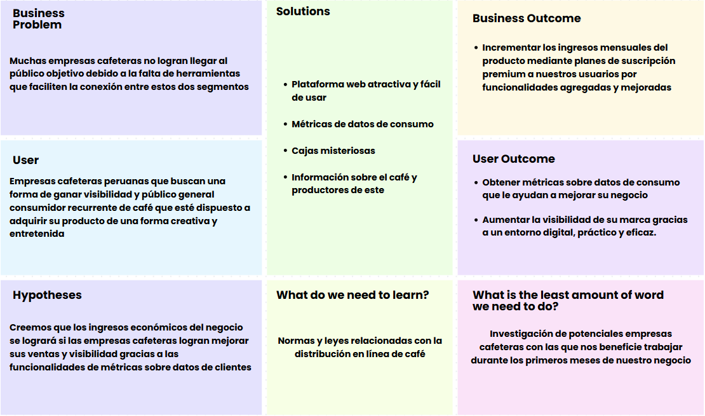

# UNIVERSIDAD PERUANA DE CIENCIAS APLICADAS
# FACULTAD DE INGENIERÍA
### PROGRAMA ACADÉMICO DE INGENIERÍA DE SOFTWARE

**Ciclo:** 2025-20
 
**NRC:** 7420
 
**Docente del curso:** Alex Humberto Sánchez Ponce

---
# INFORME DE TRABAJO(TB1)

**Nombre de la Startup:** ApoutCoffees

**Nombre del producto:** SmilingCups

## Integrantes
- Carlos Augusto Paredes Chavez - U202321613
- Daniel Jonatan Aquino Solorzano - U202217678
- Johnny Alexander Ojanama Abanto - U20231F412
- Juan Carlos Pastor Napa - U202217288
- Giuliano Angel Pelaez Vargas - U20221E121  

**Fecha:** Agosto, 2025

---
## Registro de versiones del informe
| Versión | Fecha | Autor | Descripción de modificación |
|---------|-------|-------|-----------------------------|
| 1.0    |  |  |  |
| 1.1 |

---

## Project Report Collaboration Insights
[Repositorio en GitHub](https://github.com/ApoutCoffees/upc-pre-202510-1asi0730-7420-ApoutCoffees-report-tb1.git)

---

# Tabla de Contenido

1. [Capítulo I: Introducción](#capítulo-i-introducción)
	- 1.1. [Startup Profile](#startup-profile) 
		- 1.1.1. [Descripción de la Startup](#descripción-de-la-startup)
		- 1.1.2. [Perfiles de integrantes del equipo](#perfiles-de-integrantes-del-equipo)
	- 1.2. [Solution Profile](#solution-profile)
		- 1.2.1 [Antecedentes y problemática](#antecedentes-y-problemática)
		- 1.2.2 [Lean UX Process](#lean-ux-process)
			- 1.2.2.1. [Lean UX Problem Statements](#lean-ux-problem-statements)
			- 1.2.2.2. [Lean UX Assumptions](#lean-ux-assumptions)
			- 1.2.2.3. [Lean UX Hypothesis Statements](#lean-ux-hypothesis-statements)
			- 1.2.2.4. [Lean UX Canvas](#lean-ux-canvas)
	- 1.3. [Segmentos objetivo](#segmentos-objetivo)
2. [Capítulo II: Requirements Elicitation & Analysis](#capítulo-ii-requirements-elicitation--analysis)
	- 2.1. [Competidores](#competidores)
		- 2.1.1. [Análisis competitivo](#análisis-competitivo)
		-  2.1.2. [Estrategias y tácticas frente a competidores](#estrategias-y-tácticas-frente-a-competidores)
	- 2.2. [Entrevistas](#entrevistas)
		-  2.2.1. [Diseño de entrevistas](#diseño-de-entrevistas)
		- 2.2.2. [Registro de entrevistas](#registro-de-entrevistas)
		- 2.2.3. [Análisis de entrevistas](análisis-de-entrevistas)
	-  2.3. [Needfinding](#needfinding)
		- 2.3.1. [User Personas](#user-personas)
		- 2.3.2. [User Task Matrix](#user-task-matrix)
		- 2.3.3. [User Journey Mapping](#user-journey-mapping)
		- 2.3.4. [Empathy Mapping](#empathy-mapping)
	- 2.4. [Big Picture Event Storming](#big-picture-event-storming)
	- 2.5. [Ubiquitous Language](#ubiquitous-language)
3. [Capítulo III: Requirements Specification](#capítulo-iii-requirements-specification)
	- 3.1. [To-Be Scenario Mapping](#to-be-scenario-mapping)
	- 3.2. [User Stories](#user-stories)
	- 3.3. [Impact Mapping](#impact-mapping)
	- 3.4. [Product Backlog](#product-backlog)
4. [Capítulo IV: Product Design](#capitulo-iv-product-design)
	- 4.1. [Style Guidelines](#style-guideline)
		- 4.1.1. [General Style Guidelines](#general-style-guidelines)
		- 4.1.2. [Web Style Guidelines](#web-style-guidelines)
	- 4.2. [Information Architecture](#information-architecture)
		- 4.2.1. [Organization Systems](#organization-systems)
		- 4.2.2. [Labeling Systems](#labeling-systems)
		- 4.2.3. [SEO Tags and Meta Tags](#seo-tags-and-meta-tags)
		- 4.2.4. [Searching Systems](#searching-systems)
		- 4.2.5. [Navigation Systems](#navigation-systems)
	- 4.3. [Landing Page UI Design](#landing-page-ui-design)
		- 4.3.1. [Landing Page Wireframe](#landing-page-wireframe)
		- 4.3.2. [Landing Page Mock-up](#landing-page-mock-up)
	- 4.4. [Web Applications UX/UI Design](#web-applications-uxui-design)
		- 4.4.1. [Web Applications Wireframes](#web-applications-wireframes)
		- 4.4.2. [Web Applications Wireflow Diagrams](#web-applications-wireflow-diagrams)
		- 4.4.3. [Web Applications Mock-ups](#web-applications-mock-ups)
		- 4.4.4. [Web Applications User Flow Diagrams](#web-applications-user-flow-diagrams)
	- 4.5. [Web Applications Prototyping](#web-applications-prototyping)
	- 4.6. [Domain-Driven Software Architecture](#domain-driven-software-architecture)
		- 4.6.1. [Design-Level EventStorming](#design-level-eventstorming)
		- 4.6.2. [Software Architecture Context Diagram](#software-architecture-context-diagram)
		- 4.6.3. [Software Architecture Container Diagrams](#software-architecture-container-diagrams)
		- 4.6.4. [Software Architecture Components Diagram](#software-architecture-components-diagram)
	-  4.7. [Software Object-Oriented Design](#software-object-oriented-design)
		- 4.7.1. [Class Diagrams](#class-diagrams)
	- 4.8. [Database Design](#database-design)
		-  4.8.1. [Database Diagrams](#database-diagrams)
5. [Capítulo V: Product Implementation, Validation & Deployment](#capitulo-v-product-implementation-validation--deployment)
	- 5.1. [Software Configuration Management](#software-configuration-management)
		- 5.1.1. [Software Development Environment Configuration](#software-development-environment-configuration)
		- 5.1.2. [Source Code Management](#source-code-management)
		- 5.1.3. [Source Code Style Guide & Conventions](#source-code-style-guide--conventions)
		- 5.1.4. [Software Deployment Configuration](#software-deployment-configuration)
	- 5.2. [Landing Page, Services & Applications Implementation](#landing-page-services--applications-implementation)
		- 5.2.1. [Sprint 1](#sprint-1)
			- 5.2.1.1. [Sprint Planning 1](#sprint-planning-1)
			- 5.2.1.2. [Aspect Leaders and Collaborators](#aspect-leaders-and-collaborators)
			- 5.2.1.3. [Sprint Backlog 1](#sprint-backlog-1)
			- 5.2.1.4. [Development Evidence for Sprint Review](#development-evidence-for-sprint-review)
			- 5.2.1.5. [Execution Evidence for Sprint Review](#execution-evidence-for-sprint-review)
			- 5.2.1.6. [Services Documentation Evidence for Sprint Review](#services-documentation-evidence-for-sprint-review)
			- 5.2.1.7. [Software Deployment Evidence for Sprint Review](#software-deployment-evidence-for-sprint-review)
			- 5.2.1.8. [Team Collaboration Insights during Sprint](#team-collaboration-insights-during-sprint)
		
	[Conclusiones](#conclusiones)
	[Bibliografía](#bibliografía)
	[Anexos](#anexos)

# Student Outcome

| Criterio específico | Acciones realizadas | Conclusiones |
|---------------------|---------------------|--------------|
|

# Student Outcome

| Criterio específico | Giuliano Angel Pelaez Vargas | Daniel Jonatan Aquino Solorzano | Juan Carlos Pastor Napa | Johnny Alexander Ojanama Abanto | Carlos Augusto Paredes Chavez | Conclusiones |
|---------------------|------------------------------|---------------------------------|---------------------------|---------------------------------|-------------------------------|--------------|
| Crea un entorno colaborativo e inclusivo, establece metas, planifica tareas y cumple objetivos. | asd | asd | asd | asd | asd | asd |
| Comunica por escrito con efectividad a diferentes rangos de audiencia | asd | asd | asd | asd | asd | asd |

---

# Capítulo I: Introducción
## 1.1. Startup Profile

### 1.1.1. Descripción de la Startup

Nuestra startup, Smiling Cups, es una aplicación web que conecta a amantes del café con cafeterías locales, ofreciendo un servicio de suscripciones digitales, con beneficios y promociones para los compradores, y herramientas digitales para las cafeterías para obtener métricas de consumo, llegar a más clientes y lanzar promociones. De este modo, Smiling Cups, además de dar alcance a emprendimientos cafeteros, crea una comunidad digital en torno a la experiencia cafetera, aportando valor tanto a consumidores como a los negocios.

Misión: Por un lado, ofrecemos a los amantes del café un servicio digital accesible y escalable para explorar su gusto por el café mediante beneficios exclusivos a través de un modelo de suscripciones. Por otro lado, brindamos a los negocios herramientas tecnológicas para expandir su público y fidelizar a sus clientes.

Visión: Nuestra visión es convertirnos en la plataforma líder en experiencias digitales de café, conectando a amantes del café con cafeterías a través de un ecosistema innovador que promueva la comunidad cafetera.

### 1.1.2. Perfiles de integrantes del equipo 

| Integrante                       | Código     | Carrera / Información                                                                 |
|----------------------------------|------------|----------------------------------------------------------------------------------------|
| Aquino Solorzano, Daniel Jonatan | u202217678 | Ingeniería de Software. Responsable y puntual. Conocimientos en C++ y Java.            |
| Ojanama Abanto, Johnny Alexander | u20231f412 | Ingeniería de Software. Responsable y cooperativo. Conocimientos en C++, HTML, CSS y JavaScript |
| Paredes Chavez, Carlos Augusto   | u202321613 | Ingeniería de Software. Proactivo. Conocimientos en C++ y C#.                          |
| Pastor Napa, Juan Carlos         | u202217288 | Ingenieria de Software. Creativo. Conocimientos en C++, redes, electronica y tecnico.  |
| Pelaez Vargas, Giuliano Angel    | u20221e121 | Ingeniería de Software. Solidario y enfocado. Conocimientos en C++, Python y Lua. |

## 1.2. Solution Profile 

ApoutCoffees es una plataforma en línea enfocada en la venta de cajas de misterio de café de alta calidad, que incluye cafés elegidos de pequeños proyectos peruanos.

 Su objetivo es enlazar a los consumidores con vivencias singulares de cata, proporcionando una compra digital fácil y atractiva, a la vez que otorga visibilidad y mayores beneficios a los productores locales. 

La app ofrece la opción de seleccionar entre tres clases de cajas misteriosas, cada una con un rango de precios diferente, presentadas en porciones individuales y con tarjetas informativas sobre el origen, perfiles de sabor y el proyecto detrás de cada café.

 De este modo, los consumidores encuentran nuevas opciones sin dificultades, mientras que los productores de café tienen acceso a un canal de venta en línea que aumenta su difusión del consumo local de café peruano.

### 1.2.1. Antecedentes y Problemática

Para entender mejor las necesidades de nuestros usuarios, hemos investigado sus antecedentes históricos y el problema utilizando la técnica de las 5W’s y 2H’s. Esta técnica es un método de análisis que ayuda a centrarse en las causas de un problema. Nuestro estudio se fundamenta en los antecedentes que han experimentado nuestros usuarios. A continuación, presentamos la información recopilada a través de esta técnica.  

### **What?**  
**¿Cuál es la dificultad?**  
El problema central que enfrentamos es la dificultad que tienen los consumidores para obtener cafés peruanos de pequeños agricultores de manera práctica, atractiva y contemporánea. A pesar de que Perú es conocido por la excelencia de su café, gran parte de la producción de pequeñas empresas no alcanza al consumidor final debido a la ausencia de canales de distribución innovadores. Esto restringe la visibilidad de los productores y quita a los consumidores experiencias variadas y de calidad.  

**¿Qué tipo de vínculo existe con la persona mencionada?**  
Los consumidores se ven directamente impactados al contar con escasas alternativas para encontrar cafés nuevos y diversos. Simultáneamente, los pequeños productores de café y los emprendimientos se enfrentan a dificultades en la comercialización y a la limitada accesibilidad a un mercado más extenso.  

### **When**  
**¿Cuándo ocurre el inconveniente?**  
- En el proceso de adquisición, al buscar cafés especiales, los consumidores se topan con opciones restringidas en supermercados o grandes cadenas.  
- En ocasiones de obsequio o de compra personal, cuando buscan una experiencia de alta calidad, pero no hallan opciones creativas ni asequibles.  

**¿Cuándo emplea el cliente el producto?**  
Los usuarios emplearán la aplicación web para elegir una de las 3 cajas misteriosas ofrecidas de acuerdo a su presupuesto (básica, premium o exclusiva). Emplearán el servicio tanto para uso personal como para obsequios o suscripciones mensuales.  

### **Where**  
**¿En qué lugar se encuentra el cliente al utilizar el producto?**  
El cliente ingresa desde su hogar, oficina o cualquier sitio con internet, a través de la aplicación web.  

**¿De dónde proviene el inconveniente?**  
La dificultad se presenta en la escasa participación de pequeños productores en el ámbito digital y en la carencia de plataformas que hagan de la adquisición de café una experiencia interesante y adaptada a cada cliente.  

### **Who**  
**¿Quiénes están involucrados?**  
- Pequeños productores de café peruano.  
- Consumidores interesados en experiencias premium, regalos o productos diferenciados.  
- Jóvenes profesionales y entusiastas del café.  

**¿A quiénes le sucede el problema?**  
A consumidores que buscan calidad y novedad en el café, y a productores que no logran colocar sus productos en mercados más amplios.  

**¿Quién lo utilizará?**  
El servicio será usado por consumidores nacionales e internacionales que deseen experimentar con cafés peruanos mediante un formato moderno, además de empresas que requieran regalos corporativos.  

### **Why**  
**¿Cuál es la causa principal del problema?**  
- Escasa digitalización en el sector cafetalero.  
- Dependencia de intermediarios que reducen el margen de ganancia de pequeños productores.  
- Falta de formatos innovadores de consumo (más allá de la bolsa tradicional de café).  
- Creciente demanda por experiencias de compra modernas que mezclen conveniencia digital con productos artesanales.  

### **How?**  
**¿Cómo ocurre el problema?**  
El problema ocurre porque la cadena de comercialización del café no prioriza a pequeños productores ni genera experiencias diferenciales para el consumidor final.  

**¿Cómo es percibido el problema por el usuario?**  
El consumidor percibe la compra de café como algo rutinario, poco atractivo y limitado a opciones genéricas. La falta de acceso a cafés diferenciados se siente como una barrera para explorar la riqueza del café peruano.  

**¿Cómo podemos abordar el problema?**  
**ApoutCofees** ofrece una plataforma web intuitiva que permite elegir entre tres planes de mystery boxes de café peruano. Las cajas incluyen cafés fraccionados, cartas informativas sobre el productor y notas de cata, creando una experiencia premium y educativa.  

**¿En qué condiciones los clientes usan nuestro producto?**  
- En compras digitales rápidas.  
- Al buscar un regalo premium.  
- Al desear probar nuevas variedades de café sin tener que comprar bolsas enteras.  

**¿Cómo nos conocieron los compradores?**  
- Redes sociales (Instagram, TikTok).  
- Marketing digital especializado en experiencias gourmet.  
- Recomendaciones boca a boca.  

**¿Cómo prefieren los clientes acceder al contenido?**  
A través de una aplicación web clara, con opciones simples de elección (tres cajas), información sobre cafés y posibilidad de suscripción.  

**¿Qué llevó a la persona a llegar a esta situación?**  
La necesidad de experiencias de consumo más innovadoras, la falta de acceso a cafés de pequeños emprendimientos, y el deseo de apoyar el comercio justo mientras disfrutan de un producto premium.  

### **How Much**  
- El mercado mundial de café mueve más de USD 200 mil millones anuales.  
- Perú es el noveno exportador mundial de café, con 223 mil toneladas exportadas en 2023 (SUNAT – Junta Nacional del Café).  
- Más del 90 % de los productores peruanos son pequeños caficultores, con limitadas herramientas de comercialización digital.  
- El consumo interno en Perú ha crecido un 25 % en los últimos 5 años, especialmente en el segmento de cafés especiales (Cámara Peruana del Café y Cacao).  

Esto demuestra que existe una alta demanda insatisfecha, y una oportunidad clara para **ApoutCofees** de conectar digitalmente a pequeños productores con consumidores nacionales e internacionales.  

### 1.2.2. Lean UX Process
#### 1.2.2.1 Lean UX Problem Statements

Nuestro producto de software tiene como objetivo conectar eficazmente mediante un entorno digital a empresas cafeteras con consumidores de café. Ofreciendo funcionalidades innovadoras como entregas en forma de cajas misteriosas y contando con métricas de consumo para ayudar a las marcas con el análisis del mercado.

La problemática principalmente radica en que las marcas o empresas cafeteras peruanas (especialmente las más pequeñas) no poseen mucha visibilidad en el mercado y por consiguiente no logran llegar llegar al público objetivo. Esto genera que no consigan los ingresos esperados y sus negocios no logren conseguir el éxito empresarial.

¿Cómo podemos ayudar a las empresas cafeteras a lograr ganar visibilidad en el mercado del café para que puedan mejorar sus ingresos y sus productos puedan llegar a ser reconocidos por el consumidor objetivo?

#### 1.2.2.2. Lean UX Assumptions

- Las empresas cafeteras necesitan una herramienta digital que logre dar visibilidad a sus productos
- Estas marcas buscan que sus productos no solo se vendan bien sino que también logren transmitir y generar reconocimiento para los responsables de la producción de ese café
- Las funcionalidades creativas de la aplicación lograrán incrementar su popularidad en el mercado del café
- Los consumidores se verán atraídos por la aplicación web gracias a sus funcionalidades como las cajas misteriosas.

##### 1.2.2.2.1. Assumptions Worksheet 

**¿Quién es el usuario?**
- Empresas cafeteras peruanas que necesiten ganar visibilidad en el mercado para que sus productos lleguen mayor público
- Consumidores cotidianos de café que se vean atraídos por una aplicación que venda café de forma creativa e innovadora.
  
**¿Dónde encaja el producto en su vida?**
En la etapa de comercialización digital de café hacia el publico consumidor objetivo y al momento de realizar una búsqueda de posibles cafés para el consumo mismo del cliente de estas empresas
  
**¿Qué problemas tiene y cómo se resuelven?**
Las marcan cafeteras presentan el problema de no lograr darle la mayor visibilidad posible a sus productos debido a una falta de adaptación al mercado contemporáneo y la forma en que intentan resolver estos problemas es recurrir a mayor inversión en estrategias de Marketing y publicidad
  
**¿Cuándo y cómo se usa el producto?**
El producto se usa cuando los consumidores tienen la intención de comprar café mediante cajas misteriosas que ofrecen una experiencia atractiva para el usuario, por otro lado las marcas usarán el producto cuando necesiten saber sobre métricas y datos de consumo de sus clientes mediante las funcionalidades que ofrece la aplicación. 
  
**¿Qué características son importantes?**
  
-   Cajas misteriosas personalizables
    
-   Métodos de suscripción para funcionalidades extras y mejoradas
    
-  Catálogos de cafés y cajas misteriosas
    
-   Sección de comentarios y reseñas sobre cada café y caja misteriosa
    
-   Sección informativa sobre productores y marcas cafeteras
    
-   Métricas sobre datos de consumo de los clientes para cada empresa

**¿Cómo debe verse nuestro producto y cómo comportarse?**

La aplicación debe verse atractiva para el cliente, transmitiendo un ambiente relacionado a la razón del negocio que es el café. Debe comportarse de forma amigable e intuitiva con el usuario, demostrando que es fácil de usar y entender

##### 1.2.2.2.2. Business Outcomes 

- Incrementar los ingresos mensuales del producto mediante planes de suscripción premium a nuestros usuarios por funcionalidades agregadas y mejoradas

- Expandir las conexiones y convenios con empresas cafeteras del país para que tengamos al rededor de 50 marcas para el primer año

- Incrementar la visibilidad y reconocimiento del negocio en la mayor parte del país mediante estrategias de Marketing para seguir impulsando el crecimiento de nuestra empresa

- Incrementar el porcentaje del número de registros mensuales a la aplicación web
- Reducir el porcentaje de usuarios que dejan de usar la aplicación escuchando sus quejas y feedback que dejen en la sección de reseñas del producto 

##### 1.2.2.2.4. User Outcomes 

-   **Público Consumidor**
    
    -   Descubrir nuevos tipos de café de forma creativa y entretenida
        
    -   Disfrutar de la incertidumbre sobre los artículos que le tocarán al momento de comprar las cajas misteriosas
        
    -   Estar seguro que recibe un servicio de calidad con cafés de buena marca
        
    -   Ahorrar tiempo al poder comprar cafés de forma remota desde cualquier lugar en el que se encuentre
        
        
-   **Empresa cafetera**:
    
    -   Llegar a conectar con un mayor número de clientes sin necesidad de recurrir a grandes inversiones en Marketing.
        
    -   Obtener métricas sobre datos de consumo que le ayudan a mejorar su negocio
             
    -   Aumentar la visibilidad de su marca gracias a un entorno digital, práctico y eficaz.
        
    -   Sentirse cómodos de trabajar en torno de un ambiente digital que facilita muchas funcionalidades.

##### 1.2.2.2.5. Features

- Cajas misteriosas con artículos relacionados al café
- Catálogos de cafés con descripción de cada uno
- Sistema de compendio de cafés coleccionados 
- Sistema de logros y gamificación para el usuario consumidor
- Sección informativa sobre marcas de café y productores
- Métricas sobre datos de consumo para cada empresa cafetera 
- Sección de reseñas y comentarios para cada café y caj misteriosa
- Sección de perfil personal de usuario para ver información personal y sobre estadísticas de su cuenta
- Historial de cajas misteriosas y cafés consumidos por los usuarios consumidores

#### 1.2.2.3. Lean UX Hypothesis Statements
##### 1.2.2.3.1. Hipótesis de Usuario

-   **Creemos que** los consumidores valorarán descubrir cafés nuevos de forma entretenida y fácil.  
    **Sabremos que es cierto cuando** veamos que al menos un 10% de las reseñas positivas de la aplicación son sobre la funcionalidad de las cajas misteriosas
    
    
-   **Creemos que** los usuarios se sentirán interesados sobre los datos del café. que reciben en las cajas misteriosas  
	**Sabremos que es cierto cuando** veamos que al menos un 15% de las reseñas positivas de la aplicación son sobre los añadidos de estos datos en las cajas misteriosas
    
    
-   **Creemos que** los clientes prefieren comprar café de forma digital y remota.  
    **Sabremos que es cierto cuando** veamos que aumentan en 60% la cantidad de ventas fuera de horario comercial presencial de las empresas
        
-   **Creemos que** los usuarios valoran la rapidez en la entrega.  
    **Sabremos que es cierto cuando** el 75% califique 4 o 5 estrellas en tiempos de entrega.
    
-   **Creemos que** los clientes quieren sentirse parte de una comunidad cafetera.  
    **Sabremos que es cierto cuando** un 30% de los usuarios publiquen en las reseñas de las aplicación que desean un entorno social y comunitario dentro de la app

##### 1.2.2.3.2. Hipótesis de Negocio

-   **Creemos que** ofrecer suscripciones en la aplicación generará buenos ingresos recurrentes.  
    **Sabremos que es cierto cuando** después de 6 hayamos aumentado los ingresos en un 60%
    
    
-   **Creemos que** incluir cafeteras conocidas atraerá más usuarios.  
    **Sabremos que es cierto cuando** veamos un crecimiento del 30% en usuarios registrados.  
   
    
-   **Creemos que** ofrecer promociones de envíos gratuitos a suscriptores aumentará la cantidad de usuarios que se registran.  
    **Sabremos que es cierto cuando** veamos un aumento del 10% en usuarios que se registran en periodos de promociones especiales
    
    
-   **Creemos que** la aplicación ganará reconocimiento gracias a las estrategias de Marketing en redes sociales
    **Sabremos que es cierto cuando** veamos un incremento del 40% de usuarios que se registran en periodos de publicación de comerciales

#### 1.2.2.4. Lean UX Canvas

## 1.3. Segmentos Objetivo
- Segmento 1: Consumidores urbanos jóvenes y entusiastas del café
	-Perfil: Estudiantes o profesionales, edades entre 20-40 años, familiarizados con compras digitales.
	-   Necesidades:
		-   Encontrar calidad, novedad y conexión con el origen del producto.
		-   Hallar experiencias distintas con un producto familiar.
	-   Como ayuda SmilingCups:
		-   Ofrece opciones de café variadas a través de la experiencia de las "Mystery Boxes".
    
		-   Otorga visibilidad a emprendimientos de café con propuestas atractivas para un público casual.
-   Segmento 2: Marcas cafeteras peruanas de limitado acceso digital
	-   Perfil: Emprendimientos, microempresas cafeteras del Perú.
	-   Necesidades:
		-   Obtener mayor visibilidad y alcance al público cafetero.
		-   Llevar a conocer popularmente diversas propuestas con el café peruano.
	-   Como ayuda SmilingCups:
		-   Brinda los medios por los que los diversos emprendimientos cafeteros pueden darse a conocer a un público más amplio.
# Capítulo II: Requirements Elicitation & Analysis
## 2.1. Competidores 

Se identificaron hasta la fecha a 3 principales competidores para la aplicación web de nuestro startup, centrado en el mercado digital del café.

**Coffee Hunters Perú**
-   **Descripción:** Es una comercializadora de cafés de especialidad que tiene como objetivo de negocio viajar a  diversas fincas de los productores cafeteros peruanos para encontrar cafés de alta calidad y comercializar estos de una manera justa con los caficultores.
-   **Ventajas:**
	-   Dar acceso a cafés con trazabilidad completa
	- Presentaciones a pequeña escala de sus productos para probar diversos orígenes a menor precio
-   **Desventajas:**
	-   Falta de estabilidad de los sabores a largo plazo
	-  Volatilidad de la fermentación experimental
	
**Café Compadre**
-   **Descripción:** Marca de café de especialidad peruana que se distingue por su proceso con energía solar y su compromiso con los agricultores locales.
-   **Ventajas:**
	-   Compromiso con el café de especialidad
	-   Enfoque en la sostenibilidad socio-ambiental
-   **Desventajas:**
	-   Productos sean menos accesibles o más caros
	-   Problemas de disponibilidad en comparación con marcas más grandes

**Tunki Coffee**
-   **Descripción:** Cooperativa con años de producción de café, dedicada a café especial, orgánico y de calidad.
-   **Ventajas**
	-   Reconocimiento en el mercado por la calidad de su café
	-  Ofrece distintos formatos para sus productos
-   **Desventajas**
	- Mucha diversificación por el canal digital
	- Precios de cafés más altos en función de la especialidad de estos

### 2.1.1 Análisis Competitivo

El analisis permitio identificar similitudes y diferencias entre Smiling Cups y los principales actores del mercado.

-   **Coffee Hunters Perú**
    
    -   **Fortalezas:** Tiene trazabilidad de cafés, ofrece pruebas de pequeños lotes.
        
    -   **Debilidades:** Variedad poco estable y limitada fidelización de clientes.
        
    -   **Oportunidad para SmilingCups:** Mejorar la experiencia digital, ofreciendo consistencia en la entrega de cafés y gamificación para aumentar la lealtad de los usuarios.
        
-   **Café Compadre**
    
    -   **Fortalezas:** Imagen sólida de sostenibilidad y calidad premium.
        
    -   **Debilidades:** Precio alto y disponibilidad reducida.
        
    -   **Oportunidad para SmilingCups:** Competir con precios accesibles mediante suscripciones, reforzando también un discurso sostenible pero con una experiencia más cercana al usuario digital.
        
-   **Tunki Coffee**
    
    -   **Fortalezas:** Marca reconocida, café especial con certificaciones.
        
    -   **Debilidades:** Canales digitales limitados y precios elevados.
        
    -   **Oportunidad para SmilingCups:** Destacar con un modelo digital-first, creando comunidad cafetera y visibilizando pequeños productores que aún no tienen reconocimiento internacional.

	  
- 
### 2.1.2. Estrategias y tácticas frente a competidores

-   **Diferenciación de producto:** Mystery box interactivas, algo que los competidores no ofrecen.
    
-   **Estrategia de precio:** Planes de suscripción flexibles y promociones exclusivas para fidelizar usuarios.
    
-   **Táctica digital:** Campañas en Instagram y TikTok para atraer a un público joven urbano.
        

## 2.2. Entrevistas

---

### 2.2.1. Diseño de entrevistas

**Perfil:** Consumidores urbanos jóvenes y entusiastas del café.  
**Necesidades:** Encontrar novedad y experienias variadas en un producto conocido, el café.

**Preguntas de entrevista:**
-   ¿Qué tipo de café sueles consumir y dónde lo compras normalmente?  
-   ¿Has probado alguna vez cafés de origen peruano de pequeños productores?  
-   ¿Qué te parecería recibir una "Mystery Box" con cafés seleccionados y fichas informativas de cada uno?  
-   ¿Qué factores te motivarían a tener una suscripción a un servicio mensual de café?  
-   ¿Qué tan importante es para ti conocer la historia detrás del producto que consumes?  
-   ¿Qué elementos visuales o de diseño te llaman la atención de una aplicativo de café?  
-   ¿Usarías esta app como opción de regalo? ¿Qué te gustaría que incluya para que sea especial?

 **Perfil:** Marcas cafeteras peruanas de limitado acceso digital.  
**Necesidades:** Obtener visibilidad y aumentar su alcance al público cafetero.

**Preguntas de entrevista:**
-   ¿Qué canales usas actualmente para vender tus productos?  
-   ¿Has probado utilizar las redes sociales para vender el café? ¿Qué funcionó y qué no?  
-   ¿Qué te parecería formar parte de una plataforma que promocione tus productos a través de mystery Boxes junto a otros productores?  
-   ¿Qué información te gustaría que los consumidores conozcan sobre tu marca y tu café?  
-   ¿Qué tipo de apoyo necesitarías para participar en una plataforma digital como SmilingCups? 
-   ¿Cómo mides actualmente el impacto o éxito de tus ventas? ¿Te interesaría acceder a métricas de consumo?  
-   ¿Qué esperas de una alianza con una plataforma como esta? ¿Qué beneficios te parecerían justos?

### 2.2.2. Registro de entrevistas
### 2.2.3. Análisis de entrevistas
## 2.3 Needfinding
### 2.3.1. User Personas
### 2.3.2. User Task Matrix
### 2.3.3. User Journey Mapping
### 2.3.4. Empathy Mapping
## 2.3. Big Picture Event Storming
## 2.4. Ubiquitous Language

Para mantener consistencia en el desarrollo y comunicación del proyecto, se definieron los siguientes términos comunes dentro del equipo:

-   **Mystery Box:** Caja de suscripción con cafés seleccionados al azar de pequeños productores peruanos.
    
-   **Productores:** Cafeterías locales o microempresas proveedoras de café.
    
-   **Consumidores:** Usuarios que adquieren las mystery boxes mediante la plataforma web.
    
-   **Suscripción:** Modelo de pago recurrente mensual que da acceso a beneficios adicionales.
    
-   **Ficha de Café:** Documento digital o físico con la información de origen, notas de cata y productor.
    
-   **Dashboard de métricas:** Panel digital que muestra a los productores información sobre ventas, reseñas y comportamiento de consumidores.
    
-   **Gamificación:** Elementos lúdicos como logros, insignias y colecciones de cafés para aumentar la retención del usuario.

  
# Capítulo III: Requirements Specification
## 3.1. To-Be Scenario Mapping
## 3.2. User Stories
## 3.3. Impact Mapping
## 3.4. Product Backlog
# Capitulo IV: Product Design
## 4.1. Style guidelines
### 4.1.1. General Style Guidelines
### 4.1.2. Web Style Guidelines
## 4.2. Information Architecture
### 4.2.1. Organization Systems
SmilingCups organiza su información aplicando sistemas de organización visual y esquemas de categorización:

**A) Organización visual del contenido**

-   **Jerárquica:** Menú superior con secciones principales (Inicio,  Comunidad, Suscripciones, Mi Cuenta).
    
-   **Secuencial:** Procesos guiados paso a paso como el registro de usuarios, compra de cajas y configuración de suscripción.
    
-   **Matriz:** Sección de exploración de cafés y productores, filtrada por origen, tipo de tueste, o precio.
    
**B) Esquemas de categorización del contenido**

-   **Alfabético:** Listados de productores o cafés en catálogo.
    
-   **Cronológico:** Historial de compras y reseñas.
    
-   **Por tópicos:** Clasificación por tipo de café (espresso, filtrado, cold brew).
    
-   **Por audiencia:** División de vistas:
    
    -   Consumidores (mystery boxes, catálogo, comunidad).
        
    -   Productores (dashboard de métricas, gestión de cafés).
 
      
### 4.2.2. Labeling Systems

SmilingCups se plantea para ser claro, conciso y evitar ambigüedades:

-   **Inicio:** Página de bienvenida.
    
-   **Mystery Box:** Acceso directo a los planes de cajas misteriosas.
    
-   **Explorar:** Catálogo de cafés y productores.
    
-   **Comunidad:** Espacio de interacción, reseñas y foros.
    
-   **Mi Cuenta:** Perfil personal del usuario (historial y  configuraciones).
    
-   **Dashboard:** Herramienta exclusiva para productores con métricas de consumo.

  

### 4.2.3. SEO Tags and Meta Tags
### 4.2.4. Searching System

El sistema de búsqueda de SmilingCups busca facilitar el acceso rápido a cafés, productores y reseñas, evitando que los usuarios se pierdan entre el volumen de información.

-   **Barra de búsqueda principal:** Disponible en el header de la aplicación.
    
-   **Filtros de búsqueda:**
    
    -   Por tipo de café (espresso, americano, filtrado).
        
    -   Por precio (básico, premium, exclusivo).
        
    -   Por productor (nombre de la marca o región).
        
    -   Por popularidad o valoración de usuarios.
 
    
### 4.2.5. Navigation Systems
## 4.3. Landing Page UI Design
### 4.3.1. Landing Page Wireframe
 

**Web landing page wireframe** 
 

- Home

 

 

- About

 

 

- Goals

 

 

- Contact

 

 

**Mobile landing page wireframe** 
 

- Home

 

 

- Home Tab

 

 

- About

 

 

- Goals

 

 

- Contact

 

 

### 4.3.2. Landing Page Moc-up
 

**Web landing page Moc-up** 
 

- Home

 

 

- About

 

 

- Goals

 

 

- Contact

 

 

**Mobile landing page wireframe** 
 

- Home

 

 

- Home Tab

 

 

- About

 

 

- Goals

 

 

- Contact

 

 

## 4.4 Web Applications UX/UI Design
### 4.4.1. Web Applications Wireframes
### 4.4.2. Web Applications Wireflow Diagrams
### 4.4.3. Web Applications Mock-ups
### 4.4.4. Web Applications User Flow Diagrams
## 4.5 Web Applications Prototyping
## 4.6 Domain-Driven Software Architecture
### 4.6.1. Design-Level Event Storming
### 4.6.2. Software Architecture Context Diagram
### 4.6.3. Software Architecture Container Diagrams
### 4.6.4.Software Architecture Components Diagrams
## 4.7Software Object-Oriented Design
### 4.7.1. Class Diagrams
## 4.8. Database Design
### 4.8.1.Database Diagrams
# Capitulo V Product Implementation, Validation & Deployment
## 5.1. Software Configuration Management
### 5.1.1. Software Development Environment Configuration

El entorno de desarrollo de **SmilingCups** se definió considerando las tecnologías base del proyecto:  

- **Frontend:** Vue.js 3 (con Vite) para construcción de interfaces reactivas.  
- **Backend:** Node.js con Express para la construcción de la API REST.  
- **Base de Datos:** MySQL para el almacenamiento relacional de usuarios, pedidos y suscripciones.  
- **IDE principal:**  WebStorm para frontend y JetBrains IntelliJ IDEA/Visual Studio Code para backend.  
- **Gestor de paquetes:** npm para frontend y backend.  
- **Control de versiones:** GitHub.

### 5.1.2. Source Code Management

El control del código fuente se gestiona en **GitHub**, bajo un flujo de trabajo basado en **GitFlow**, adaptado al marco ágil.  

- **Branching Strategy**  
  - **main:** Contiene el código estable y en producción.  
  - **develop:** Versión de integración para nuevas funcionalidades.  
  - **feature/:** Ramas específicas para cada User Story o Task.
    
### 5.1.3. Source Code Style Guide & Conventions

Para mantener un código consistente y legible, se adoptaron las siguientes guías de estilo y convenciones:  

- **Frontend (Vue.js):**  
  - Uso de la guía oficial de estilo de Vue.js.  
  - Componentes nombrados en PascalCase (UserProfile.vue).  
  - Variables y funciones en camelCase.  
  - Archivos .vue organizados en carpetas components/, views/, store/.  

- **Backend (Node.js ):**  
  - Estructura MVC (Model, View, Controller).  
  - Rutas en minúsculas con guiones (/api/user-profile).  
  - Variables en inglés, con nombres claros y descriptivos.  

- **General:**  
  - Commits con mensajes siguiendo convención:  
    - feat: para nuevas funcionalidades.  
    - fix: para correcciones de errores.  
    - docs: para cambios en documentación.  
    - refactor: para mejoras sin cambiar funcionalidad.  
    - test: para agregar o modificar pruebas.

### 5.1.4. Software Deployment Configuration

El despliegue de **SmilingCups** se organiza bajo un esquema de servicios distribuidos:  

- **Frontend (Vue.js):** Desplegado en **Vercel**, con actualizaciones automáticas al hacer push a **main**.  
- **Backend (Node.js/Express):** Desplegado en **Render**, con conexión directa a la base de datos.  
- **Base de Datos (MySQL):** Implementada en (MySQL en la nube) o en **MySQL Workbench** para entorno local.  
- **Landing Page:** Incluida en el mismo frontend de Vue.js.
  
## 5.2. Landing Page, Services & Applications Implementation
### 5.2.1. Sprint 0
####  5.2.1.1. Sprint Planning 0

| **Sprint #**                  | Sprint 0 |
|--------------------------------|----------|
| **Sprint Planning Background** | |
| **Date**   | 2025-09-3 |
| **Time**   | 9:00 PM |
| **Location**  | Meet via Discord  |
| **Prepared By**  | Juan Carlos Pastor Napa |
| **Attendees (to planning meeting)** | Carlos Augusto Paredes Chavez/Daniel Jonatan Aquino Solorzano/Johnny Alexander Ojanama Abanto/Juan Carlos Pastor Napa/Giuliano Angel Pelaez Vargas |
| **Sprint n – 1 Review Summary** | No hubo Sprint anterior. |
| **Sprint n – 1 Retrospective Summary** | Al ser el primer Sprint, la retrospectiva se enfocó en definir comunicación, repositorio y guías de estilo de código. |
| **Sprint Goal & User Stories** | |
| **Sprint 0 Goal**              | Configurar la base técnica del proyecto (entorno de desarrollo en WebStorm, repositorio GitHub, GitFlow, integración inicial de Vue.js + Node.js + MySQL, prototipo básico de Landing Page). |
| **Sprint 0 Velocity**          | 10 Story Points |
| **Sum of Story Points**        | 10 |

####  5.2.1.2. Aspect Leaders and Collaborators

En este Sprint se identificaron los principales aspectos: **Frontend (Vue.js), Backend (Node.js ), Base de Datos (MySQL), Landing Page, QA & Documentación**.  

| **Team Member**         | **GitHub Username** | **Frontend** | **Backend** | **Base de Datos** | **Landing Page** | **QA & Documentación** |
|--------------------------|----------------------|-----------------------|-----------------------|---------------------------|------------------|-------------------------|
| Carlos Augusto Paredes Chavez  | @CarlossUPC | C | L | C | C | L |
| Juan Carlos Pastor Napa | @ElKiwi1271  | L  | C  | L | C | C |
| Daniel Jonatan Aquino Solorzano| @DanielAquinoSolorzano | C | L | C | C | C |
| Giuliano Angel Pelaez Vargas | @SimpleGP | C  | C   | L | C | L |
| Johnny Alexander Ojanama Abanto | @JohnnyGZ41 | L | C  | C  | L | C  |

####  5.2.1.3. Sprint Backlog 0

El Sprint 0 tuvo como objetivo preparar el entorno de trabajo y asegurar la infraestructura básica.  

| **Sprint #** | **User Story** | **Work-Item / Task** | **Description** | **Estimation (Hours)** | **Assigned To** | **Status** |
|--------------|----------------|----------------------|-----------------|-------------------------|-----------------|------------|
| Sprint 0     | US01 – Registro de Usuario | T-01: Crear tabla users en MySQL | Definir estructura de tabla con campos id, name, email, password. | 4h | Giuliano Pelaez | In process |
| Sprint 0     | US01 – Registro de Usuario | T-02: Endpoint /api/register | Implementar endpoint en Express para registrar nuevos usuarios. | 5h | Daniel Aquino | In process |
| Sprint 0     | US01 – Registro de Usuario | T-03: Formulario de registro en Vue.js | Crear vista de registro y validaciones en frontend. | 4h | Juan Pastor | In process |
| Sprint 0     | US02 – Inicio de Sesión | T-04: Endpoint /api/login | Implementar autenticación con JWT en backend. | 6h | Daniel Aquino | In process |
| Sprint 0     | US02 – Inicio de Sesión | T-05: Pantalla de Login | Crear formulario de login en Vue.js y conectar al backend. | 4h | Juan Pastor | In process |
| Sprint 0     | US03 – Explorar Mystery Boxes | T-06: Crear tabla mystery_boxes | Diseñar tabla para almacenar datos de cajas (id, nombre, precio, descripción). | 3h | Giuliano Peláez | In process |
| Sprint 0     | US03 – Explorar Mystery Boxes | T-07: Endpoint /api/boxes | Implementar endpoint para obtener listado de cajas. | 4h | Daniel Aquino | In process |
| Sprint 0     | US03 – Explorar Mystery Boxes | T-08: Vista de Exploración | Diseñar página Vue.js que muestre listado de Mystery Boxes. | 5h | Carlos Paredes | In process |
| Sprint 0     | US04 – Ver ficha informativa del café | T-09: Crear tabla coffee | Definir estructura de cafés relacionados a cada Mystery Box. | 3h | Carlos Paredes | In process |
| Sprint 0     | US04 – Ver ficha informativa del café | T-10: Endpoint /api/coffee/:id | Implementar endpoint para mostrar perfil de café. | 4h | Daniel Aquino| In process |
| Sprint 0     | US04 – Ver ficha informativa del café | T-11: Página de ficha de café en Vue.js | Desarrollar vista con historia, notas de cata y productor. | 4h | Johnny Ojanama | In process |
| Sprint 0     | US05 – Suscripción mensual | T-12: Crear tabla subscriptions | Definir modelo para almacenar suscripciones activas por usuario. | 3h | Carlos Paredes | In process |
| Sprint 0     | US05 – Suscripción mensual | T-13: Endpoint /api/subscribe | Implementar lógica para activar suscripción mensual. | 5h | Daniel Aquino | In process |
| Sprint 0     | US05 – Suscripción mensual | T-14: Vista de suscripción en Vue.js | Crear interfaz donde usuario seleccione una caja y confirme pago simulado. | 4h | Johnny Ojanama| In process |

####  5.2.1.4. Development Evidence for Sprint Review

Al ser **Sprint 0**, no se implementaron aún funcionalidades completas.  
Sin embargo, se avanzó en la configuración técnica:  

- Repositorio de GitHub creado y accesible al equipo.  
- Ramas configuradas bajo GitFlow.  
- WebStorm preparado con entornos para Vue.js y Node.js.  
- Creación de la base de datos MySQL con tabla users.  
- Primer prototipo de la Landing Page en HTML/CSS.
  
####  5.2.1.5. Execution Evidence for Sprint Review

La ejecución incluyó:  
- Reunión de arranque para definir flujo de trabajo.  
- Configuración de repositorio con **commits iniciales**.  
- Sincronización del equipo a través de reuniones virtuales y Discord.  

####  5.2.1.6. Services Documentation Evidence for Sprint Review

Se documentó lo siguiente:  
- Guía de uso del repositorio (README inicial en GitHub).  
- Modelo entidad-relación inicial para la base de datos. 

####  5.2.1.7. Software Deployment Evidence for Sprint Review

El despliegue de Sprint 0 se realizó en entornos de prueba:  
- **Frontend (Vue.js):** ejecutado en WebStorm con servidor local 
- **Backend (Node.js):** levantado en WebStorm (npm start).  
- **Base de datos:** configurada en MySQL Server o MySQl workbench.
  
####  5.2.1.8. Team Collaboration Insights during Sprint

- Se estableció Discord como canal de comunicación principal y Google Meet para reuniones semanales.  
- Se adoptaron convenciones de commits en inglés siguiendo el estándar feat:, fix:.  
- Se clarificaron los roles principales de liderazgo y colaboración para cada aspecto (Frontend, Backend, Base de Datos, Landing Page, QA & Documentación).
- Se observó una fortaleza en la rápida alineación del equipo respecto a las herramientas y lineamientos técnicos.
- Se identificó como oportunidad de mejora la estimación más precisa del esfuerzo de tareas y una documentación más detallada desde el inicio.
  
# Conclusiones
# Bibliografía 
# Anexos

