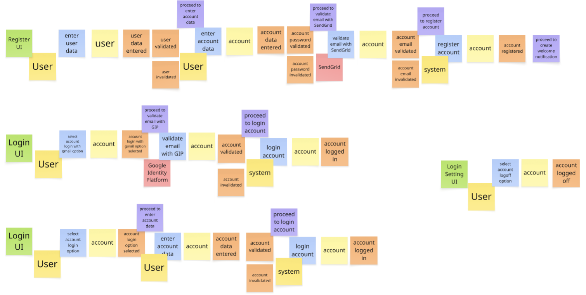
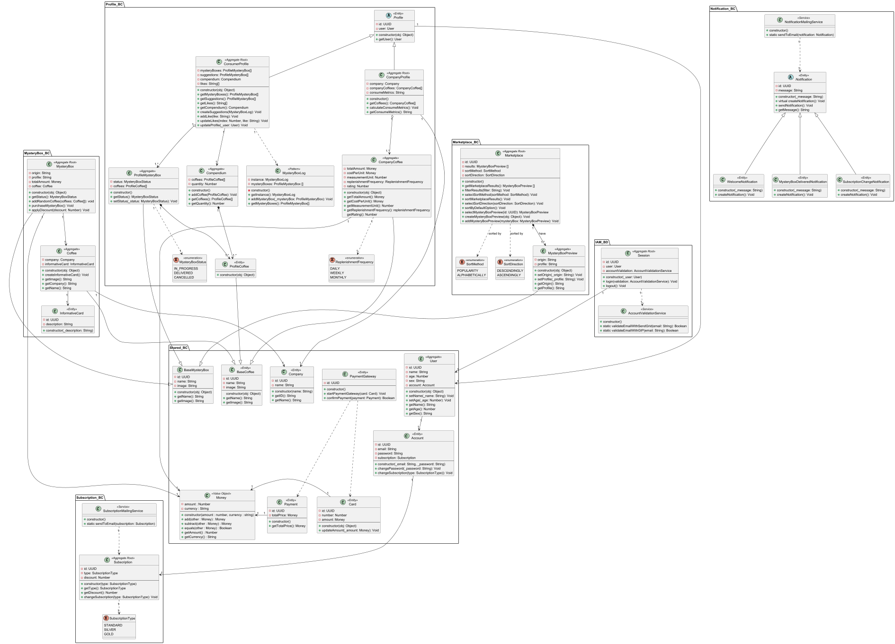
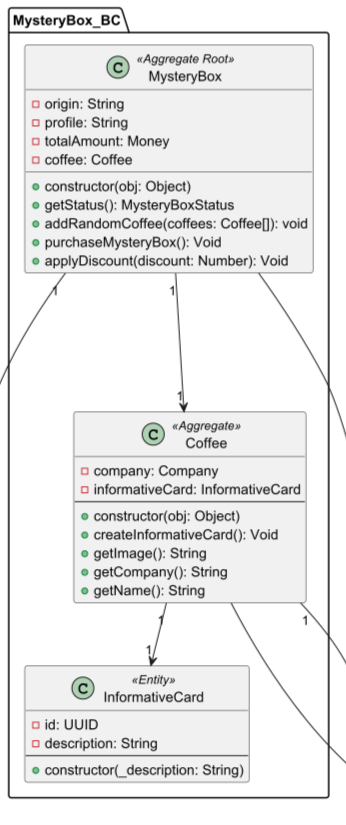
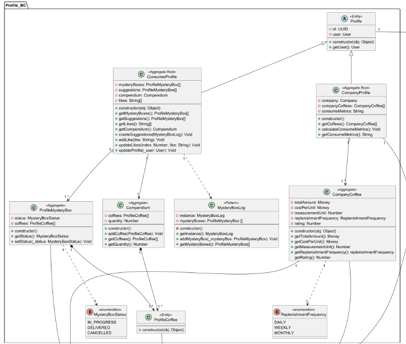

# Capitulo IV: Product Design
## 4.1. Style guidelines
Estos lineamientos se establecerán para el diseño del sistema de smiling cups, una plataforma de mysteryboxes con tematica de cafes.
### 4.1.1. General Style Guidelines

#### a. Branding
- Logotipo:El logotipo de SmilingCups utiliza una composicion circular. Se presenta en formato png para permitir su visualizacion en la mas alta calidad.
- Colores del logotipo: El logotipo emplea tonos monocromaticos para dar una vista simple y no cargada. Tiene una cara feliz en medio representando la parte de "Smiling" y la vista es de una taza desde arriba.
- Espaciado mínimo: Se establece un espaciado mínimo de 10px alrededor del logotipo para garantizar su legibilidad y presencia visual en cualquier contexto.

#### b. Tipografía

- Primera Fuente - Amaranth (56px): Utilizada para titulos principales, se usa esta fuente buscando trasmitir una vibra de tranquilidad y calma al usuario.
- Segunda Fuente - Amatic SC(32px): Utilizada para textos descriptivos e informaticos trasmitiendo una vibra segura y hogareña.
- Tercera Fuente - Lindo Figma (24px): Utilizada para los botones, es un estilo alegre y creativo para llamar la atencion del usuario
- Aplicaciones:
	- Amaranth: Utilizada para titulos principales

	- Amatic SC: Utilizada para textos descriptivos

	- Lindo Figma: Utilizada para los botones
   
### 4.1.2. Web Style Guidelines

#### a. Estructura de la página

La interfaz de usuario de la aplicación Web de Smiling Cups fue diseñada con el objetivo de ofrecer un experiencia fluida y de calidad para los usuarios, tendiendo en cuenta las adaptaciones a los distintos formatos de pantalla. Se observan a continuación tres secciones para poder entender como se organiza el contenido.

-   Header
    
    -   Ubicación: Parte superior de la pantalla
    -   Contenido:
        -   Logo: El logo de nuestra aplicación se posiciona en la esquina superior izquierda, mostrado en el formato JPG.
        -   Botones de navegación: Se disponen en la esquina superior izquierda después del logo, con opciones como "About", "Goals" y "Contact".
    -   Color del Header: Café oscuro – código #CDAC77. Este color fue elegido por debido a su relación con los contextos del negocio, transmitiendo identidad visual y profesionalismo.
-   Body
    
    -   Ubicación: La zona más amplia de la página, se encuentra en la zona central.
    -   Contenido:
        -   Imágenes: Se incluyen imágenes JPG que guardan relación con el objetivo de cada sección de la aplicación Web
    -   Color del Body: Café claro – código #FFF1D1. Este color demuestra un entorno agradable para el usuario y se muestra de forma limpia y pulida.
    

#### b. Diseño de Interfaz

-   Responsive Design: La interfaz grafica de la aplicación  esta diseñada para poder ser mostrada en diferentes tipos de dispositivos. Esto se logra mediante la utilización de diversas herramientas que ayuden con el redimensionamiento.

#### c. Tipografía Web

-   Menú Horizontal y Vertical
    -   Fuente: Scribbled
    -   Tamaño: 32 px
    -   Estilo: Negrita
-   Títulos
    -   Fuente: Amaranth
    -   Tamaño: 56 px
    -   Estilo: Regular
-   Subtítulos
    -   Fuente: Amatic SC
    -   Tamaño: 32 px
    -   Estilo: Regular
-   Cuerpo de Texto
    -   Fuente: Amatic SC
    -   Tamaño: 32 px
    -   Estilo: Regular
 

#### d. Colores

-   Paleta de colores base
    
    -   Café oscuro(#CDAC77): Color usado en el encabezado de la app.
    -   Café claro(#FFF1D1): Color usado para el fondo de la página.
 para aportar frescura y contraste.

#### e. Iconografía

-   Estilo: Íconos divertidos y atractivos, diseñados para mejorar la accesibilidad y facilitar la navegación.

## 4.2. Information Architecture
### 4.2.1. Organization Systems
SmilingCups organiza su información aplicando sistemas de organización visual y esquemas de categorización:

**A) Organización visual del contenido**

-   **Jerárquica:** Menú superior con secciones principales (Inicio,  Comunidad, Suscripciones, Mi Cuenta).
    
-   **Secuencial:** Procesos guiados paso a paso como el registro de usuarios, compra de cajas y configuración de suscripción.
    
-   **Matriz:** Sección de exploración de cafés y productores, filtrada por origen, tipo de tueste, o precio.
    
**B) Esquemas de categorización del contenido**

-   **Alfabético:** Listados de productores o cafés en catálogo.
    
-   **Cronológico:** Historial de compras y reseñas.
    
-   **Por tópicos:** Clasificación por tipo de café (espresso, filtrado, cold brew).
    
-   **Por audiencia:** División de vistas:
    
    -   Consumidores (mystery boxes, catálogo, comunidad).
        
    -   Productores (dashboard de métricas, gestión de cafés).
 
      
### 4.2.2. Labeling Systems

SmilingCups se plantea para ser claro, conciso y evitar ambigüedades:

-   **Inicio:** Página de bienvenida.
    
-   **Mystery Box:** Acceso directo a los planes de cajas misteriosas.
    
-   **Explorar:** Catálogo de cafés y productores.
    
-   **Comunidad:** Espacio de interacción, reseñas y foros.
    
-   **Mi Cuenta:** Perfil personal del usuario (historial y  configuraciones).
    
-   **Dashboard:** Herramienta exclusiva para productores con métricas de consumo.

  
### 4.2.3. SEO Tags and Meta Tags
Con el objetivo de optimizar la visibilidad de SmilingCups en motores de búsqueda y mejorar la accesibilidad de la información, se han definido los principales SEO Tags y Meta Tags que serán implementados en la Landing Page y la Web Application.

**Landing Page**

- **Title:** SmilingCups-Plataforma de Misteryboxes sobre cafe
- **Meta Description:** SmilingCups te ofrece una ruleta rusa de posibilidades si amas el cafe. Desarrollado por ApoutCoffes para los amantes del cafe y el azar.
- **Meta Keywords:** Cafe, MysteryBox, Gambling, Develop Team, Cafeina.
- **Meta Author:** ApoutCoffees Team

**Web Application**

- **Title:** SmilingCups
- **Meta Description:** Prueba tu suerte y degusta los distintos cafes que tanto te gustan, suscribete y tienta a la suerte.
- **Meta Keywords:** Cafe, MisteryBox, Gambling, Develop Team, Cafeina, Tipos de cafe, Cafe cargado.
- **Meta Author:** ApoutCoffees Team
  
### 4.2.4. Searching System

El sistema de búsqueda de SmilingCups busca facilitar el acceso rápido a cafés, productores y reseñas, evitando que los usuarios se pierdan entre el volumen de información.

-   **Barra de búsqueda principal:** Disponible en el header de la aplicación.
    
-   **Filtros de búsqueda:**
    
    -   Por tipo de café (espresso, americano, filtrado).
        
    -   Por precio (básico, premium, exclusivo).
        
    -   Por productor (nombre de la marca o región).
        
    -   Por popularidad o valoración de usuarios.
 
    
### 4.2.5. Navigation Systems
## 4.3. Landing Page UI Design
### 4.3.1. Landing Page Wireframe
 

**Web landing page wireframe** 
 

- Home

 

 

- About

 

 

- Goals

 

 

- Contact

 

 

**Mobile landing page wireframe** 
 

- Home

 

 

- Home Tab

 

 

- About

 

 

- Goals

 

 

- Contact

 

 

### 4.3.2. Landing Page Moc-up
 

**Web landing page Moc-up** 
 

- Home

 

 

- About

 

 

- Goals

 

 

- Contact

 

 

**Mobile landing page wireframe** 
 

- Home

 

 

- Home Tab

 

 

- About

 

 

- Goals

 

 

- Contact

 

 

## 4.4 Web Applications UX/UI Design
### 4.4.1. Web Applications Wireframes
### 4.4.2. Web Applications Wireflow Diagrams
### 4.4.3. Web Applications Mock-ups
### 4.4.4. Web Applications User Flow Diagrams
## 4.5 Web Applications Prototyping
## 4.6 Domain-Driven Software Architecture
### 4.6.1. Design-Level Event Storming

En esta sección nos enfocamos en pulir el diseño realizado en el Big Picture Event Storming, denotando nuevos elementos que nos ayudar a profundizar más en los flujos de eventos que se recorren dentro de la aplicación Web.

-   **Comandos:**  Representados mediante un post-it azul, son aquellos que simbolizan las acciones a realizar que serán transformadas a eventos.

   
-   **Aggregates:**  Representados mediante un post-it amarillo claro, son los que simbolizan una entidad a manera de agregados, se forman en base a los eventos del dominio, así que antes de cada evento se debe colocar un aggregate que simbolice la identidad del evento del dominio.
    
-   **Políticas:**  Representadas mediante un post-it morado, vendrían a ser las reglas del negocio que, después de haber pasado por un evento, se encargan de acción un nuevo comando, es así que normalmente se colocan entre un evento y un comando que le sigue a este. Pero también lo utilizamos como un puente entre Bounded Context, para de esta forma conectar un flujo de eventos entre diferentes contextos.
  

A continuación mostraremos las capturas del Design Level Event Storming realizado, separandolos según el Bounded Context al que pertenecen y comenzando con los Core del negocio.

   
 
**Bounded Context Marketplace**

 

**Bounded Context Mistery Box**

	
 

**Bounded Context Profile**

 

**Bounded Context IAM**

 

**Bounded Context Notification**

 

**Bounded Context Subscription**

### 4.6.2. Software Architecture Context Diagram

### 4.6.3. Software Architecture Container Diagrams

### 4.6.4.Software Architecture Components Diagrams

## 4.7Software Object-Oriented Design
### 4.7.1. Class Diagrams

**Vista general:**

**Bounded Context Marketplace**

**Bounded Context Mistery Box**

**Bounded Context Profile**

**Bounded Context IAM**

**Bounded Context Notification**

**Bounded Context Subscription**

**Shared**

## 4.8. Database Design
### 4.8.1.Database Diagrams

