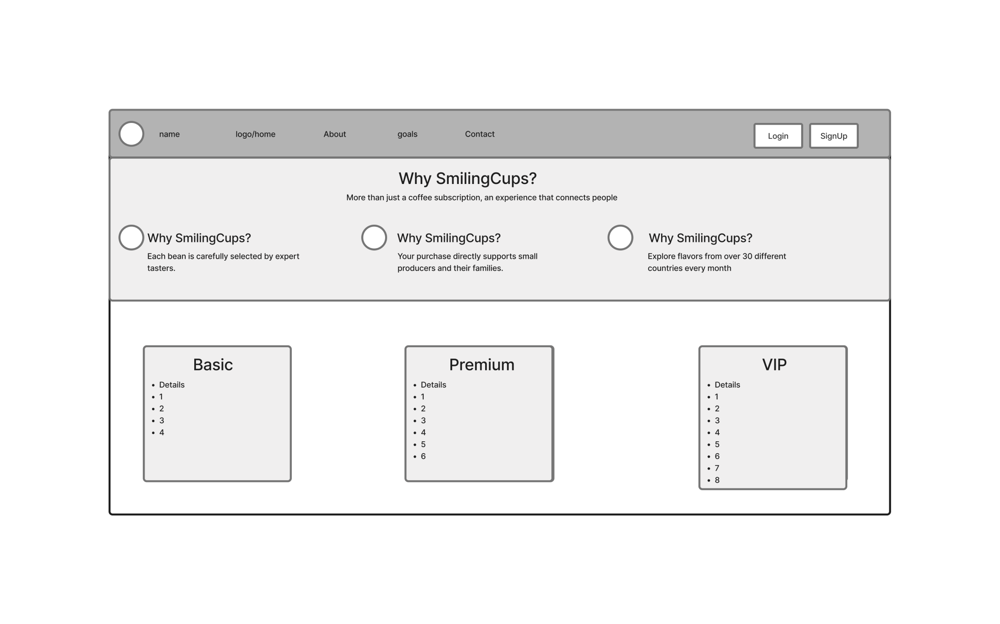
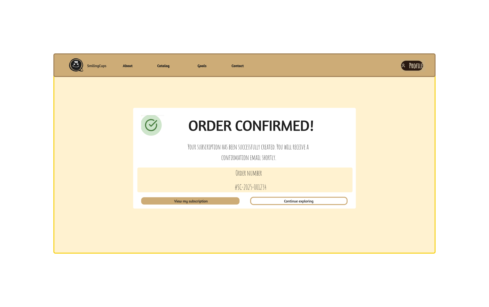
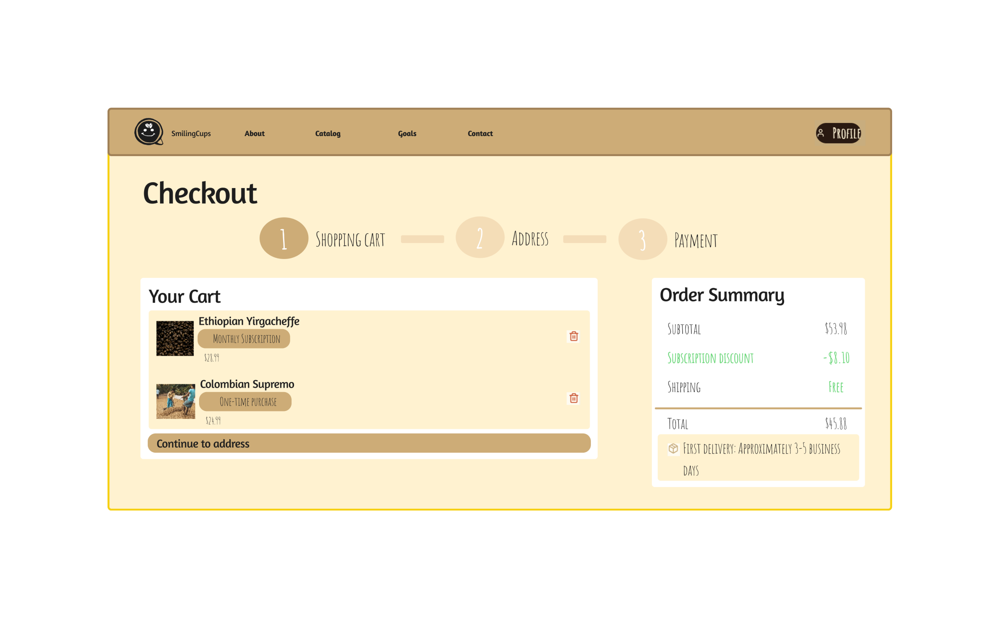
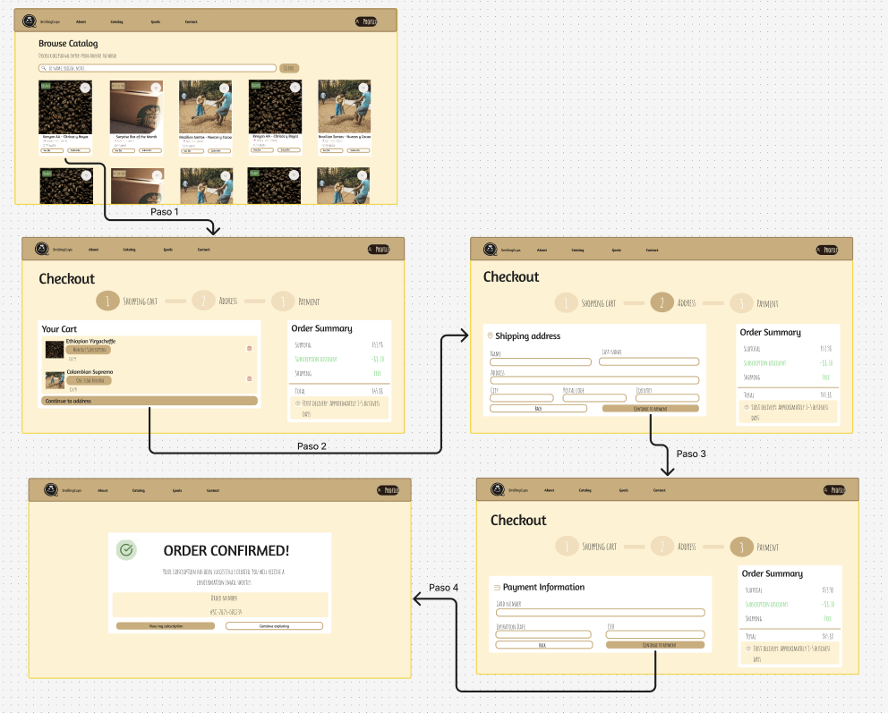

#### UNIVERSIDAD PERUANA DE CIENCIAS APLICADAS
### FACULTAD DE INGENIERÍA
### PROGRAMA ACADÉMICO DE INGENIERÍA DE SOFTWARE

**Ciclo:** 2025-20
 
**Curso:** 1AS10730 Aplicaciones Web
 
**NRC:** 7420
 
**Docente:** Alex Humberto Sánchez Ponce

---
# INFORME DE TRABAJO FINAL

**Nombre de la Startup:** ApoutCoffees

**Nombre del producto:** SmilingCups

## Integrantes
| Código | Apellidos y Nombres | Carrera |
| :--- | :--- | :--- |
| U202321613 | Paredes Chavez, Carlos Augusto | Ingeniería de Software |
| U202217678 | Aquino Solorzano, Daniel Jonatan | Ingeniería de Software |
| U20231F412 | Ojanama Abanto, Johnny Alexander | Ingeniería de Software |
| U202217288 | Pastor Napa, Juan Carlos | Ingeniería de Software |
| U20221E121 | Pelaez Vargas, Giuliano Angel | Ingeniería de Software |

**Fecha:** Diciembre, 2025

## Registro de versiones del informe
| Versión | Fecha | Autor | Descripción de modificación |
|---------|-------|-------|-----------------------------|
| 1.0    | 20.09.2025 | Todo el Equipo | Todo el equipo estuvo trabajando en el desarrollo de la documentación para el Sprint 1. |
| 1.1    | 09.11.2025 | Todo el Equipo | Todo el equipo se encargó del correcto desarrollo de la documentación del Sprint 2 las tareas definidias para el proyecto según la documentación del Sprint 2. |

---

## Project Report Collaboration Insights

	
[Repositorio de documentacion](https://github.com/ApoutCoffees/upc-pre-202510-1asi0730-7420-ApoutCoffees-report-tb1)  
Tabla inside de colaboradores   

[Repositorio del Landing Page](https://github.com/ApoutCoffees/SmilingCups-Landing-Page)  
Tabla inside de colaboradores   

[Repositorio del Fronted](https://github.com/ApoutCoffees/SmilingCups-Fronted)
Tabla inside de colaboradores   

[Repositorio del Backend](https://github.com/ApoutCoffees/SmilingCups-Backend)
Tabla inside de colaboradores   

---

# Tabla de Contenido

[Student Outcome](#student-outcome)

1. [Capítulo I: Introducción](#capítulo-i-introducción)
	- 1.1. [Startup Profile](#11-startup-profile) 
		- 1.1.1. [Descripción de la Startup](#111-descripción-de-la-startup)
		- 1.1.2. [Perfiles de integrantes del equipo](#112-perfiles-de-integrantes-del-equipo)
	- 1.2. [Solution Profile](#12-solution-profile)
		- 1.2.1 [Antecedentes y problemática](#121-antecedentes-y-problemática)
		- 1.2.2 [Lean UX Process](#122-lean-ux-process)
			- 1.2.2.1. [Lean UX Problem Statements](#1221-lean-ux-problem-statements)
			- 1.2.2.2. [Lean UX Assumptions](#1222-lean-ux-assumptions)
			- 1.2.2.3. [Lean UX Hypothesis Statements](#1223-lean-ux-hypothesis-statements)
			- 1.2.2.4. [Lean UX Canvas](#1224-lean-ux-canvas)
	- 1.3. [Segmentos objetivo](#13-segmentos-objetivo)
2. [Capítulo II: Requirements Elicitation & Analysis](#capítulo-ii-requirements-elicitation--analysis)
	- 2.1. [Competidores](#21-competidores)
		- 2.1.1. [Análisis competitivo](#211-análisis-competitivo)
		-  2.1.2. [Estrategias y tácticas frente a competidores](#212-estrategias-y-tácticas-frente-a-competidores)
	- 2.2. [Entrevistas](#22-entrevistas)
		-  2.2.1. [Diseño de entrevistas](#221-diseño-de-entrevistas)
		- 2.2.2. [Registro de entrevistas](#222-registro-de-entrevistas)
		- 2.2.3. [Análisis de entrevistas](#223-análisis-de-entrevistas)
	-  2.3. [Needfinding](#23-needfinding)
		- 2.3.1. [User Personas](#231-user-personas)
		- 2.3.2. [User Task Matrix](#232-user-task-matrix)
		- 2.3.3. [User Journey Mapping](#233-user-journey-mapping)
		- 2.3.4. [Empathy Mapping](#234-empathy-mapping)
	- 2.4. [Big Picture Event Storming](#24-big-picture-event-storming)
	- 2.5. [Ubiquitous Language](#25-ubiquitous-language)
3. [Capítulo III: Requirements Specification](#capítulo-iii-requirements-specification)
	- 3.1. [To-Be Scenario Mapping](#31-to-be-scenario-mapping)
	- 3.2. [User Stories](#32-user-stories)
	- 3.3. [Impact Mapping](#33-impact-mapping)
	- 3.4. [Product Backlog](#34-product-backlog)
4. [Capítulo IV: Product Design](#capitulo-iv-product-design)
	- 4.1. [Style Guidelines](#41-style-guidelines)
		- 4.1.1. [General Style Guidelines](#411-general-style-guidelines)
		- 4.1.2. [Web Style Guidelines](#412-web-style-guidelines)
	- 4.2. [Information Architecture](#42-information-architecture)
		- 4.2.1. [Organization Systems](#421-organization-systems)
		- 4.2.2. [Labeling Systems](#422-labeling-systems)
		- 4.2.3. [SEO Tags and Meta Tags](#423-seo-tags-and-meta-tags)
		- 4.2.4. [Searching Systems](#424-searching-system)
		- 4.2.5. [Navigation Systems](#425-navigation-systems)
	- 4.3. [Landing Page UI Design](#43-landing-page-ui-design)
		- 4.3.1. [Landing Page Wireframe](#431-landing-page-wireframe)
		- 4.3.2. [Landing Page Mock-up](#432-landing-page-mock-up)
	- 4.4. [Web Applications UX/UI Design](#44-web-applications-uxui-design)
		- 4.4.1. [Web Applications Wireframes](#441-web-applications-wireframes)
		- 4.4.2. [Web Applications Wireflow Diagrams](#442-web-applications-wireflow-diagrams)
		- 4.4.3. [Web Applications Mock-ups](#443-web-applications-mock-ups)
		- 4.4.4. [Web Applications User Flow Diagrams](#444-web-applications-user-flow-diagrams)
	- 4.5. [Web Applications Prototyping](#45-web-applications-prototyping)
	- 4.6. [Domain-Driven Software Architecture](#46-domain-driven-software-architecture)
		- 4.6.1. [Design-Level EventStorming](#461-design-level-event-storming)
		- 4.6.2. [Software Architecture Context Diagram](#462-software-architecture-context-diagram)
		- 4.6.3. [Software Architecture Container Diagrams](#463-software-architecture-container-diagrams)
		- 4.6.4. [Software Architecture Components Diagram](#464-software-architecture-components-diagrams)
	-  4.7. [Software Object-Oriented Design](#47-software-object-oriented-design)
		- 4.7.1. [Class Diagrams](#471-class-diagrams)
	- 4.8. [Database Design](#48-database-design)
		-  4.8.1. [Database Diagrams](#481-database-diagrams)
5. [Capítulo V: Product Implementation, Validation & Deployment](#capitulo-v-product-implementation-validation--deployment)
	- 5.1. [Software Configuration Management](#51-software-configuration-management)
		- 5.1.1. [Software Development Environment Configuration](#511-software-development-environment-configuration)
		- 5.1.2. [Source Code Management](#512-source-code-management)
		- 5.1.3. [Source Code Style Guide & Conventions](#513-source-code-style-guide--conventions)
		- 5.1.4. [Software Deployment Configuration](#514-software-deployment-configuration)
	- 5.2. [Landing Page, Services & Applications Implementation](#52-landing-page-services--applications-implementation)
		- 5.2.1. [Sprint 1](#521-sprint-1)
			- 5.2.1.1. [Sprint Planning 1](#5211-sprint-planning-1)
			- 5.2.1.2. [Aspect Leaders and Collaborators](#5212-aspect-leaders-and-collaborators)
			- 5.2.1.3. [Sprint Backlog 1](#5213-sprint-backlog-1)
			- 5.2.1.4. [Development Evidence for Sprint Review](#5214-development-evidence-for-sprint-review)
			- 5.2.1.5. [Execution Evidence for Sprint Review](#5215-execution-evidence-for-sprint-review)
			- 5.2.1.6. [Services Documentation Evidence for Sprint Review](#5216-services-documentation-evidence-for-sprint-review)
			- 5.2.1.7. [Software Deployment Evidence for Sprint Review](#5217-software-deployment-evidence-for-sprint-review)
			- 5.2.1.8. [Team Collaboration Insights during Sprint](#5218-team-collaboration-insights-during-sprint)
   - - 5.2.2. [Sprint 2](#522-sprint-2)
			- 5.2.2.1. [Sprint Planning 2](#5221-sprint-planning-2)
			- 5.2.2.2. [Aspect Leaders and Collaborators](#5222-aspect-leaders-and-collaborators)
			- 5.2.2.3. [Sprint Backlog 2](#5223-sprint-backlog-2)
			- 5.2.2.4. [Development Evidence for Sprint Review](#5224-development-evidence-for-sprint-review)
			- 5.2.2.5. [Execution Evidence for Sprint Review](#5225-execution-evidence-for-sprint-review)
			- 5.2.2.6. [Services Documentation Evidence for Sprint Review](#5226-services-documentation-evidence-for-sprint-review)
			- 5.2.2.7. [Software Deployment Evidence for Sprint Review](#5227-software-deployment-evidence-for-sprint-review)
			- 5.2.2.8. [Team Collaboration Insights during Sprint](#5228-team-collaboration-insights-during-sprint)
		- **5.2.3. [Sprint 3](#523-sprint-3)**
			- 5.2.3.1. [Sprint Planning 3](#5231-sprint-planning-3)
			- 5.2.3.2. [Aspect Leaders and Collaborators](#5232-aspect-leaders-and-collaborators)
			- 5.2.3.3. [Sprint Backlog 3](#5233-sprint-backlog-3)
			- 5.2.3.4. [Development Evidence for Sprint Review](#5234-development-evidence-for-sprint-review)
			- 5.2.3.5. [Execution Evidence for Sprint Review](#5235-execution-evidence-for-sprint-review)
			- 5.2.3.6. [Services Documentation Evidence for Sprint Review](#5236-services-documentation-evidence-for-sprint-review)
			- 5.2.3.7. [Software Deployment Evidence for Sprint Review](#5237-software-deployment-evidence-for-sprint-review)
			- 5.2.3.8. [Team Collaboration Insights during Sprint](#5238-team-collaboration-insights-during-sprint)
	- **5.3. [Validation Interviews](#53-validation-interviews)**
		- 5.3.1. [Diseño de Entrevistas](#531-diseño-de-entrevistas)
		- 5.3.2. [Registro de Entrevistas](#532-registro-de-entrevistas)
		- 5.3.3. [Evaluaciones según heurísticas](#533-evaluaciones-según-heurísticas)
	- **5.4. [Video About-the-Product](#54-video-about-the-product)**
      
	[Conclusiones](#conclusiones)

	[Bibliografía](#bibliografía)

	[Anexos](#anexos)

# Student Outcome

| Criterio específico | Acciones realizadas | Conclusiones |
| :--- | :--- | :--- |
| **Trabaja en equipo para proporcionar liderazgo en forma conjunta** | **Carlos Augusto Paredes Chavez** **TB1:** Lideró la definición de los segmentos objetivo y la priorización inicial del Product Backlog. **TP1:** Coordinó la integración del Landing Page y verificó la consistencia visual con el equipo de diseño. **TB2:** Dirigió la implementación de la vista de Historial de Pedidos y su conexión con el backend. **TF1:** Lideró la migración completa a la arquitectura DDD en el frontend y la revisión final de la documentación.  **Daniel Jonatan Aquino Solorzano** **TB1:** Definió la arquitectura base del backend en Node.js y la estrategia de autenticación con JWT. **TP1:** Lideró la implementación de los servicios RESTful para el catálogo de productos y gestión de usuarios. **TB2:** Organizó las tareas de integración de la lógica de suscripciones y la pasarela de pagos simulada. **TF1:** Supervisó el despliegue final en Render y la configuración de variables de entorno para producción.  **Johnny Alexander Ojanama Abanto** **TB1:** Lideró el diseño de los wireframes de alta fidelidad para el flujo de compra. **TP1:** Coordinó la implementación de componentes reutilizables en Vue.js para mantener la consistencia. **TB2:** Dirigió las pruebas de usabilidad del módulo de perfil de usuario. **TF1:** Lideró la corrección de estilos finales y la optimización de assets para el despliegue.  *(Completa aquí con Juan Carlos Pastor Napa y Giuliano Angel Pelaez Vargas siguiendo el mismo formato de hitos TB1, TP1, TB2, TF1)* | El equipo logró distribuir el liderazgo técnico y funcional de manera efectiva. Se asignaron roles claros (Product Owner, Arquitecto Backend, Lead Frontend) que permitieron tomar decisiones críticas de forma autónoma pero consensuada. Esta división facilitó la adopción de una arquitectura compleja como DDD sin bloquear el avance de los sprints, permitiendo cumplir con los objetivos de cada entrega a tiempo. |
| **Crea un entorno colaborativo e inclusivo, establece metas, planifica tareas y cumple objetivos** | **Giuliano Angel Pelaez Vargas** **TB1:** Configuró el repositorio en GitHub estableciendo las reglas de *Branch Protection* y el flujo *GitFlow*. **TP1:** Realizó *Code Reviews* semanales para asegurar la calidad del código y guiar a los compañeros con menos experiencia en Vue. **TB2:** Implementó las pruebas unitarias para el módulo de perfiles y favoritos, asegurando la estabilidad del código. **TF1:** Documentó la totalidad de los endpoints finales en Swagger para facilitar el consumo por parte del equipo de frontend.  **Juan Carlos Pastor Napa** **TB1:** Facilitó las sesiones de *Brainstorming* para el Event Storming y la definición de Bounded Contexts. **TP1:** Mantuvo actualizado el tablero Kanban (Trello), asegurando la visibilidad del progreso de las tareas. **TB2:** Apoyó en la corrección de errores de CSS y la adaptación *responsive* de las vistas críticas. **TF1:** Grabó y editó los videos finales de presentación (About the Product/Team), integrando el feedback de todo el equipo.  *(Asegúrate de que todos los integrantes tengan acciones en este criterio o en el anterior, cubriendo todas las entregas)* | Se estableció un flujo de trabajo colaborativo robusto mediante el uso estricto de GitFlow y revisiones de código obligatorias (Pull Requests). La planificación visual en Trello permitió identificar y resolver cuellos de botella a tiempo. A pesar de las dificultades técnicas en la integración de servicios externos, el equipo demostró resiliencia replanificando tareas en las reuniones diarias (*dailies*) para cumplir con el despliegue final en la fecha prevista. |
---

# Capítulo I: Introducción
## 1.1. Startup Profile

### 1.1.1. Descripción de la Startup

Nuestra startup, Smiling Cups, es una aplicación web que conecta a amantes del café con cafeterías locales, ofreciendo un servicio de suscripciones digitales, con beneficios y promociones para los compradores, y herramientas digitales para las cafeterías para obtener métricas de consumo, llegar a más clientes y lanzar promociones. De este modo, Smiling Cups, además de dar alcance a emprendimientos cafeteros, crea una comunidad digital en torno a la experiencia cafetera, aportando valor tanto a consumidores como a los negocios.

Misión: Por un lado, ofrecemos a los amantes del café un servicio digital accesible y escalable para explorar su gusto por el café mediante beneficios exclusivos a través de un modelo de suscripciones. Por otro lado, brindamos a los negocios herramientas tecnológicas para expandir su público y fidelizar a sus clientes.

Visión: Nuestra visión es convertirnos en la plataforma líder en experiencias digitales de café, conectando a amantes del café con cafeterías a través de un ecosistema innovador que promueva la comunidad cafetera.

### 1.1.2. Perfiles de integrantes del equipo 

| Integrante                       | Código     | Carrera / Información                                                                 |
|----------------------------------|------------|----------------------------------------------------------------------------------------|
| Aquino Solorzano, Daniel Jonatan | u202217678 | Ingeniería de Software. Responsable y puntual. Conocimientos en C++ y Java.            |
| Ojanama Abanto, Johnny Alexander | u20231f412 | Ingeniería de Software. Responsable y cooperativo. Conocimientos en C++, HTML, CSS y JavaScript |
| Paredes Chavez, Carlos Augusto   | u202321613 | Ingeniería de Software. Proactivo. Conocimientos en C++ y C#.                          |
| Pastor Napa, Juan Carlos         | u202217288 | Ingenieria de Software. Creativo. Conocimientos en C++, redes, electronica y tecnico.  |
| Pelaez Vargas, Giuliano Angel    | u20221e121 | Ingeniería de Software. Solidario y enfocado. Conocimientos en C++, Python y Lua. |

## 1.2. Solution Profile 

ApoutCoffees es una plataforma en línea enfocada en la venta de cajas de misterio de café de alta calidad, que incluye cafés elegidos de pequeños proyectos peruanos.

 Su objetivo es enlazar a los consumidores con vivencias singulares de cata, proporcionando una compra digital fácil y atractiva, a la vez que otorga visibilidad y mayores beneficios a los productores locales. 

La app ofrece la opción de seleccionar entre tres clases de cajas misteriosas, cada una con un rango de precios diferente, presentadas en porciones individuales y con tarjetas informativas sobre el origen, perfiles de sabor y el proyecto detrás de cada café.

 De este modo, los consumidores encuentran nuevas opciones sin dificultades, mientras que los productores de café tienen acceso a un canal de venta en línea que aumenta su difusión del consumo local de café peruano.

### 1.2.1. Antecedentes y Problemática

Para entender mejor las necesidades de nuestros usuarios, hemos investigado sus antecedentes históricos y el problema utilizando la técnica de las 5W’s y 2H’s. Esta técnica es un método de análisis que ayuda a centrarse en las causas de un problema. Nuestro estudio se fundamenta en los antecedentes que han experimentado nuestros usuarios. A continuación, presentamos la información recopilada a través de esta técnica.  

### **What?**  
**¿Cuál es la dificultad?**  
El problema central que enfrentamos es la dificultad que tienen los consumidores para obtener cafés peruanos de pequeños agricultores de manera práctica, atractiva y contemporánea. A pesar de que Perú es conocido por la excelencia de su café, gran parte de la producción de pequeñas empresas no alcanza al consumidor final debido a la ausencia de canales de distribución innovadores. Esto restringe la visibilidad de los productores y quita a los consumidores experiencias variadas y de calidad.  

**¿Qué tipo de vínculo existe con la persona mencionada?**  
Los consumidores se ven directamente impactados al contar con escasas alternativas para encontrar cafés nuevos y diversos. Simultáneamente, los pequeños productores de café y los emprendimientos se enfrentan a dificultades en la comercialización y a la limitada accesibilidad a un mercado más extenso.  

### **When**  
**¿Cuándo ocurre el inconveniente?**  
- En el proceso de adquisición, al buscar cafés especiales, los consumidores se topan con opciones restringidas en supermercados o grandes cadenas.  
- En ocasiones de obsequio o de compra personal, cuando buscan una experiencia de alta calidad, pero no hallan opciones creativas ni asequibles.  

**¿Cuándo emplea el cliente el producto?**  
Los usuarios emplearán la aplicación web para elegir una de las 3 cajas misteriosas ofrecidas de acuerdo a su presupuesto (básica, premium o exclusiva). Emplearán el servicio tanto para uso personal como para obsequios o suscripciones mensuales.  

### **Where**  
**¿En qué lugar se encuentra el cliente al utilizar el producto?**  
El cliente ingresa desde su hogar, oficina o cualquier sitio con internet, a través de la aplicación web.  

**¿De dónde proviene el inconveniente?**  
La dificultad se presenta en la escasa participación de pequeños productores en el ámbito digital y en la carencia de plataformas que hagan de la adquisición de café una experiencia interesante y adaptada a cada cliente.  

### **Who**  
**¿Quiénes están involucrados?**  
- Pequeños productores de café peruano.  
- Consumidores interesados en experiencias premium, regalos o productos diferenciados.  
- Jóvenes profesionales y entusiastas del café.  

**¿A quiénes le sucede el problema?**  
A consumidores que buscan calidad y novedad en el café, y a productores que no logran colocar sus productos en mercados más amplios.  

**¿Quién lo utilizará?**  
El servicio será usado por consumidores nacionales e internacionales que deseen experimentar con cafés peruanos mediante un formato moderno, además de empresas que requieran regalos corporativos.  

### **Why**  
**¿Cuál es la causa principal del problema?**  
- Escasa digitalización en el sector cafetalero.  
- Dependencia de intermediarios que reducen el margen de ganancia de pequeños productores.  
- Falta de formatos innovadores de consumo (más allá de la bolsa tradicional de café).  
- Creciente demanda por experiencias de compra modernas que mezclen conveniencia digital con productos artesanales.  

### **How?**  
**¿Cómo ocurre el problema?**  
El problema ocurre porque la cadena de comercialización del café no prioriza a pequeños productores ni genera experiencias diferenciales para el consumidor final.  

**¿Cómo es percibido el problema por el usuario?**  
El consumidor percibe la compra de café como algo rutinario, poco atractivo y limitado a opciones genéricas. La falta de acceso a cafés diferenciados se siente como una barrera para explorar la riqueza del café peruano.  

**¿Cómo podemos abordar el problema?**  
**ApoutCofees** ofrece una plataforma web intuitiva que permite elegir entre tres planes de mystery boxes de café peruano. Las cajas incluyen cafés fraccionados, cartas informativas sobre el productor y notas de cata, creando una experiencia premium y educativa.  

**¿En qué condiciones los clientes usan nuestro producto?**  
- En compras digitales rápidas.  
- Al buscar un regalo premium.  
- Al desear probar nuevas variedades de café sin tener que comprar bolsas enteras.  

**¿Cómo nos conocieron los compradores?**  
- Redes sociales (Instagram, TikTok).  
- Marketing digital especializado en experiencias gourmet.  
- Recomendaciones boca a boca.  

**¿Cómo prefieren los clientes acceder al contenido?**  
A través de una aplicación web clara, con opciones simples de elección (tres cajas), información sobre cafés y posibilidad de suscripción.  

**¿Qué llevó a la persona a llegar a esta situación?**  
La necesidad de experiencias de consumo más innovadoras, la falta de acceso a cafés de pequeños emprendimientos, y el deseo de apoyar el comercio justo mientras disfrutan de un producto premium.  

### **How Much**  
- El mercado mundial de café mueve más de USD 200 mil millones anuales.  
- Perú es el noveno exportador mundial de café, con 223 mil toneladas exportadas en 2023 (SUNAT – Junta Nacional del Café).  
- Más del 90 % de los productores peruanos son pequeños caficultores, con limitadas herramientas de comercialización digital.  
- El consumo interno en Perú ha crecido un 25 % en los últimos 5 años, especialmente en el segmento de cafés especiales (Cámara Peruana del Café y Cacao).  

Esto demuestra que existe una alta demanda insatisfecha, y una oportunidad clara para **ApoutCofees** de conectar digitalmente a pequeños productores con consumidores nacionales e internacionales.  

### 1.2.2. Lean UX Process
#### 1.2.2.1 Lean UX Problem Statements

Nuestro producto de software tiene como objetivo conectar eficazmente mediante un entorno digital a empresas cafeteras con consumidores de café. Ofreciendo funcionalidades innovadoras como entregas en forma de cajas misteriosas y contando con métricas de consumo para ayudar a las marcas con el análisis del mercado.

La problemática principalmente radica en que las marcas o empresas cafeteras peruanas (especialmente las más pequeñas) no poseen mucha visibilidad en el mercado y por consiguiente no logran llegar llegar al público objetivo. Esto genera que no consigan los ingresos esperados y sus negocios no logren conseguir el éxito empresarial.

¿Cómo podemos ayudar a las empresas cafeteras a lograr ganar visibilidad en el mercado del café para que puedan mejorar sus ingresos y sus productos puedan llegar a ser reconocidos por el consumidor objetivo?

#### 1.2.2.2. Lean UX Assumptions

- Las empresas cafeteras necesitan una herramienta digital que logre dar visibilidad a sus productos
- Estas marcas buscan que sus productos no solo se vendan bien sino que también logren transmitir y generar reconocimiento para los responsables de la producción de ese café
- Las funcionalidades creativas de la aplicación lograrán incrementar su popularidad en el mercado del café
- Los consumidores se verán atraídos por la aplicación web gracias a sus funcionalidades como las cajas misteriosas.

##### 1.2.2.2.1. Assumptions Worksheet 

**¿Quién es el usuario?**
- Empresas cafeteras peruanas que necesiten ganar visibilidad en el mercado para que sus productos lleguen mayor público
- Consumidores cotidianos de café que se vean atraídos por una aplicación que venda café de forma creativa e innovadora.
  
**¿Dónde encaja el producto en su vida?**
En la etapa de comercialización digital de café hacia el publico consumidor objetivo y al momento de realizar una búsqueda de posibles cafés para el consumo mismo del cliente de estas empresas
  
**¿Qué problemas tiene y cómo se resuelven?**
Las marcan cafeteras presentan el problema de no lograr darle la mayor visibilidad posible a sus productos debido a una falta de adaptación al mercado contemporáneo y la forma en que intentan resolver estos problemas es recurrir a mayor inversión en estrategias de Marketing y publicidad
  
**¿Cuándo y cómo se usa el producto?**
El producto se usa cuando los consumidores tienen la intención de comprar café mediante cajas misteriosas que ofrecen una experiencia atractiva para el usuario, por otro lado las marcas usarán el producto cuando necesiten saber sobre métricas y datos de consumo de sus clientes mediante las funcionalidades que ofrece la aplicación. 
  
**¿Qué características son importantes?**
  
-   Cajas misteriosas personalizables
    
-   Métodos de suscripción para funcionalidades extras y mejoradas
    
-  Catálogos de cafés y cajas misteriosas
    
-   Sección de comentarios y reseñas sobre cada café y caja misteriosa
    
-   Sección informativa sobre productores y marcas cafeteras
    
-   Métricas sobre datos de consumo de los clientes para cada empresa

**¿Cómo debe verse nuestro producto y cómo comportarse?**

La aplicación debe verse atractiva para el cliente, transmitiendo un ambiente relacionado a la razón del negocio que es el café. Debe comportarse de forma amigable e intuitiva con el usuario, demostrando que es fácil de usar y entender

##### 1.2.2.2.2. Business Outcomes 

- Incrementar los ingresos mensuales del producto mediante planes de suscripción premium a nuestros usuarios por funcionalidades agregadas y mejoradas

- Expandir las conexiones y convenios con empresas cafeteras del país para que tengamos al rededor de 50 marcas para el primer año

- Incrementar la visibilidad y reconocimiento del negocio en la mayor parte del país mediante estrategias de Marketing para seguir impulsando el crecimiento de nuestra empresa

- Incrementar el porcentaje del número de registros mensuales a la aplicación web
- Reducir el porcentaje de usuarios que dejan de usar la aplicación escuchando sus quejas y feedback que dejen en la sección de reseñas del producto 

##### 1.2.2.2.4. User Outcomes 

-   **Público Consumidor**
    
    -   Descubrir nuevos tipos de café de forma creativa y entretenida
        
    -   Disfrutar de la incertidumbre sobre los artículos que le tocarán al momento de comprar las cajas misteriosas
        
    -   Estar seguro que recibe un servicio de calidad con cafés de buena marca
        
    -   Ahorrar tiempo al poder comprar cafés de forma remota desde cualquier lugar en el que se encuentre
        
        
-   **Empresa cafetera**:
    
    -   Llegar a conectar con un mayor número de clientes sin necesidad de recurrir a grandes inversiones en Marketing.
        
    -   Obtener métricas sobre datos de consumo que le ayudan a mejorar su negocio
             
    -   Aumentar la visibilidad de su marca gracias a un entorno digital, práctico y eficaz.
        
    -   Sentirse cómodos de trabajar en torno de un ambiente digital que facilita muchas funcionalidades.

##### 1.2.2.2.5. Features

- Cajas misteriosas con artículos relacionados al café
- Catálogos de cafés con descripción de cada uno
- Sistema de compendio de cafés coleccionados 
- Sistema de logros y gamificación para el usuario consumidor
- Sección informativa sobre marcas de café y productores
- Métricas sobre datos de consumo para cada empresa cafetera 
- Sección de reseñas y comentarios para cada café y caj misteriosa
- Sección de perfil personal de usuario para ver información personal y sobre estadísticas de su cuenta
- Historial de cajas misteriosas y cafés consumidos por los usuarios consumidores

#### 1.2.2.3. Lean UX Hypothesis Statements
##### 1.2.2.3.1. Hipótesis de Usuario

-   **Creemos que** los consumidores valorarán descubrir cafés nuevos de forma entretenida y fácil.  
    **Sabremos que es cierto cuando** veamos que al menos un 10% de las reseñas positivas de la aplicación son sobre la funcionalidad de las cajas misteriosas
    
    
-   **Creemos que** los usuarios se sentirán interesados sobre los datos del café. que reciben en las cajas misteriosas  
	**Sabremos que es cierto cuando** veamos que al menos un 15% de las reseñas positivas de la aplicación son sobre los añadidos de estos datos en las cajas misteriosas
    
    
-   **Creemos que** los clientes prefieren comprar café de forma digital y remota.  
    **Sabremos que es cierto cuando** veamos que aumentan en 60% la cantidad de ventas fuera de horario comercial presencial de las empresas
        
-   **Creemos que** los usuarios valoran la rapidez en la entrega.  
    **Sabremos que es cierto cuando** el 75% califique 4 o 5 estrellas en tiempos de entrega.
    
-   **Creemos que** los clientes quieren sentirse parte de una comunidad cafetera.  
    **Sabremos que es cierto cuando** un 30% de los usuarios publiquen en las reseñas de las aplicación que desean un entorno social y comunitario dentro de la app

##### 1.2.2.3.2. Hipótesis de Negocio

-   **Creemos que** ofrecer suscripciones en la aplicación generará buenos ingresos recurrentes.  
    **Sabremos que es cierto cuando** después de 6 hayamos aumentado los ingresos en un 60%
    
    
-   **Creemos que** incluir cafeteras conocidas atraerá más usuarios.  
    **Sabremos que es cierto cuando** veamos un crecimiento del 30% en usuarios registrados.  
   
    
-   **Creemos que** ofrecer promociones de envíos gratuitos a suscriptores aumentará la cantidad de usuarios que se registran.  
    **Sabremos que es cierto cuando** veamos un aumento del 10% en usuarios que se registran en periodos de promociones especiales
    
    
-   **Creemos que** la aplicación ganará reconocimiento gracias a las estrategias de Marketing en redes sociales
    **Sabremos que es cierto cuando** veamos un incremento del 40% de usuarios que se registran en periodos de publicación de comerciales

#### 1.2.2.4. Lean UX Canvas

## 1.3. Segmentos Objetivo
- Segmento 1: Consumidores urbanos jóvenes y entusiastas del café
	-Perfil: Estudiantes o profesionales, edades entre 20-40 años, familiarizados con compras digitales.
	-   Necesidades:
		-   Encontrar calidad, novedad y conexión con el origen del producto.
		-   Hallar experiencias distintas con un producto familiar.
	-   Como ayuda SmilingCups:
		-   Ofrece opciones de café variadas a través de la experiencia de las "Mystery Boxes".
    
		-   Otorga visibilidad a emprendimientos de café con propuestas atractivas para un público casual.
-   Segmento 2: Marcas cafeteras peruanas de limitado acceso digital
	-   Perfil: Emprendimientos, microempresas cafeteras del Perú.
	-   Necesidades:
		-   Obtener mayor visibilidad y alcance al público cafetero.
		-   Llevar a conocer popularmente diversas propuestas con el café peruano.
	-   Como ayuda SmilingCups:
		-   Brinda los medios por los que los diversos emprendimientos cafeteros pueden darse a conocer a un público más amplio.

# Capítulo II: Requirements Elicitation & Analysis
## 2.1. Competidores 

Se identificaron hasta la fecha a 3 principales competidores para la aplicación web de nuestro startup, centrado en el mercado digital del café.

| id | nombre | descripcion general del competidor | propuesta de valor / características principales | canales de distribución / comercialización | logo_url |
|----|--------|-------------------------------------|------------------------------------------------|-------------------------------------------|----------|
| 1  | Coffee Hunters Perú | Comercializadora de cafés de especialidad dedicada a viajar a fincas de productores cafeteros peruanos para encontrar y comercializar cafés de alta calidad de manera justa | - Trazabilidad completa de los cafés - Presentaciones a pequeña escala - Selección directa de fincas cafeteras | - Venta directa - Comercio electrónico - Tiendas especializadas |  |
| 2  | Café Compadre | Marca de café de especialidad peruana con proceso de producción usando energía solar y compromiso con agricultores locales | - Café de especialidad - Sostenibilidad socio-ambiental - Proceso de producción con energía solar | - Venta directa - Canales digitales - Tiendas de productos orgánicos |  |
| 3  | Tunki Coffee | Cooperativa con amplia experiencia en producción de café especial, orgánico y de calidad | - Alta calidad de café - Variedad de formatos de producto - Café orgánico certificado | - Cooperativa de productores - Comercio electrónico - Distribución especializada |  |

### 2.1.1 Análisis Competitivo

<table class="tg"> <thead> <tr> <th class="tg-0pky" colspan="6">Competitive Analysis Landscape</th> </tr> </thead> <tbody> <!-- Propósito --> <tr> <td class="tg-0pky" colspan="6"><strong>Propósito del análisis:</strong> Evaluar la posición de nuestra plataforma digital de café frente a tres competidores clave del mercado peruano de café de especialidad para identificar ventajas competitivas, riesgos y tácticas prioritarias que permitan ganar cuota en el mercado.</td> </tr> <!-- Pregunta guía --> <tr> <td class="tg-0pky" colspan="6"><strong>Pregunta guía:</strong> ¿Cómo se compara nuestra plataforma digital en oferta, producto, mercado y potencial estratégico frente a Coffee Hunters Perú, Café Compadre y Tunki Coffee, y qué acciones tácticas deben priorizarse para diferenciarse y crecer?</td> </tr> <!-- Cabecera --> <tr> <td class="tg-0pky" colspan="2"></td> <td class="tg-0lax">Smiling Cups</td> <td class="tg-0pky">Coffee Hunters Perú</td> <td class="tg-0pky">Café Compadre</td> <td class="tg-0pky">Tunki Coffee</td> </tr> <!-- Perfil --> <tr> <td class="tg-0pky" rowspan="2">Perfil</td> <td class="tg-0pky">Overview</td> <td class="tg-0lax">Plataforma digital innovadora que conecta consumidores con marcas de café mediante cajas misteriosas y experiencias interactivas de descubrimiento de café.</td> <td class="tg-0pky">Comercializadora de cafés de especialidad que viaja a fincas para encontrar cafés de alta calidad.</td> <td class="tg-0pky">Marca de café de especialidad con proceso de producción sostenible usando energía solar.</td> <td class="tg-0pky">Cooperativa dedicada a la producción de café especial, orgánico y de calidad.</td> </tr> <tr> <td class="tg-0pky">Ventaja Competitiva ¿Qué valor ofrece a los clientes?</td> <td class="tg-0lax">- Experiencia gamificada de descubrimiento de café - Cajas misteriosas personalizadas - Métricas de consumo para usuarios - Conectividad directa entre productores y consumidores via carta.</td> <td class="tg-0pky">- Trazabilidad completa de los cafés - Selección directa de fincas - Presentaciones a pequeña escala</td> <td class="tg-0pky">- Sostenibilidad socio-ambiental - Proceso de producción con energía solar - Compromiso con agricultores locales</td> <td class="tg-0pky">- Alta calidad de café - Variedad de formatos de producto - Café orgánico certificado</td> </tr> <!-- Perfil de marketing --> <tr> <td class="tg-0pky" rowspan="2">Perfil de marketing</td> <td class="tg-0pky">Mercado objetivo</td> <td class="tg-0lax">- Consumidores digitales - Amantes del café - Millennials y Gen Z - Consumidores interesados en experiencias únicas</td> <td class="tg-0pky">- Consumidores de café de especialidad - Interesados en trazabilidad - Compradores conscientes</td> <td class="tg-0pky">- Consumidores ecológicos - Interesados en sostenibilidad - Consumidores de café premium</td> <td class="tg-0pky">- Consumidores de café gourmet - Interesados en productos orgánicos - Compradores de café de alta calidad</td> </tr> <tr> <td class="tg-0pky">Estrategias de marketing</td> <td class="tg-0lax">- Marketing digital - Redes sociales - Contenido interactivo - Programa de referidos - Alianzas con influencers de café</td> <td class="tg-0pky">- Storytelling de origen - Marketing de contenidos - Ferias de café - Redes sociales especializadas</td> <td class="tg-0pky">- Marketing de sostenibilidad - Eventos de concientización - Redes sociales ecológicas</td> <td class="tg-0pky">- Marketing de calidad - Participación en concursos de café - Presentaciones en eventos especializados</td> </tr> <!-- Perfil de producto --> <tr> <td class="tg-0pky" rowspan="3">Perfil de producto</td> <td class="tg-0pky">Productos o servicios</td> <td class="tg-0lax">- Cajas misteriosas de café - Plataforma digital interactiva - Sistema de recomendaciones - Perfil de consumo de café</td> <td class="tg-0pky">- Café de especialidad - Selecciones de origen - Lotes limitados</td> <td class="tg-0pky">- Café de especialidad - Café con energía solar - Presentaciones únicas</td> <td class="tg-0pky">- Café orgánico - Diversos formatos - Café de especialidad</td> </tr> <tr> <td class="tg-0pky">Precios y costos</td> <td class="tg-0lax">- Modelo de suscripción - Planes flexibles - Cajas con diferentes rangos de precio - Opciones personalizables -Opcion de entrada notablemente economica.</td> <td class="tg-0pky">- Precios premium - Lotes pequeños - Variabilidad de precios</td> <td class="tg-0pky">- Precios premium - Enfoque en sostenibilidad - Valor agregado ecológico</td> <td class="tg-0pky">- Precios altos por especialidad - Diferentes rangos de precio - Certificaciones orgánicas</td> </tr> <tr> <td class="tg-0pky">Canales de distribución</td> <td class="tg-0lax">- Plataforma web - Aplicación móvil - Entrega directa - Alianzas con cafeterías</td> <td class="tg-0pky">- Comercio electrónico - Tiendas especializadas - Venta directa</td> <td class="tg-0pky">- Canales digitales - Tiendas de productos orgánicos - Venta directa</td> <td class="tg-0pky">- Comercio electrónico - Distribución especializada - Cooperativa</td> </tr> <!-- Análisis FODA --> <tr> <td class="tg-0pky" rowspan="4">Análisis FODA</td> <td class="tg-0pky">Fortalezas</td> <td class="tg-0lax">- Innovación tecnológica - Experiencia interactiva - Conexión directa productor-consumidor - Métricas personalizadas</td> <td class="tg-0pky">- Conocimiento directo de origen - Selección cuidadosa - Relaciones con productores</td> <td class="tg-0pky">- Compromiso ambiental - Proceso de producción único - Imagen de marca ecológica</td> <td class="tg-0pky">- Reconocimiento de mercado - Calidad consistente - Experiencia en producción</td> </tr> <tr> <td class="tg-0pky">Debilidades</td> <td class="tg-0lax">- Plataforma nueva - Necesidad de construir confianza - Dependencia de tecnología - Curva de aprendizaje para usuarios</td> <td class="tg-0pky">- Volatilidad de sabores - Inconsistencia en lotes - Escala limitada</td> <td class="tg-0pky">- Precios más altos - Disponibilidad limitada - Mercado reducido</td> <td class="tg-0pky">- Poca presencia digital - Precios elevados - Diversificación limitada</td> </tr> <tr> <td class="tg-0pky">Oportunidades</td> <td class="tg-0lax">- Crecimiento del mercado digital - Interés en experiencias personalizadas - Consumidores digitales emergentes - Tendencia hacia consumo consciente</td> <td class="tg-0pky">- Interés en trazabilidad - Consumidores conscientes - Mercado de especialidad en crecimiento</td> <td class="tg-0pky">- Conciencia ambiental - Preferencia por sostenibilidad - Consumidores eco-friendly</td> <td class="tg-0pky">- Crecimiento de café de especialidad - Demanda de productos orgánicos - Interés en calidad</td> </tr> <tr> <td class="tg-0pky">Amenazas</td> <td class="tg-0lax">- Competencia tecnológica - Cambios rápidos en preferencias digitales - Barrera de entrada tecnológica - Posible saturación de mercado</td> <td class="tg-0pky">- Competencia de grandes marcas - Volatilidad de precios - Cambio climático</td> <td class="tg-0pky">- Altos costos de producción - Competencia de marcas tradicionales - Precios poco competitivos</td> <td class="tg-0pky">- Entrada de nuevos competidores - Presión de precios - Regulaciones cambiantes</td> </tr> </tbody> </table>
	  
- 
	  
- 
### 2.1.2. Estrategias y tácticas frente a competidores

-   **Diferenciación de producto:** Mystery box interactivas, algo que los competidores no ofrecen.
    
-   **Estrategia de precio:** Planes de suscripción flexibles y promociones exclusivas para fidelizar usuarios.
    
-   **Táctica digital:** Campañas en Instagram y TikTok para atraer a un público joven urbano.
        

## 2.2. Entrevistas

---

### 2.2.1. Diseño de entrevistas

**Perfil:** Consumidores urbanos jóvenes y entusiastas del café.  
**Necesidades:** Encontrar novedad y experienias variadas en un producto conocido, el café.

**Preguntas de entrevista:**
-   ¿Qué tipo de café sueles consumir y dónde lo compras normalmente?  
-   ¿Has probado alguna vez cafés de origen peruano de pequeños productores?  
-   ¿Qué te parecería recibir una "Mystery Box" con cafés seleccionados y fichas informativas de cada uno?  
-   ¿Qué factores te motivarían a tener una suscripción a un servicio mensual de café?  
-   ¿Qué tan importante es para ti conocer la historia detrás del producto que consumes?  
-   ¿Qué elementos visuales o de diseño te llaman la atención de una aplicativo de café?  
-   ¿Usarías esta app como opción de regalo? ¿Qué te gustaría que incluya para que sea especial?

 **Perfil:** Marcas cafeteras peruanas de limitado acceso digital.  
**Necesidades:** Obtener visibilidad y aumentar su alcance al público cafetero.

**Preguntas de entrevista:**
-   ¿Qué canales usas actualmente para vender tus productos?  
-   ¿Has probado utilizar las redes sociales para vender el café? ¿Qué funcionó y qué no?  
-   ¿Qué te parecería formar parte de una plataforma que promocione tus productos a través de mystery Boxes junto a otros productores?  
-   ¿Qué información te gustaría que los consumidores conozcan sobre tu marca y tu café?  
-   ¿Qué tipo de apoyo necesitarías para participar en una plataforma digital como SmilingCups? 
-   ¿Cómo mides actualmente el impacto o éxito de tus ventas? ¿Te interesaría acceder a métricas de consumo?  
-   ¿Qué esperas de una alianza con una plataforma como esta? ¿Qué beneficios te parecerían justos?

### 2.2.2. Registro de entrevistas

___-Segmento Objetivo 1___

__Entrevista 1 (Alejandro)__

+ Nombre: Alejandro
+ Edad: 21
+ Distrito de residencia: La Molina

**Resumen de Entrevista :**
Alejandro, 21 años y residente en La Molina, consume café de forma ocasional y no suele ser quien lo compra, ya que prefiere que su hermana se encargue. Está dispuesto a probar cafés de pequeños productores y le interesa la idea de recibir una "mystery box" mensual con selecciones distintas; sin embargo, duda sobre si conocer la historia u origen del café le aportaría valor.

---

__Entrevista 2 (Franco Matías Flores)__

+ Nombre: Franco Matías Tasayko Flores
+ Edad: 20
+ Distrito de residencia: San Borja

**Resumen de Entrevista :**
Franco Matías Tasayko Flores, de 20 años, tiene una relación con el café marcada por la tradición familiar: su abuela solía tomarlo habitualmente, lo que dejó una impronta en su experiencia aunque él no sea un gran consumidor. A pesar de su bajo consumo personal, muestra disposición a explorar y probar cafés de pequeños productores, lo que sugiere interés por la autenticidad, la trazabilidad y el valor artesanal del producto. Le resulta atractiva la idea de recibir una Mystery Box de café, lo que revela curiosidad sensorial y una preferencia por experiencias de descubrimiento más que por la lealtad a una marca o perfil de sabor concreto. En conjunto, esto indica que, aunque su consumo actual es limitado, Franco es un consumidor potencialmente receptivo a estrategias de marketing basadas en la exploración, las muestras y las historias sobre origen y productores; la influencia familiar explica la familiaridad y la apertura inicial, mientras que su interés en pequeños productores y formatos sorpresa denota una motivación más experiencial y ética que puramente funcional.

---

__Entrevista 3 (Fabricio Quispe Barzola)__

+ Nombre: Fabricio Fabián Quispe Barzola
+ Edad: 20
+ Distrito de residencia: Ate

**Resumen de Entrevista :**
Entrevista a Fabricio Fabián Quispe Barzola (24, Diseñador Gráfico), consumidor del Segmento 1. Fabricio relata su frustración al sentir "parálisis por análisis" ante la excesiva terminología técnica en las tiendas de café, terminando por comprar siempre lo mismo por miedo a equivocarse. Como diseñador, valora profundamente la estética del empaque. Se muestra muy interesado en el concepto de "Mystery Box" como una forma lúdica de descubrir nuevos orígenes sin la presión de elegir, condicionado a que el producto garantice frescura y sostenibilidad.

---

___-Segmento Objetivo 2___

__Entrevista 4 (Jhonatan Murga Abad)__

+ Nombre: Jhonatan Murga Abad
+ Edad: 34
+ Distrito de residencia: San Miguel
+ Sector: Producción y comercialización de café

**Resumen de Entrevista :**
Jhonatan Murga Abad, ingeniero agroindustrial, comparte la experiencia de comercializar el café familiar; actualmente vende principalmente a través de distribuidores y por WhatsApp, con un volumen modesto y una fuerte dependencia de intermediarios, lo que limita su control sobre precio, posicionamiento y la relación directa con el cliente. El principal cuello de botella es la logística: sin una solución de distribución directa, llegar al consumidor final resulta difícil y frena el crecimiento. Aunque utiliza canales digitales básicos como WhatsApp, no cuenta con una estrategia digital robusta —no hay tienda en línea, presencia comercial estructurada en marketplaces ni métricas claras— y por eso carece de datos sobre preferencias de los clientes, presentaciones o sabores más aceptados y la sensibilidad al precio. Muestra interés en modelos innovadores como el Mystery Box para diversificar la oferta y captar clientes finales, pero su implementación depende de solucionar la logística y la distribución. En conjunto, la falta de métricas y canales directos dificulta la toma de decisiones informadas y la escalabilidad; las prioridades inmediatas serían resolver la cadena de distribución, construir canales digitales que permitan vender directo al consumidor y recopilar datos de clientes para optimizar presentaciones, precios y promociones.

---

__Entrevista 5 (Toby Dextre)__

+ Nombre: Toby Dextre
+ Edad: 23
+ Distrito de residencia: Surco
+ Sector: Emprendimiento de café

**Resumen de Entrevista :**
Dextre, un estudiante que vende café por Instagram; comenzó por necesidad económica y usa la plataforma para mostrar su producto, pero aunque recibe muchas vistas le cuesta convertirlas en ventas porque su alcance se limita a su círculo cercano y los compradores dudan por falta de confianza y desconocimiento del proceso; él prepara, empaqueta y entrega el café personalmente y atiende por mensajes, lo que facilita la comunicación pero le consume tiempo y choca con sus responsabilidades universitarias, por lo que necesita mejores herramientas para pago y envío, reseñas que generen confianza y una plataforma que conecte a pequeños vendedores con consumidores interesados para aumentar visibilidad y reducir la carga operativa.

---

__Entrevista 6 (Kory Milagros)__

+ Nombre: Kory Milagros
+ Edad: 48
+ Distrito de residencia: Surquillo
+ Sector: Comercialización de café

**Resumen de Entrevista :**
Kory Milagros cuenta su experiencia vendiendo café principalmente a través del boca a boca y WhatsApp, lo que evidencia que su clientela se construye por confianza personal y redes locales; esto sugiere que una plataforma que conecte vendedores con consumidores y ofrezca pagos seguros y logística confiable podría escalar su modelo sin romper esas relaciones directas. Además, la idea de las Mystery Boxes aparece como una oportunidad para que Kory aumente la visibilidad de productos menos conocidos y fomente la prueba por parte de nuevos clientes, aunque requiere atención en la gestión de expectativas, control de calidad y trazabilidad para mantener la satisfacción y fidelidad. En resumen, su trayectoria muestra potencial para formalizar ventas informales si se le brinda soporte tecnológico y operativo que preserve la confianza que hoy logra personalmente.

### 2.2.3. Análisis de entrevistas

**Segmento Objetivo 1:**

Este segmento está compuesto por consumidores jóvenes (21 y 20 años) que tienen un consumo ocasional o limitado de café, pero muestran apertura hacia la exploración y la prueba de productos de pequeños productores. La motivación principal es experiencial y curiosa: la "Mystery Box" les atrae como formato novedoso y lúdico, más que por la necesidad de un consumo constante. La complejidad radica en que su consumo no es rutinario ni estable, lo que implica que la fidelización no puede basarse en el hábito, sino en propuestas que refuercen la experiencia, la sorpresa y la conexión emocional. Aunque son receptivos, requieren estrategias de comunicación claras y atractivas para convertir interés en compra efectiva.

**Segmento Objetivo 2:**

Este segmento está conformado por productores y microemprendedores (34, 23 y 48 años) que comercializan café de manera directa, con canales digitales básicos y alta dependencia de confianza personal o distribuidores. Su principal reto es operativo: logística, pagos seguros, confianza del cliente y escalabilidad. La complejidad aquí está en la falta de estructura digital y de métricas que permitan tomar decisiones informadas. Aunque muestran apertura a innovaciones como la Mystery Box, la prioridad es resolver la cadena de distribución, formalizar canales de venta y contar con herramientas tecnológicas que simplifiquen su operación. Son un segmento con necesidades prácticas y urgentes, lo que los hace sensibles al soporte en infraestructura más que al marketing experiencial.

## 2.3 Needfinding

### 2.3.1. User Personas
- Segmento 1 : Consumidores

-Segmento 2: Negocios

### 2.3.2. User Task Matrix

#### 🧍 Segmento 1: Jóvenes exploradores de café (20–21) motivados por experiencias y sorpresa

| Tarea principal                                                     | Frecuencia     | Importancia |
|---------------------------------------------------------------------|----------------|-------------|
| Descubrir y explorar “Mystery Boxes” interesantes                   | Frecuente      | Alta        |
| Leer descripciones claras y visuales sobre la experiencia           | Frecuente      | Alta        |
| Comprar una Mystery Box puntual (no suscripción)                   | Ocasional      | Alta        |
| Valorar/compartir la experiencia (reseña, redes)                    | Ocasional      | Media       |
| Guardar productos/marcas para una futura compra                     | Ocasional      | Media       |
| Gestionar métodos de pago y dirección de envío                      | Una vez / Rara | Media       |
| Resolver dudas rápidas (precio final, envíos, tiempos)              | Frecuente      | Alta        |
| Recibir recomendaciones personalizadas sin fricción                 | Frecuente      | Media       |
| Consultar estado de pedido y tracking                               | Ocasional      | Media       |

**Notas:**  
En este segmento, la motivación es la experiencia y la sorpresa, no el hábito de consumo. La claridad del valor y la narrativa pesan mucho en la conversión.

---

#### 🧑‍💼 Segmento 2: Microemprendedores/productores de café (23–48) con retos operativos y de digitalización

| Tarea principal                                                             | Frecuencia | Importancia |
|-----------------------------------------------------------------------------|------------|-------------|
| Publicar/actualizar inventario y características del café                   | Frecuente  | Alta        |
| Configurar precios, descuentos y disponibilidad                             | Frecuente  | Alta        |
| Gestionar pedidos: confirmación, preparación, despacho                      | Frecuente  | Alta        |
| Coordinar logística y seguimiento de envíos                                 | Frecuente  | Alta        |
| Cobrar y conciliar pagos (reportes, liquidaciones)                          | Frecuente  | Alta        |
| Atender mensajes/consultas de clientes                                      | Frecuente  | Media       |
| Revisar métricas básicas (ventas, conversión, stock)                        | Semanal    | Alta        |
| Mantener perfil/marca (fotos, descripciones, certificaciones)               | Ocasional  | Media       |
| Gestionar devoluciones o incidencias                                        | Ocasional  | Media       |
| Integrar herramientas externas mínimas (pagos, envíos)                      | Variable   | Alta        |

---
### 2.3.3. User Journey Mapping

**Segmento 1: Consumidor**

**Segmento 2: Negocio**

### 2.3.4. Empathy Mapping

Empathy Map - Segmento 1 

Empathy Map - Segmento 2

### 2.3.5. As-is Scenario Mapping

As-Is Scneario Map - Segmento 1:

As-Is Scneario Map - Segmento 2:

## 2.3. Big Picture Event Storming

En esta sección nos enfocamos en modelar los flujos de actividad que pudieran darse dentro de nuestra aplicación, denotando elementos claves que no ayudarán a tener un mejor panorama del diseño a nivel generar de la esta aplicación Web. Se debe de tomar en cuenta que esta fase se puede interpretar como un bosquejo de lo que vendría a ser la siguiente fase del Event Storming, la cual se verá más adelante. Nos enfocaremos en mostrar eventos del dominio pero a una escala general, para de esa forma recién profundizar estos elementos en la siguiente fase. 

Para comenzar, se describen los elementos que serán vistos en el Big Picture Event Storming, donde se decribe a manera de leyenda cual es la función de cada uno de estos elementos y como están modelados dentro de los flujos de eventos.

-   **Evento:**  Representados mediante un post-it naranja, representan un evento de dominio y están en verbo pasado, sirven para identificar de forma precisa que evento ocurrió dentro de la aplicación. 
    
-   **Actor:**  Representados mediante un post-it amarillo, son los que modelan a aquellos actores que están involucrados en el flujo de los eventos del dominio. Tener en cuenta que contamos con dos tipos de actores, los User , para identificar a cualquier persona que interactua con la plataforma, y el System, que simboliza a la aplicación en si y se refiere a que el sistema se va a encargar de la activación de los eventos relacionados a este.
    
-   **Vista:**  Representadas mediante un post-it verde, vendrían a ser las interfaces de gráficas que conectan a nuestros usuarios con la aplicación Web.

- **Punto de quiebre:** Representadas mediante un post-it rosa, vendrían a ser las inconsistencias y dudas que quedan abiertas al momento de diseñar el event storming. Deben solventarse para las futuras versiones.

- **Sistemas Externos:** Representadas mediante un post-it rojo, representan a los sistemas que nos ayudan en procesos complejos que no convendría diseñarlos desde cero para no "reinventar la rueda". Estos sistemas son muy útiles en procesos clásicos como mensajería y métodos de pago.

A continuación se muestran las capturas del Big Picture Event Storming, donde clasificamos los flujos de eventos de acuerdo a los Bounded Context a los que podrían pertenecer.

 

**Bounded Context Marketplace**

En este bounded context se aprecian flujos de eventos que denotan funcionalidades como el filtrado de resultados que se pueden mostrar en la marketplace, métodos de ordenamiento según el usuario o de forma automática y por último el proceso de añador una previsualización de las mistery boxes para que solo se trabaje con un concepto abstraido de estas que le sirvan al Bounded Context.

 

**Bounded Context Mistery Box**

Aquí se puede ver por un lado el flujo para poder realizar la compra de una mistery box, donde se calcula el precio total teniendo en cuenta descuentos que el usuario puede tener de su suscripción. Además, se ven flujos para la visualización de contenido relacionado a mistery boxes y la creación de estas.
	
 

**Bounded Context Profile**

En esta captura se ven flujos de eventos que denotan funcionalidades de visualización de contenido dentro del perfil del usuario, como las sugerencias, el historial de mistery boxes comprados, entre otros. Además, se puede ver un punto de quiebre, debido a que se debe aclarar bien el significado de "preference" para que no sea ambiguo.

Aquí  vemos procesos para la actualización de datos del perfil del usuario la funcionalidad de mostrar métricas de consumo de su cuenta.

 

**Bounded Context IAM**

Se pueden ver procesos genéricos para el registro y tipos de login que puede realizar el usuario, donde se contacta con sistemas externos para la autenticación del correo del usuario.

 

**Bounded Context Notification**

	

Vemos procesos generales para las notificaciones que se puedan generar dentro de la aplicación, algunas de estas también desembocan en la utilización de SendGrid como sistema externo de mensajeria.

 

**Bounded Context Subscription**

	

Vemos dos procesos para funcionalidades relacionadas a la suscripción del usuario, donde se utilizan métodos de un sistema externo, en este caso Stripe, para gestionar los pagos.

## 2.4. Ubiquitous Language

Para mantener consistencia en el desarrollo y comunicación del proyecto, se definieron los siguientes términos comunes dentro del equipo:

-   **Mystery Box:** Caja de suscripción con cafés seleccionados al azar de pequeños productores peruanos.
    
-   **Productores:** Cafeterías locales o microempresas proveedoras de café.
    
-   **Consumidores:** Usuarios que adquieren las mystery boxes mediante la plataforma web.
    
-   **Suscripción:** Modelo de pago recurrente mensual que da acceso a beneficios adicionales.
    
-   **Ficha de Café:** Documento digital o físico con la información de origen, notas de cata y productor.
    
-   **Dashboard de métricas:** Panel digital que muestra a los productores información sobre ventas, reseñas y comportamiento de consumidores.
    
-   **Gamificación:** Elementos lúdicos como logros, insignias y colecciones de cafés para aumentar la retención del usuario.

# Capítulo III: Requirements Specification
## 3.1. To-Be Scenario Mapping
## 3.2. User Stories

|Epic/Story ID|Título|Descripción|Criterios de Aceptación|Relacionado con (Epic ID)|
|--|--|--|--|--|
|US01|**Registro de Usuario**|**Como consumidor** **Quiero poder** registrarme en SmilingCups **para** crear un perfil dentro del aplicativo.|**Scenario 1**  **DADO QUE** soy un nuevo usuario,  **CUANDO** ingreso mis datos y confirmo el registro,  **ENTONCES** se crea mi cuenta y puedo acceder a la plataforma.  **Scenario 2**  **DADO QUE** ya tengo cuenta,  **CUANDO** intento registrarme con el mismo correo,  **ENTONCES** el sistema me sugiere iniciar sesión.|EP01|
|US02|**Inicio de sesión**|**Como usuario registrado** **Quiero poder** iniciar sesión fácilmente **para** acceder a mis cajas y suscripciones.|**Scenario 1**  **DADO QUE** tengo una cuenta,  **CUANDO** ingreso mis credenciales,  **ENTONCES** accedo a mi panel de usuario.|EP01|
|US03|**Explorar Mystery Boxes**|**Como consumidor** **Quiero poder** explorar las opciones de las Mystery Boxes **para** elegir la que más llame mi atención o se adapte a mi presupuesto.|**Scenario 1**  **DADO QUE** estoy en la sección "Mystery Boxes",  **CUANDO** navego entre las opciones y hago clic en la imagen de una,  **ENTONCES** puedo ver detalles, precios y perfiles de sabor.|EP02|
|US04|**Ver ficha informativa del café**|**Como consumidor** **Quiero poder** ver la historia y perfil de cada café incluido **para** conocer más sobre su origen y sabor.|**Scenario 1**  **DADO QUE** selecciono una caja,  **CUANDO** abro la ficha de un café,  **ENTONCES** veo información sobre el productor, región y notas de cata.|EP02|
|US05|**Poder suscribirse a cajas mensuales**|**Como consumidor** **Quiero poder** suscribirme a una caja mensual **para** recibir café de forma automática y sin complicaciones.|**Scenario 1**  **DADO QUE** estoy en la sección de suscripciones,  **CUANDO** elijo una caja y confirmo el pago,  **ENTONCES** se activa mi suscripción mensual.|EP02|
|US06|**Cancelar suscripción**|**Como consumidor** **Quiero poder** cancelar mi suscripción en cualquier momento **para** tener control sobre mis compras.|**Scenario 1**  **DADO QUE** tengo una suscripción activa,  **CUANDO** accedo a mi perfil y selecciono cancelar,  **ENTONCES** se detiene la renovación automática.|EP02|
|US07|**Regalar una Mystery Box**|**Como consumidor** **Quiero poder** enviar una Mystery Box como regalo **para** sorprender a alguien con una experiencia de café.|**Scenario 1**  **DADO QUE** quiero regalar una caja,  **CUANDO** ingreso los datos del destinatario y pago,  **ENTONCES** se envía la caja con una nota personalizada.|EP02|
|US08|**Aceptar o rechazar una Mystery Box**|**Como consumidor** **Quiero poder** aceptar o rechazar una Mystery Box como regalo **para** confirmar la posibilidad de recibirlo o no.|**Scenario 1**  **DADO QUE** recibo una notificación de "Propuesta de Regalo de **Usuario**", **CUANDO** le hago clic al botón "Aceptar Regalo" y relleno los datos requeridos,  **ENTONCES** el sistema muestra el mensaje "Regalo Aceptado".    **Scenario 2**  **DADO QUE** recibo una notificación de "Propuesta de Regalo de **Usuario**",  **CUANDO** le hago clic al botón "Denegar Regalo",  **ENTONCES** el sistema muestra el mensaje "Regalo No Aceptado".|EP02|
|US09|**Definir zona de entrega**|**Como consumidor** **Quiero brindar** a la app una ubicación de entrega a través de un mapa **para** poder recibir o enviar las Mystery Boxes que ordene.|**Scenario 1**  **DADO QUE** estoy generando un pedido de una Mystery Box y entro al apartado "Entrega",  **CUANDO** en el mapa de la aplicación escribo la dirección correcta y hago clic en "Aceptar",  **ENTONCES** el sistema muestra el mensaje "Ubicación recibida correctamente".  **Scenario 2**  **DADO QUE** estoy generando un pedido de una Mystery Box y entro al apartado "Entrega",  **CUANDO** en el mapa de la aplicación escribo una dirección incorrecta o fuera de alcance,  **ENTONCES** el sistema muestra el mensaje "Pruebe otra ubicación".|EP01|
|US10|**Dejar una reseña**|**Como consumidor** **Quiero poder** dejar una reseña sobre un producto o Mystery Box que probé **para** compartir mi experiencia con otros.|**Scenario 1**  **DADO QUE** recibí una caja,  **CUANDO** accedo a la sección de reseñas,  **ENTONCES** puedo escribir mi opinión y calificar.|EP02|
|US10|**Filtrar Mystery Boxes por perfil de sabor**|**Como consumidor** **Quiero poder** filtrar las cajas por perfil de sabor **para** encontrar opciones que se alineen con mis preferencias.|**Scenario 1**  **DADO QUE** estoy en la sección de "Mystery Boxes",  **CUANDO** uso el filtro de sabor,  **ENTONCES** solo se muestran las cajas que coinciden.|EP02|
|US11|**Ver métricas de consumo**|**Como marca cafetera** **Quiero poder** ver métricas de consumo de mis cafés **para** entender mejor a mis clientes.|**Scenario 1**  **DADO QUE** soy productor registrado,  **CUANDO** accedo a mi panel,  **ENTONCES** veo estadísticas de ventas, reseñas y preferencias.|EP03|
|US12|**Registrar perfil de productor**|**Como productor** **Quiero poder** registrar una cuenta como productor en el aplicativo **para** tener funcionalidades distintas a las de un usuario consumidor.|**Scenario 1**  **DADO QUE** soy productor,  **CUANDO** le doy clic a "Crear cuenta como Productor" y lleno los datos necesarios,  **ENTONCES** el sistema muestra el mensaje "Cuenta creada exitosamente" y accedo a funcionalidades especiales para productores.|EP03|
|US13|**Generar muro propio de marca cafetera**|**Como productor** **Quiero poder** tener un muro propio sobre mi marca cafetera **para** tener un espacio específico para mis productos que ofrezca.|**Scenario 1**  **DADO QUE** soy productor,  **CUANDO** ingreso a mi perfil,  **ENTONCES** el sistema muestra el nombre de mi marca y la opción de realizar publicaciones o ver las ya realizadas.|EP03|
|US14|**Subir perfil de marca cafetera**|**Como productor** **Quiero poder** subir información sobre mi marca y café **para** que los consumidores conozcan mi historia.|**Scenario 1**  **DADO QUE** soy productor,  **CUANDO** ingreso mi información y la guardo,  **ENTONCES** se publica mi perfil en la app.|EP03|
|US15|**Recibir notificaciones de pedidos**|**Como productor** **Quiero recibir** alertas cuando se incluya mi café en un pedido realizado por un usuario **para** estar al tanto de la demanda.|**Scenario 1**  **DADO QUE** mi café fue seleccionado,  **CUANDO** se genera un pedido,  **ENTONCES** recibo una notificación en mi panel con los datos del pedido.|EP03|
|US16|**Crear Mystery Box**|**Como productor** **Quiero generar** una Mystery Box propio con productos propios **para** promocionar mi marca entre usuarios siguiendo la dinámica principal del aplicativo.|**Scenario 1**  **DADO QUE** deseo promocionar nuevas propuestas cafeteras,  **CUANDO** hago clic en "Generar Mystery Box" y lleno los datos de los productos que incluirá esa Mystery Box, le coloco un nombre especial y hago clic en "Aceptar",  **ENTONCES** el sistema muestra en mi perfil la Mystery Box nueva.|EP03|
|US17|**Ver ranking de cafés más valorados de una marca**|**Como consumidor** **Quiero poder** ver cuáles son los cafés más valorados de una marca en su perfil **para** descubrir opciones populares.|**Scenario 1**  **DADO QUE** estoy explorando opciones de café en un perfil de una marca,  **CUANDO** accedo a la sección "Populares",  **ENTONCES** veo los más pedidos por otros usuarios.|EP02|
|US18|**Marcar o desmarcar cafés favoritos**|**Como consumidor** **Quiero poder** guardar cafés y demás productos que me gustaron **para** tenerlos ubicados para volver a comprarlos en el futuro.|**Scenario 1**  **DADO QUE** probé un café que me gustó,  **CUANDO** hago clic en el botón con logo de estrella amarilla,  **ENTONCES** se guarda en la sección de "Favoritos" de mi perfil.  **Scenario 2**  **DADO QUE** guardé un café como favorito,  **CUANDO** estoy en la sección de "Favoritos" y hago clic en el botón de tacho de basura de uno de los productos,  **ENTONCES** se elimina de la sección de "Favoritos" de mi perfil.|EP02|
|US19|**Ver historial de Mystery Boxes o productos recibidos**|**Como usuario** **Quiero poder** ver mi historial de productos recibidas con los productos recibidos **para** recordar qué cafés probé.|**Scenario 1**  **DADO QUE** tengo una cuenta,  **CUANDO** accedo a mi perfil al apartado "Historial",  **ENTONCES** veo las Mystery Boxes y cafés que recibí.|EP02|
|US20|**Hacer pedidos desde el historial**|**Como usuario** **Quiero poder** ordenar Mystery Boxes u otros productos desde el historial **para** repetir pedidos rápidamente.|**Scenario 1**  **DADO QUE** estoy en el apartado "Historial" de mi perfil,  **CUANDO** hago clic en "Repetir Experiencia" en una de las opciones y sí está disponible ese producto,  **ENTONCES** el sistema me permite realizar el pedido tranquilamente.  **Scenario 2**  **DADO QUE** estoy en el apartado "Historial" de mi perfil,  **CUANDO** hago clic en "Repetir Experiencia" en una de las opciones, pero no está disponible ese producto,  **ENTONCES** el sistema no me permite realizar el pedido.|EP02|
|US21|**Tener marcadas los productos según disponibilidad**|**Como usuario** **Quiero poder** observar si un producto está disponible desde el historial **para** evitar hacer un pedido que no voy a recibir.|**Scenario 1**  **DADO QUE** estoy en el apartado "Historial" de mi perfil,  **CUANDO** un producto, sea una Mystery Box u otro, y sí está disponible,  **ENTONCES** el sistema muestra el producto a color y es clickeable.  **Scenario 2**  **DADO QUE** estoy en el apartado "Historial" de mi perfil,  **CUANDO** un producto, sea una Mystery Box u otro, y no está disponible,  **ENTONCES** el sistema muestra el producto en escala de grises y no es clickeable.|EP02|
|US23|**Establecer como disponibles o no ciertos productos realizadas**|**Como productor** **Quiero poder** establecer como disponibles o no productos de temporada, incluyendo Mystery Boxes **para** evitar pedidos de productos que no hay.|**Scenario 1**  **DADO QUE** tengo una cuenta "Productor" y estoy en la sección "Productos",  **CUANDO** un producto no está disponible y hago clic en "Habilitar Pedidos",  **ENTONCES** el sistema muestra los productos a color y habilita los pedidos.  **Scenario 2**  **DADO QUE** tengo una cuenta "Productor" y estoy en la sección "Productos",  **CUANDO** un producto está disponible y hago clic en "Deshabilitar Pedidos",  **ENTONCES** el sistema muestra los productos en gris e inhabilita los pedidos.|EP03|
|US24|**Ver historial de Mystery Boxes realizadas**|**Como productor** **Quiero poder** ver mi historial de Mystery Boxes realizadas con productos propios **para** volver a promocionarlas más adelante.|**Scenario 1**  **DADO QUE** tengo una cuenta "Productor",  **CUANDO** accedo a mi perfil al apartado "Historial de Vendidos",  **ENTONCES** el sistema muestra las Mystery Boxer que realicé anteriormente.|EP03|
|US25|**Acceder desde cualquier dispositivo**|**Como usuario** **Quiero poder** usar la app desde cualquier dispositivo **para** comprar café en cualquier momento.|**Scenario 1**  **DADO QUE** tengo cuenta,  **CUANDO** ingreso desde mi laptop o celular,  **ENTONCES** puedo acceder sin problemas.|EP01|
|US26|**Recibir recomendaciones personalizadas**|**Como consumidor** **Quiero recibir** sugerencias de cajas según mis gustos **para** descubrir nuevas opciones.|**Scenario 1**  **DADO QUE** tengo historial de consumo,  **CUANDO** accedo a la app,  **ENTONCES** veo recomendaciones basadas en mis preferencias.|EP02|
|US27|**Ver mapa de emprendimientos de cafés**|**Como consumidor** **Quiero ver** un mapa interactivo con la ubicación de los emprendimientos disponibles **para** conocer su procedencia.|**Scenario 1**  **DADO QUE** deseo tener una experiencia presencial en un emprendimiento que descubrí en el aplicativo,  **CUANDO** abro el mapa,  **ENTONCES** veo la ubicación marcada en el mapa con el texto con su título.|EP02|
|US28|**Activar o Desactivar Notificaciones de un Productor**|**Como consumidor** **Quiero poder** activar o desactivar notificaciones de la cuenta de un productor **para** notificarme de sus publicaciones. |**Scenario 1**  **DADO QUE** deseo saber cuanto antes las publicaciones y novedades de una cuenta de productor,  **CUANDO** voy a su perfil y le doy al botón "Seguir",  **ENTONCES** el sistema muestra el mensaje "Siguiendo Cuenta".  |**Scenario 2**  **DADO QUE** ya no deseo seguir la cuenta de un productor,  **CUANDO** voy a su perfil y le doy al botón "Dejar de seguir",  **ENTONCES** el sistema muestra el mensaje "Ya no sigues esta cuenta".|EP02|
|US29|**Recibir notificaciones sobre nuevos lanzamientos de una marca**|**Como usuario** **Quiero recibir** una notificación de novedades y lanzamientos de una marca en específico **para** estar al tanto de nuevas experiencias que pueda ofrecerme.|**Scenario 1**  **DADO QUE** activé las notificaciones de una cuenta de Productor,  **CUANDO** hay novedades,  **ENTONCES** recibo la notificación con un avance.|EP02|
|US30|**Panel de control para productores**|**Como marca cafetera**  **Quiero tener** un panel de control personalizado **para** gestionar mi perfil, cafés y métricas.|**Scenario 1**  **DADO QUE** soy productor registrado,  **CUANDO** accedo a mi panel,  **ENTONCES** puedo ver y editar mi información, cafés y estadísticas.|EP03| 
|US31|**Subir nuevos cafés al catálogo**|**Como productor** **Quiero poder** subir nuevos cafés al sistema **para** que sean considerados en futuras cajas.|**Scenario 1**  **DADO QUE** tengo nuevos lotes,  **CUANDO**  ingreso los datos y fotos,  **ENTONCES**  se agregan al catálogo de selección.|EP03|
|US32|**Agregar o borrar comentarios a creadores**|**Como cliente** **Quiero poder** agregar o borrar comentarios sobre cafés y demás productos de ciertas cuentas **para** dar feedback sobre sus productos.|**Scenario 1**  **DADO QUE** quiero escribir algo sobre un producto de un productor,  **CUANDO** accedo a la sección de "Comentarios" en su perfil y hago clic en un espacio para escribir,  **ENTONCES** puedo escribir una reseña.  **Scenario 2**  **DADO QUE** quiero borrar un comentario que realicé anteriormente,  **CUANDO** accedo a la sección de "Comentarios" en su perfil y hago clic en el logo de tacho de un comentario propio,  **ENTONCES** el sistema lo borra.|EP02|
|US33|**Ver cafés destacados del mes**|**Como consumidor**  **Quiero ver**  los cafés destacados del mes **para**  descubrir lo más recomendado por la comunidad.|**Scenario 1**   **DADO QUE**  estoy en la app,  **CUANDO**  accedo a la sección mensual,  **ENTONCES**  veo los cafés más votados y comentados.|EP02| 
|US34|**Recibir alertas de nuevas cajas**|**Como consumidor**  **Quiero recibir**  notificaciones cuando se lancen nuevas cajas que correspondan a mi suscripción **para** no perderme ninguna edición especial.|**Scenario 1**  **DADO QUE** tengo una suscripción con Mystery Boxes mensuales,  **CUANDO**  hay una nueva Mystery Box,  **ENTONCES** recibo una notificación en mi apicativo o correo.|EP02|
|US35|**Ver perfil del productor**|**Como consumidor**  **Quiero poder**  ver el perfil completo del productor de cada café **para**  conocer su historia.|**Scenario 1**  **DADO QUE**  estoy revisando un café,  **CUANDO** hago clic en el producto,  **ENTONCES** el sistema me muestra una descripción que colocó el creador.|EP02| 
|US36|**Promocionar productos segun la temporada**|**Como productor**  **Quiero poder** promocionar mis productos según la temporada **para**  aprovechar el clima para atraer clientes.|**Scenario 1**   **DADO QUE**  es invierno y deseo promocionar un producto,  **CUANDO** creo una publicación sobre mi producto,  **ENTONCES** el sistema me sugiere imágenes y fuentes de letra cómodos acorde a la temporada.|EP03|
|US37|**Generar promociones especiales**|**Como productor** **Quiero crear**  promociones y descuentos activos para ciertos productos **para**  promocionar mis productos.|**Scenario 1**  **DADO QUE** deseo promocionar un producto a través de un descuento en una Mystery Box especial,  **CUANDO** voy a "Sacar Promoción" y coloco los datos necesarios,  **ENTONCES** el sistema muestra la promoción al público.  **Scenario 2**  **DADO QUE** deseo crear una promoción especial,  **CUANDO** voy a "Sacar Promoción" y coloco los datos necesarios, pero son iguales a una promoción anterior,  **ENTONCES** el sistema muestra el mensaje "Esta promoción ya existe".   **Scenario 3**  **DADO QUE** deseo crear una promoción especial,  **CUANDO** voy a "Sacar Promoción" pero coloco datos incorrectos,  **ENTONCES** el sistema muestra el mensaje "No es posible crear esta promoción".|EP03|
|US38|**Acceder a promociones especiales**|**Como consumidor** **Quiero ver**  promociones y descuentos activos **para**  aprovechar ofertas en cajas misteriosas.|**Scenario 1**  **DADO QUE**  hay una campaña activa,  **CUANDO**  entro a la sección de promociones,  **ENTONCES**  veo los descuentos disponibles.  **Scenario 2**  **DADO QUE** deseo una promoción pero ya no está disponible,  **CUANDO** entro a la sección de promociones,  **ENTONCES** el sistema no muestra la promoción inhabilitada.|EP03|
|US39|**Recibir alertas de productos agotados**|**Como consumidor** **Quiero recibir** notificaciones cuando un producto que me gusta esté por agotarse **para** comprarlo a tiempo.|**Scenario 1**  **DADO QUE**  marqué un producto como favorito,  **CUANDO** está por agotarse,  **ENTONCES** el sistema envía notificaciones con el mensaje "**Producto** está por agotarse!!".|EP02| 
|US40|**Ver ofertas de cafés por tipo de grano**|**Como consumidor**  **Quiero poder**  filtrar cafés por tipo de grano (Bourbon, Typica, etc.) **para** explorar variedades específicas.|**Scenario 1**   **DADO QUE**  tengo interés en un tipo de grano,  **CUANDO**  uso el filtro,  **ENTONCES**  veo cafés que lo incluyen.|EP02|
|US41|**Crear campañas colaborativas entre cafeterías**|**Como productor** **Quiero poder** lanzar campañas junto a otras marcas **para** aumentar alcance y compartir clientes.|**Scenario**  **DADO QUE** el usuario es productor,  **CUANDO** accede a la sección de colaboración,  **ENTONCES** puede invitar a otras marcas y lanzar una campaña conjunta.|EP03|
|US42|**Recibir recomendaciones según cafeterías seguidas**|**Como consumidor** **Quiero recibir** sugerencias de productos según las cafeterías que sigo **para** descubrir nuevas experiencias.|**Scenario**  **DADO QUE** sigue varias marcas,  **CUANDO** accede a la sección de recomendaciones,  **ENTONCES** ve productos relacionados.|EP02|
|US43|**Ver evolución de métricas de mi marca**|**Como productor** **Quiero ver** cómo evolucionan mis métricas de consumo y reseñas **para** tomar decisiones estratégicas.|**Scenario**  **DADO QUE** tiene una cuenta de productor,  **CUANDO** accede al panel de métricas,  **ENTONCES** ve gráficos comparativos por mes.|EP03|
|US44|**Recibir alertas de interacción con mi marca**|**Como productor** **Quiero recibir** notificaciones cuando alguien siga mi marca, deje reseña o compre **para** mantenerme informado.|**Scenario**  **DADO QUE** tiene una marca activa,  **CUANDO** ocurre una interacción,  **ENTONCES** recibe una alerta en mi panel.|EP03|

## 3.3. Impact Mapping

## 3.4. Product Backlog

|# Orden|User Story ID|Título|Descripción|Story Points  (1/2/3/5/8)|
|--|--|--|--|--|
|1|US01|Registro de Usuario|Como consumidor, quiero poder registrarme en SmilingCups para crear un perfil dentro del aplicativo.|3|
|2|US02|Inicio de sesión|Como usuario registrado, quiero poder iniciar sesión fácilmente para acceder a mis cajas y suscripciones.|2|
|3|US03|Explorar Mystery Boxes|Como consumidor, quiero poder explorar las opciones de las Mystery Boxes para elegir la que más llame mi atención o se adapte a mi presupuesto.|5|
|4|US04|Ver ficha informativa del café|Como consumidor, quiero poder ver la historia y perfil de cada café incluido para conocer más sobre su origen y sabor.|3|
|5|US05|Poder suscribirse a cajas mensuales|Como consumidor, quiero poder suscribirme a una caja mensual para recibir café de forma automática y sin complicaciones.|5|
|6|US06|Cancelar suscripción|Como consumidor, quiero poder cancelar mi suscripción en cualquier momento para tener control sobre mis compras.|3|
|7|US07|Regalar una Mystery Box|Como consumidor, quiero poder enviar una Mystery Box como regalo para sorprender a alguien con una experiencia de café.|5|
|8|US08|Aceptar o rechazar una Mystery Box|Como consumidor, quiero poder aceptar o rechazar una Mystery Box como regalo para confirmar la posibilidad de recibirlo o no.|3|
|9|US09|Definir zona de entrega|Como consumidor, quiero brindar a la app una ubicación de entrega a través de un mapa para poder recibir o enviar las Mystery Boxes que ordene.|5|
|10|US10|Dejar una reseña|Como consumidor, quiero poder dejar una reseña sobre un producto o Mystery Box que probé para compartir mi experiencia con otros.|3|
|11|US11|Filtrar Mystery Boxes por perfil de sabor|Como consumidor, quiero poder filtrar las cajas por perfil de sabor para encontrar opciones que se alineen con mis preferencias.|3|
|12|US12|Ver métricas de consumo|Como marca cafetera, quiero poder ver métricas de consumo de mis cafés para entender mejor a mis clientes.|5|
|13|US13|Registrar perfil de productor|Como productor, quiero poder registrar una cuenta como productor en el aplicativo para tener funcionalidades distintas a las de un usuario consumidor.|3|
|14|US14|Generar muro propio de marca cafetera|Como productor, quiero poder tener un muro propio sobre mi marca cafetera para tener un espacio específico para mis productos que ofrezca.|5|
|15|US15|Subir perfil de marca cafetera|Como productor, quiero poder subir información sobre mi marca y café para que los consumidores conozcan mi historia.|3|
|16|US16|Recibir notificaciones de pedidos|Como productor, quiero recibir alertas cuando se incluya mi café en un pedido realizado por un usuario para estar al tanto de la demanda.|3|
|17|US17|Crear Mystery Box|Como productor, quiero generar una Mystery Box propio con productos propios para promocionar mi marca entre usuarios siguiendo la dinámica principal del aplicativo.|5|
|18|US18|Ver ranking de cafés más valorados de una marca|Como consumidor, quiero poder ver cuáles son los cafés más valorados de una marca en su perfil para descubrir opciones populares.|3|
|19|US19|Marcar o desmarcar cafés favoritos|Como consumidor, quiero poder guardar cafés y demás productos que me gustaron para tenerlos ubicados para volver a comprarlos en el futuro.|3|
|20|US20|Ver historial de Mystery Boxes o productos recibidos|Como usuario, quiero poder ver mi historial de productos recibidas con los productos recibidos para recordar qué cafés probé.|3|
|21|US21|Hacer pedidos desde el historial|Como usuario, quiero poder ordenar Mystery Boxes u otros productos desde el historial para repetir pedidos rápidamente.|5|
|22|US22|Tener marcadas los productos según disponibilidad|Como usuario, quiero poder observar si un producto está disponible desde el historial para evitar hacer un pedido que no voy a recibir.|3|
|23|US23|Establecer como disponibles o no ciertos productos realizadas|Como productor, quiero poder establecer como disponibles o no productos de temporada, incluyendo Mystery Boxes para evitar pedidos de productos que no hay.|5|
|24|US24|Ver historial de Mystery Boxes realizadas|Como productor, quiero poder ver mi historial de Mystery Boxes realizadas con productos propios para volver a promocionarlas más adelante.|3|
|25|US25|Acceder desde cualquier dispositivo|Como usuario, quiero poder usar la app desde cualquier dispositivo para comprar café en cualquier momento.|2|
|26|US26|Recibir recomendaciones personalizadas|Como consumidor, quiero recibir sugerencias de cajas según mis gustos para descubrir nuevas opciones.|5|
|27|US27|Ver mapa de emprendimientos de cafés|Como consumidor, quiero ver un mapa interactivo con la ubicación de los emprendimientos disponibles para conocer su procedencia.|5|
|28|US28|Activar o Desactivar Notificaciones de un Productor|Como consumidor, quiero poder activar o desactivar notificaciones de la cuenta de un productor para notificarme de sus publicaciones.|3|
|29|US29|Recibir notificaciones sobre nuevos lanzamientos de una marca|Como usuario, quiero recibir una notificación de novedades y lanzamientos de una marca en específico para estar al tanto de nuevas experiencias que pueda ofrecerme.|3|
|30|US30|Panel de control para productores|Como marca cafetera, quiero tener un panel de control personalizado para gestionar mi perfil, cafés y métricas.|5|
|31|US31|Subir nuevos cafés al catálogo|Como productor, quiero poder subir nuevos cafés al sistema para que sean considerados en futuras cajas.|3|
|32|US32|Agregar o borrar comentarios a creadores|Como cliente, quiero poder agregar o borrar comentarios sobre cafés y demás productos de ciertas cuentas para dar feedback sobre sus productos.|3|
|33|US33|Ver cafés destacados del mes|Como consumidor, quiero ver los cafés destacados del mes para descubrir lo más recomendado por la comunidad.|2|
|34|US34|Recibir alertas de nuevas cajas|Como consumidor, quiero recibir notificaciones cuando se lancen nuevas cajas que correspondan a mi suscripción para no perderme ninguna edición especial.|2|
|35|US35|Ver perfil del productor|Como consumidor, quiero poder ver el perfil completo del productor de cada café para conocer su historia.|2|
|36|US36|Promocionar productos según la temporada|Como productor, quiero poder promocionar mis productos según la temporada para aprovechar el clima para atraer clientes.|3|
|37|US37|Generar promociones especiales|Como productor, quiero crear promociones y descuentos activos para ciertos productos para promocionar mis productos.|5|
|38|US38|Acceder a promociones especiales|Como consumidor, quiero ver promociones y descuentos activos para aprovechar ofertas en cajas misteriosas.|3|
|39|US39|Recibir alertas de productos agotados|Como consumidor, quiero recibir notificaciones cuando un producto que me gusta esté por agotarse para comprarlo a tiempo.|2|
|40|US40|Ver ofertas de cafés por tipo de grano|Como consumidor, quiero poder filtrar cafés por tipo de grano (Bourbon, Typica, etc.) para explorar variedades específicas.|3|
|41|US41|Crear campañas colaborativas entre cafeterías|Como productor, quiero poder lanzar campañas junto a otras marcas para aumentar alcance y compartir clientes.|5|
|42|US42|Recibir recomendaciones según cafeterías seguidas|Como consumidor, quiero recibir sugerencias de productos según las cafeterías que sigo para descubrir nuevas experiencias.|3|
|43|US43|Ver evolución de métricas de mi marca|Como productor, quiero ver cómo evolucionan mis métricas de consumo y reseñas para tomar decisiones estratégicas.|5|
|44|US44|Recibir alertas de interacción con mi marca|Como productor, quiero recibir notificaciones cuando alguien siga mi marca, deje reseña o compre para mantenerme informado.|3|

# Capitulo IV: Product Design
## 4.1. Style guidelines
Estos lineamientos se establecerán para el diseño del sistema de smiling cups, una plataforma de mysteryboxes con tematica de cafes.
### 4.1.1. General Style Guidelines

#### a. Branding
- Logotipo:El logotipo de SmilingCups utiliza una composicion circular. Se presenta en formato png para permitir su visualizacion en la mas alta calidad.
- Colores del logotipo: El logotipo emplea tonos monocromaticos para dar una vista simple y no cargada. Tiene una cara feliz en medio representando la parte de "Smiling" y la vista es de una taza desde arriba.
- Espaciado mínimo: Se establece un espaciado mínimo de 10px alrededor del logotipo para garantizar su legibilidad y presencia visual en cualquier contexto.

#### b. Tipografía

- Primera Fuente - Amaranth (56px): Utilizada para titulos principales, se usa esta fuente buscando trasmitir una vibra de tranquilidad y calma al usuario.
- Segunda Fuente - Amatic SC(32px): Utilizada para textos descriptivos e informaticos trasmitiendo una vibra segura y hogareña.
- Tercera Fuente - Lindo Figma (24px): Utilizada para los botones, es un estilo alegre y creativo para llamar la atencion del usuario
- Aplicaciones:
	- Amaranth: Utilizada para titulos principales

	- Amatic SC: Utilizada para textos descriptivos

	- Lindo Figma: Utilizada para los botones
   
### 4.1.2. Web Style Guidelines

#### a. Estructura de la página

La interfaz de usuario de la aplicación Web de Smiling Cups fue diseñada con el objetivo de ofrecer un experiencia fluida y de calidad para los usuarios, tendiendo en cuenta las adaptaciones a los distintos formatos de pantalla. Se observan a continuación tres secciones para poder entender como se organiza el contenido.

-   Header
    
    -   Ubicación: Parte superior de la pantalla
    -   Contenido:
        -   Logo: El logo de nuestra aplicación se posiciona en la esquina superior izquierda, mostrado en el formato JPG.
        -   Botones de navegación: Se disponen en la esquina superior izquierda después del logo, con opciones como "About", "Goals" y "Contact".
    -   Color del Header: Café oscuro – código #CDAC77. Este color fue elegido por debido a su relación con los contextos del negocio, transmitiendo identidad visual y profesionalismo.
-   Body
    
    -   Ubicación: La zona más amplia de la página, se encuentra en la zona central.
    -   Contenido:
        -   Imágenes: Se incluyen imágenes JPG que guardan relación con el objetivo de cada sección de la aplicación Web
    -   Color del Body: Café claro – código #FFF1D1. Este color demuestra un entorno agradable para el usuario y se muestra de forma limpia y pulida.
    

#### b. Diseño de Interfaz

-   Responsive Design: La interfaz grafica de la aplicación  esta diseñada para poder ser mostrada en diferentes tipos de dispositivos. Esto se logra mediante la utilización de diversas herramientas que ayuden con el redimensionamiento.

#### c. Tipografía Web

-   Menú Horizontal y Vertical
    -   Fuente: Scribbled
    -   Tamaño: 32 px
    -   Estilo: Negrita
-   Títulos
    -   Fuente: Amaranth
    -   Tamaño: 56 px
    -   Estilo: Regular
-   Subtítulos
    -   Fuente: Amatic SC
    -   Tamaño: 32 px
    -   Estilo: Regular
-   Cuerpo de Texto
    -   Fuente: Amatic SC
    -   Tamaño: 32 px
    -   Estilo: Regular
 

#### d. Colores

-   Paleta de colores base
    
    -   Café oscuro(#CDAC77): Color usado en el encabezado de la app.
    -   Café claro(#FFF1D1): Color usado para el fondo de la página.
 para aportar frescura y contraste.

#### e. Iconografía

-   Estilo: Íconos divertidos y atractivos, diseñados para mejorar la accesibilidad y facilitar la navegación.

## 4.2. Information Architecture
### 4.2.1. Organization Systems
SmilingCups organiza su información aplicando sistemas de organización visual y esquemas de categorización:

**A) Organización visual del contenido**

-   **Jerárquica:** Menú superior con secciones principales (Inicio,  Comunidad, Suscripciones, Mi Cuenta).
    
-   **Secuencial:** Procesos guiados paso a paso como el registro de usuarios, compra de cajas y configuración de suscripción.
    
-   **Matriz:** Sección de exploración de cafés y productores, filtrada por origen, tipo de tueste, o precio.
    
**B) Esquemas de categorización del contenido**

-   **Alfabético:** Listados de productores o cafés en catálogo.
    
-   **Cronológico:** Historial de compras y reseñas.
    
-   **Por tópicos:** Clasificación por tipo de café (espresso, filtrado, cold brew).
    
-   **Por audiencia:** División de vistas:
    
    -   Consumidores (mystery boxes, catálogo, comunidad).
        
    -   Productores (dashboard de métricas, gestión de cafés).
 
      
### 4.2.2. Labeling Systems

SmilingCups se plantea para ser claro, conciso y evitar ambigüedades:

-   **Inicio:** Página de bienvenida.
    
-   **Mystery Box:** Acceso directo a los planes de cajas misteriosas.
    
-   **Explorar:** Catálogo de cafés y productores.
    
-   **Comunidad:** Espacio de interacción, reseñas y foros.
    
-   **Mi Cuenta:** Perfil personal del usuario (historial y  configuraciones).
    
-   **Dashboard:** Herramienta exclusiva para productores con métricas de consumo.

  
### 4.2.3. SEO Tags and Meta Tags
Con el objetivo de optimizar la visibilidad de SmilingCups en motores de búsqueda y mejorar la accesibilidad de la información, se han definido los principales SEO Tags y Meta Tags que serán implementados en la Landing Page y la Web Application.

**Landing Page**

- **Title:** SmilingCups-Plataforma de Misteryboxes sobre cafe
- **Meta Description:** SmilingCups te ofrece una ruleta rusa de posibilidades si amas el cafe. Desarrollado por ApoutCoffes para los amantes del cafe y el azar.
- **Meta Keywords:** Cafe, MysteryBox, Gambling, Develop Team, Cafeina.
- **Meta Author:** ApoutCoffees Team

**Web Application**

- **Title:** SmilingCups
- **Meta Description:** Prueba tu suerte y degusta los distintos cafes que tanto te gustan, suscribete y tienta a la suerte.
- **Meta Keywords:** Cafe, MisteryBox, Gambling, Develop Team, Cafeina, Tipos de cafe, Cafe cargado.
- **Meta Author:** ApoutCoffees Team
  
### 4.2.4. Searching System

El sistema de búsqueda de SmilingCups busca facilitar el acceso rápido a cafés, productores y reseñas, evitando que los usuarios se pierdan entre el volumen de información.

-   **Barra de búsqueda principal:** Disponible en el header de la aplicación.
    
-   **Filtros de búsqueda:**
    
    -   Por tipo de café (espresso, americano, filtrado).
        
    -   Por precio (básico, premium, exclusivo).
        
    -   Por productor (nombre de la marca o región).
        
    -   Por popularidad o valoración de usuarios.
 
    
### 4.2.5. Navigation Systems
## 4.3. Landing Page UI Design
### 4.3.1. Landing Page Wireframe
 

**Web landing page wireframe** 
 

- Home

 

 

- About

 

 

- Goals

 

 

- Contact

 

 

**Mobile landing page wireframe** 
 

- Home

 

 

- Home Tab

 

 

- About

 

 

- Goals

 

 

- Contact

 

 

### 4.3.2. Landing Page Moc-up
 

**Web landing page Moc-up** 
 

- Home

 

 

- About

 

 

- Goals

 

 

- Contact

 

 

**Mobile landing page wireframe** 
 

- Home

 

 

- Home Tab

 

 

- About

 

 

- Goals

 

 

- Contact

 

 

## 4.4 Web Applications UX/UI Design
### 4.4.1. Web Applications Wireframes

Home

Login register:

Profle

Catalogue

Subscriptions

Payment
  
  
  

### 4.4.2. Web Applications Wireflow Diagrams

User Goal 1 - Acceder al catálogo de SmilingCups
Segmento objetivo involucrado: Consumidores

**Pasos:**
- Paso 0: El usuario se situa en  la vista principal de la aplicación
- Paso 1: El usuario selecciona la opción de SignUp para acceder a la vista de selección de tipo de usuario.
- Paso 2: El usuario selecciona la opción de registrarse como "Amante del café" y es redirigido a la vista del formulario del registro de su cuenta.
- Paso 3: El usuario selecciona el botón de "Crear cuenta" y es redirigido finalmente a la vista del catálogo.

**Eventos adicionales:**
- El usuario selecciona la opción "Log in" para ser redirigido la vista de inicio de sesión
- El usuario, en la vista del login, selecciona "Iniciar sesión" para acceder a la vista del catálogo 

User goal 2: Comprar una suscripción de producto
Segmento objetivo involucrado: ConsumidoresPasos:

**Pasos:**
- Paso 0: El usuario se situa en  la vista del catálogo de la aplicación
- Paso 1: El usuario selecciona la opción "Suscribirme" de uno de los productos del catálogo y es llevado a la vista del carrito.
- Paso 2: En esta vista el usuario selecciona "Continuar a dirección" y accede a la vista de la dirección de envío.
- Paso 3:  Ya en la vista de la dirección de envío el usuario completa sus datos y pasa a seleccionar "Continuar a pago" para ser dirigido a la vista de la información de pago.
- Paso 4: El usuario selecciona el botón "Continuar a pago" y pasa a la vista de confirmación de pedido.

**Eventos adicionales:**
- El usuario puede acceder a la vista del carrito de compra desde otros productos en el catálogo.
- El usuario puede regresar a un vista anterior en todas aquellas secciones referentes al pago del producto.

### 4.4.3. Web Applications Mock-ups

### 4.4.4. Web Applications User Flow Diagrams

User Goal 1 - Acceder al catálogo de SmilingCups
Segmento objetivo involucrado: Consumidores

**Pasos:**
- Paso 0: El usuario se situa en  la vista principal de la aplicación
- Paso 1: El usuario selecciona la opción de SignUp para acceder a la vista de selección de tipo de usuario.
- Paso 2: El usuario selecciona la opción de registrarse como "Amante del café" y es redirigido a la vista del formulario del registro de su cuenta.
- Paso 2.1: El usuario rellena los campos del formulario teniendo en cuenta que sus credenciales deben ser validas.
- Paso 2.2: El usuario selecciona el checkbox de aceptar los terminos y condiciones.
- Paso 3: El usuario selecciona la opción "Crear cuenta" para ser redirigido a la vista del catálogo. 

User goal 2: Comprar una suscripción de producto
Segmento objetivo involucrado: ConsumidoresPasos:

**Pasos:**
- Paso 0: El usuario se situa en  la vista del catálogo de la aplicación
- Paso 1: El usuario selecciona la opción "Suscribirme" del primer producto del catálogo y es llevado a la vista del carrito.
- Paso 2: En esta vista el usuario  ve los productos que tiene en su carrito selecciona "Continuar a dirección" y accede a la vista de la dirección de envío.
- Paso 2.1: El usuario llena los campos de la dirección de envío con credenciales.
- Paso 3:  El usuario pasa a seleccionar "Continuar a pago" para ser dirigido a la vista de la información de pago.
- Paso 3.1: El usuario llena los campos con la información de su tarjeta, cuidando que sean credenciales válidas.
- Paso 4: El usuario selecciona el botón "Continuar a pago" y pasa a la vista de confirmación de pedido.

## 4.5 Web Applications Prototyping

A continuación se presenta el protyping de las vistas principales de la aplicación web, donde el acceso a estas proviene de la vista general About. Desde esta pantalla se accederán a secciones como Catalog, Goals, Contact, Login y Sign up. 
A su vez se modelaron todos los flujos posibles de estas rutas principales de la aplicación.
 
 

## 4.6 Domain-Driven Software Architecture
### 4.6.1. Design-Level Event Storming

En esta sección nos enfocamos en pulir el diseño realizado en el Big Picture Event Storming, denotando nuevos elementos que nos ayudar a profundizar más en los flujos de eventos que se recorren dentro de la aplicación Web.

-   **Comandos:**  Representados mediante un post-it azul, son aquellos que simbolizan las acciones a realizar que serán transformadas a eventos.

   
-   **Aggregates:**  Representados mediante un post-it amarillo claro, son los que simbolizan una entidad a manera de agregados, se forman en base a los eventos del dominio, así que antes de cada evento se debe colocar un aggregate que simbolice la identidad del evento del dominio.
    
-   **Políticas:**  Representadas mediante un post-it morado, vendrían a ser las reglas del negocio que, después de haber pasado por un evento, se encargan de acción un nuevo comando, es así que normalmente se colocan entre un evento y un comando que le sigue a este. Pero también lo utilizamos como un puente entre Bounded Context, para de esta forma conectar un flujo de eventos entre diferentes contextos.
  

A continuación mostraremos las capturas del Design Level Event Storming realizado, separandolos según el Bounded Context al que pertenecen y comenzando con los Core del negocio.

   
 
**Bounded Context Marketplace**

 

**Bounded Context Mistery Box**

	
 

**Bounded Context Profile**

 

**Bounded Context IAM**

 

**Bounded Context Notification**

 

**Bounded Context Subscription**

### 4.6.2. Software Architecture Context Diagram

### 4.6.3. Software Architecture Container Diagrams

### 4.6.4.Software Architecture Components Diagrams

## 4.7Software Object-Oriented Design
### 4.7.1. Class Diagrams

**Vista general Fronted:**

**Backend: IAM**

**Backend: Payment**

**Backend: Product**

**Backend: Profiles**

**Backend: Shared**

## 4.8. Database Design
### 4.8.1.Database Diagrams

# Capitulo V Product Implementation, Validation & Deployment
## 5.1. Software Configuration Management
### 5.1.1. Software Development Environment Configuration

El entorno de desarrollo de **SmilingCups** se definió considerando las tecnologías base del proyecto:  

- **Frontend:** Vue.js 3 (con Vite) para construcción de interfaces reactivas.  
- **Backend:** Node.js con Express para la construcción de la API REST.  
- **Base de Datos:** MySQL para el almacenamiento relacional de usuarios, pedidos y suscripciones.  
- **IDE principal:**  WebStorm para frontend y JetBrains IntelliJ IDEA/Visual Studio Code para backend.  
- **Gestor de paquetes:** npm para frontend y backend.  
- **Control de versiones:** GitHub.

### 5.1.2. Source Code Management

El control del código fuente se gestiona en **GitHub**, bajo un flujo de trabajo basado en **GitFlow**, adaptado al marco ágil.  

- **Branching Strategy**  
  - **main:** Contiene el código estable y en producción.  
  - **develop:** Versión de integración para nuevas funcionalidades.  
  - **feature/:** Ramas específicas para cada User Story o Task.
    
### 5.1.3. Source Code Style Guide & Conventions

Para mantener un código consistente y legible, se adoptaron las siguientes guías de estilo y convenciones:  

- **Frontend (Vue.js):**  
  - Uso de la guía oficial de estilo de Vue.js.  
  - Componentes nombrados en PascalCase (UserProfile.vue).  
  - Variables y funciones en camelCase.  
  - Archivos .vue organizados en carpetas components/, views/, store/.  

- **Backend (Node.js ):**  
  - Estructura MVC (Model, View, Controller).  
  - Rutas en minúsculas con guiones (/api/user-profile).  
  - Variables en inglés, con nombres claros y descriptivos.  

- **General:**  
  - Commits con mensajes siguiendo convención:  
    - feat: para nuevas funcionalidades.  
    - fix: para correcciones de errores.  
    - docs: para cambios en documentación.  
    - refactor: para mejoras sin cambiar funcionalidad.  
    - test: para agregar o modificar pruebas.

### 5.1.4. Software Deployment Configuration

El despliegue de **SmilingCups** se organiza bajo un esquema de servicios distribuidos:  

- **Frontend (Vue.js):** Desplegado en **Vercel**, con actualizaciones automáticas al hacer push a **main**.  
- **Backend (Node.js/Express):** Desplegado en **Render**, con conexión directa a la base de datos.  
- **Base de Datos (MySQL):** Implementada en (MySQL en la nube) o en **MySQL Workbench** para entorno local.  
- **Landing Page:** Incluida en el mismo frontend de Vue.js.
  
## 5.2. Landing Page, Services & Applications Implementation
## 5.2.1. Sprint 1

###  5.2.1.1. Sprint Planning 1

| **Sprint #**                  | Sprint 1 |
|--------------------------------|----------|
| **Sprint Planning Background** | |
| **Date**   | 2025-09-3 |
| **Time**   | 9:00 PM |
| **Location**  | Meet via Discord  |
| **Prepared By**  | Juan Carlos Pastor Napa |
| **Attendees (to planning meeting)** | Carlos Augusto Paredes Chavez/Daniel Jonatan Aquino Solorzano/Johnny Alexander Ojanama Abanto/Juan Carlos Pastor Napa/Giuliano Angel Pelaez Vargas |
| **Sprint n – 1 Review Summary** | No hubo Sprint anterior. |
| **Sprint n – 1 Retrospective Summary** | Al ser el primer Sprint, la retrospectiva se enfocó en definir comunicación, repositorio y guías de estilo de código. |
| **Sprint Goal & User Stories** | |
| **Sprint 1 Goal**              | Configurar la base técnica del proyecto (entorno de desarrollo en WebStorm, repositorio GitHub, GitFlow, integración inicial de Vue.js + Node.js + MySQL, prototipo básico de Landing Page). |
| **Sprint 1 Velocity**          | 10 Story Points |
| **Sum of Story Points**        | 10 |

###  5.2.1.2. Aspect Leaders and Collaborators

En este Sprint se identificaron los principales aspectos: **Frontend (Vue.js), Backend (Node.js ), Base de Datos (MySQL), Landing Page, QA & Documentación**.  

| **Team Member**         | **GitHub Username** | **Frontend** | **Backend** | **Base de Datos** | **Landing Page** | **QA & Documentación** |
|--------------------------|----------------------|-----------------------|-----------------------|---------------------------|------------------|-------------------------|
| Carlos Augusto Paredes Chavez  | @CarlossUPC | C | L | C | C | L |
| Juan Carlos Pastor Napa | @ElKiwi1271  | L  | C  | L | C | C |
| Daniel Jonatan Aquino Solorzano| @DanielAquinoSolorzano | C | L | C | C | C |
| Giuliano Angel Pelaez Vargas | @SimpleGP | C  | C   | L | C | L |
| Johnny Alexander Ojanama Abanto | @JohnnyGZ41 | L | C  | C  | L | C  |

###  5.2.1.3. Sprint Backlog 1

El Sprint 1 tuvo como objetivo preparar el entorno de trabajo y asegurar la infraestructura básica.  

| **Sprint #** | **User Story** | **Work-Item / Task** | **Description** | **Estimation (Hours)** | **Assigned To** | **Status** |
|--------------|----------------|----------------------|-----------------|-------------------------|-----------------|------------|
| Sprint 1     | US01 – Registro de Usuario | T-01: Crear tabla users en MySQL | Definir estructura de tabla con campos id, name, email, password. | 4h | Giuliano Pelaez | Done |
| Sprint 1     | US01 – Registro de Usuario | T-02: Endpoint /api/register | Implementar endpoint en Express para registrar nuevos usuarios. | 5h | Daniel Aquino | Done |
| Sprint 1     | US01 – Registro de Usuario | T-03: Formulario de registro en Vue.js | Crear vista de registro y validaciones en frontend. | 4h | Juan Pastor | Done |
| Sprint 1     | US02 – Inicio de Sesión | T-04: Endpoint /api/login | Implementar autenticación con JWT en backend. | 6h | Daniel Aquino | Done |
| Sprint 1     | US02 – Inicio de Sesión | T-05: Pantalla de Login | Crear formulario de login en Vue.js y conectar al backend. | 4h | Juan Pastor | Done |
| Sprint 1     | US03 – Explorar Mystery Boxes | T-06: Crear tabla mystery_boxes | Diseñar tabla para almacenar datos de cajas (id, nombre, precio, descripción). | 3h | Giuliano Peláez | Done |
| Sprint 1     | US03 – Explorar Mystery Boxes | T-07: Endpoint /api/boxes | Implementar endpoint para obtener listado de cajas. | 4h | Daniel Aquino | Done |
| Sprint 1     | US03 – Explorar Mystery Boxes | T-08: Vista de Exploración | Diseñar página Vue.js que muestre listado de Mystery Boxes. | 5h | Carlos Paredes | Done |
| Sprint 1     | US04 – Ver ficha informativa del café | T-09: Crear tabla coffee | Definir estructura de cafés relacionados a cada Mystery Box. | 3h | Carlos Paredes | Done |
| Sprint 1     | US04 – Ver ficha informativa del café | T-10: Endpoint /api/coffee/:id | Implementar endpoint para mostrar perfil de café. | 4h | Daniel Aquino| Done |
| Sprint 1     | US04 – Ver ficha informativa del café | T-11: Página de ficha de café en Vue.js | Desarrollar vista con historia, notas de cata y productor. | 4h | Johnny Ojanama | Done |
| Sprint 1     | US05 – Suscripción mensual | T-12: Crear tabla subscriptions | Definir modelo para almacenar suscripciones activas por usuario. | 3h | Carlos Paredes | Done |
| Sprint 1     | US05 – Suscripción mensual | T-13: Endpoint /api/subscribe | Implementar lógica para activar suscripción mensual. | 5h | Daniel Aquino | Done |
| Sprint 1     | US05 – Suscripción mensual | T-14: Vista de suscripción en Vue.js | Crear interfaz donde usuario seleccione una caja y confirme pago simulado. | 4h | Johnny Ojanama| Done |

### 5.2.1.5. Execution Evidence for Sprint Review

La ejecución incluyó:  
- Reunión de arranque para definir flujo de trabajo.  
- Configuración de repositorio con **commits iniciales**. 
- Creación de ramas por funcionalidad siguiendo el esquema GitFlow.  
- Implementación de endpoints básicos en Express.js para registro, login y consulta de Mystery Boxes.  
- Desarrollo de vistas iniciales en Vue.js para registro, login y exploración de cajas.  
- Pruebas locales de conexión entre frontend y backend usando Axios.  
- Revisión cruzada de código entre miembros para asegurar consistencia en estilo y estructura.  
- Registro de avances en tablero de tareas compartido (Trello o equivalente).  
- Implementación de lógica de suscripción simulada con persistencia en base de datos.  
- Diseño de la ficha informativa del café con datos simulados y estructura adaptable.  
- Pruebas de endpoints con Postman para verificar respuestas y seguridad básica.  

### 5.2.1.6. Services Documentation Evidence for Sprint Review

Se documentó lo siguiente:  
- Guía de uso del repositorio (README inicial en GitHub).  
- Modelo entidad-relación inicial para la base de datos.  
- Convenciones de nombres para endpoints RESTful.  
- Documentación de dependencias utilizadas en `package.json`.  
- Documentación de roles asignados por aspecto técnico en archivo compartido del equipo.  
- Especificación de validaciones en formularios de registro y login.  
- Descripción funcional de cada endpoint implementado en Sprint 1.  
  
###  5.2.1.7. Software Deployment Evidence for Sprint Review

El despliegue de Sprint 1 se realizó en entornos de prueba:  
- **Frontend (Vue.js):** ejecutado en WebStorm con servidor local 
- **Backend (Node.js):** levantado en WebStorm (npm start).  
- **Base de datos:** configurada en MySQL Server o MySQl workbench.

###  5.2.1.8. Team Collaboration Insights during Sprint

- Se estableció Discord como canal de comunicación principal y Google Meet para reuniones semanales.  
- Se adoptaron convenciones de commits en inglés siguiendo el estándar feat:, fix:.  
- Se clarificaron los roles principales de liderazgo y colaboración para cada aspecto (Frontend, Backend, Base de Datos, Landing Page, QA & Documentación).
- Se observó una fortaleza en la rápida alineación del equipo respecto a las herramientas y lineamientos técnicos.
- Se identificó como oportunidad de mejora la estimación más precisa del esfuerzo de tareas y una documentación más detallada desde el inicio.

## 5.2.2. Sprint 2

### 5.2.2.1. Sprint Planning 2

| **Sprint #**                  | Sprint 2 |
|------------------------------|----------|
| **Sprint Planning Background** | |
| **Date**   | 2025-10-10 |
| **Time**   | 9:00 PM |
| **Location**  | Meet via Discord |
| **Prepared By**  | Carlos Augusto Paredes Chavez |
| **Attendees (to planning meeting)** | Giuliano Angel Pelaez Vargas / Daniel Jonatan Aquino Solorzano / Johnny Alexander Ojanama Abanto / Juan Carlos Pastor Napa / Carlos Augusto Paredes Chavez  |
| **Sprint n – 1 Review Summary** | Se completó la configuración técnica inicial del proyecto, incluyendo entorno de desarrollo, repositorio, integración Vue.js + Node.js + MySQL, y vistas básicas para registro, login, exploración de cajas y ficha de café. |
| **Sprint n – 1 Retrospective Summary** | El equipo logró una rápida alineación técnica y organizativa. Se establecieron canales de comunicación, convenciones de commits y roles por aspecto. Se identificó como mejora la estimación más precisa de tareas y una documentación más detallada desde el inicio. |
| **Sprint Goal & User Stories** | |
| **Sprint 2 Goal**              | Implementar funcionalidades de suscripción activa, gestión de favoritos, y visualización de historial de productos recibidos, fortaleciendo la experiencia del usuario registrado. |
| **Sprint 2 Velocity**          | 15 |
| **Sum of Story Points**        | 11 |

### 5.2.2.2. Aspect Leaders and Collaborators

En este Sprint se priorizaron los aspectos: **Suscripciones activas, Gestión de Favoritos, Historial de productos recibidos, QA & Documentación, Integración de vistas con backend**.

| **Team Member**         | **GitHub Username** | **Suscripciones** | **Favoritos** | **Historial** | **Integración Frontend–Backend** | **QA & Documentación** |
|--------------------------|----------------------|-------------------|----------------|----------------|-------------------------------|-------------------------|
| Carlos Augusto Paredes Chavez  | @CarlossUPC | L | C | L | C | L |
| Juan Carlos Pastor Napa | @ElKiwi1271  | C | L | C | L | C |
| Daniel Jonatan Aquino Solorzano| @DanielAquinoSolorzano | L | C | C | L | C |
| Giuliano Angel Pelaez Vargas | @SimpleGP | C | C | L | C | L |
| Johnny Alexander Ojanama Abanto | @JohnnyGZ41 | C | L | C | C | C |

### 5.2.2.3. Sprint Backlog 2

El Sprint 2 se enfoca en mejorar la experiencia del usuario registrado, implementando funcionalidades clave como suscripciones activas, favoritos y visualización de historial.

| **Sprint #** | **User Story** | **Work-Item / Task** | **Description** | **Estimation (Hours)** | **Assigned To** | **Status** |
|--------------|----------------|----------------------|-----------------|-------------------------|-----------------|------------|
| Sprint 2     | US05 – Suscripción mensual | T-15: Validar suscripción activa | Implementar lógica para verificar si el usuario ya tiene una suscripción activa. | 4h | Daniel Aquino | Done |
| Sprint 2     | US05 – Suscripción mensual | T-16: Mostrar estado de suscripción en perfil | Agregar componente en Vue.js que muestre si el usuario está suscrito. | 3h | Johnny Ojanama | Done |
| Sprint 2     | US19 – Marcar o desmarcar cafés favoritos | T-17: Crear tabla favorites en MySQL | Definir estructura para almacenar favoritos por usuario. | 3h | Giuliano Pelaez | Done |
| Sprint 2     | US19 – Marcar o desmarcar cafés favoritos | T-18: Endpoint /api/favorites | Crear endpoint para agregar o quitar favoritos. | 4h | Daniel Aquino | Done |
| Sprint 2     | US19 – Marcar o desmarcar cafés favoritos | T-19: Componente de estrella en frontend | Implementar botón de favorito en ficha de café. | 3h | Juan Pastor | Done |
| Sprint 2     | US20 – Ver historial de productos recibidos | T-20: Crear tabla orders en MySQL | Diseñar tabla que registre pedidos realizados por usuario. | 3h | Giuliano Pelaez | Done |
| Sprint 2     | US20 – Ver historial de productos recibidos | T-21: Endpoint /api/history | Implementar endpoint para consultar historial de pedidos. | 4h | Daniel Aquino | Done |
| Sprint 2     | US20 – Ver historial de productos recibidos | T-22: Vista de historial en frontend | Crear página que muestre productos recibidos por el usuario. | 4h | Carlos Paredes | Done |

### 5.2.2.5. Execution Evidence for Sprint Review

La ejecución del Sprint 2 incluyó:

- Reunión de planificación para definir el alcance funcional del Sprint y asignar tareas por especialidad.
- Desarrollo del componente visual en Vue.js que muestra el estado de suscripción activa en el perfil del usuario.
- Implementación de lógica condicional en frontend para mostrar mensajes según suscripción activa o inactiva.
- Diseño e integración del botón de favorito (estrella) en la ficha de café, con cambios reactivos en la interfaz.
- Creación de estructura visual para la vista de historial de productos recibidos, con simulación de datos.
- Validación de interacciones en componentes usando Vue DevTools.
- Pruebas de navegación entre vistas (perfil, ficha de café, historial) para asegurar consistencia visual.
- Revisión cruzada de código entre miembros para asegurar coherencia en estilo, estructura y uso de props.
- Actualización del tablero de tareas con el estado de cada ítem y comentarios de avance.

### 5.2.2.6. Services Documentation Evidence for Sprint Review

Se documentó lo siguiente:

- Estructura de componentes Vue.js para suscripción activa, favoritos y historial de productos.
- Convenciones de nombres para archivos `.vue`, props y eventos personalizados.
- Manual de simulación de datos en frontend para pruebas sin conexión a backend.
- Documentación de rutas internas en Vue Router para navegación entre perfil, ficha de café y historial.
- Guía de uso de Vue DevTools para inspección de estados reactivos y debugging de props.
- Descripción funcional de cada componente creado, incluyendo props esperadas, eventos emitidos y estructura interna.
- Registro de convenciones de commits aplicadas en frontend (`feat:`, `fix:`, `style:`) en archivo compartido del equipo.
- Actualización del README del repositorio con instrucciones para levantar el entorno local de frontend.

### 5.2.2.7. Software Deployment Evidence for Sprint Review

El despliegue del Sprint 2 se realizó en entornos locales de desarrollo frontend:

- **Frontend (Vue.js):** ejecutado en WebStorm con servidor local (`npm run serve`).
- Se configuraron rutas internas en Vue Router para navegación entre perfil, ficha de café y historial.
- Se simularon respuestas de backend mediante objetos locales y archivos JSON para pruebas visuales.
- Se realizaron pruebas de renderizado y comportamiento de componentes usando Vue DevTools.
- Se validó la reactividad de props y eventos en componentes como favoritos, historial y estado de suscripción.
- Se documentaron capturas de pantalla de vistas funcionales para revisión interna.
- Se mantuvo consistencia visual en estilos, íconos y estructura de interfaz según guía definida en Sprint 1.
- Se probó la navegación entre vistas y la persistencia visual de datos simulados.

### 5.2.2.8. Team Collaboration Insights during Sprint

- Se mantuvo Discord como canal principal de comunicación, con reuniones de seguimiento cada 3 días.
- Se utilizaron etiquetas en el tablero de tareas para identificar avances por componente (suscripción, favoritos, historial).
- Se compartieron fragmentos de código y capturas en canales técnicos para revisión cruzada.
- Se reforzó el uso de convenciones de commits en inglés (`feat:`, `fix:`, `style:`) para mantener trazabilidad.
- Se promovió la revisión entre pares antes de integrar vistas al repositorio principal.
- Se identificó como fortaleza la autonomía técnica de cada miembro en su aspecto asignado.
- Se propuso como mejora futura la integración de pruebas unitarias para componentes clave.

## 5.2.3. Sprint 3

### 5.2.3.1. Sprint Planning 3

| **Sprint #** | Sprint 3 |
| :--- | :--- |
| **Sprint Planning Background** | |
| **Fecha (Propuesta)** | 2025-10-17 |
| **Time (Propuesta)** | 9:00 PM |
| **Sprint Goal** | **Completar la migración del *frontend* a la arquitectura DDD y CQRS (implementando las nuevas *screens*) e implementar los *endpoints* CRUD esenciales para los contextos IAM, Product y Profiles, dejando la API lista para consumir la funcionalidad principal.** |
| **Sprint 2 Velocity** | 11 Story Points |
| **Sum of Story Points** | 18 |

### 5.2.3.2. Aspect Leaders and Collaborators

En este Sprint se priorizaron los aspectos: **Front-End DDD Migration, Back-end IAM Context, Back-end Product Context, Back-end Profiles Context, QA & Deployment**.

| **Team Member**         | **GitHub Username** | **Front-End DDD Migration** | **Back-end IAM Context** | **Back-end Product Context** | **Back-end Profiles Context** | **QA & Deployment** |
|--------------------------|----------------------|-------------------|----------------|----------------|-------------------------------|-------------------------|
| Carlos Augusto Paredes Chavez  | @CarlossUPC | L | C | C | C | C |
| Juan Carlos Pastor Napa | @ElKiwi1271  | C | C | L | C | L |
| Daniel Jonatan Aquino Solorzano| @DanielAquinoSolorzano | L | L | C | C | C |
| Giuliano Angel Pelaez Vargas | @SimpleGP | C | C | C | L | L |
| Johnny Alexander Ojanama Abanto | @JohnnyGZ41 | C | l | C | L | C |

### 5.2.3.3. Sprint Backlog 3

| User Story | Work-Item / Task | Contexto | Descripción | Estimation (Hours) | Assigned To |
| :--- | :--- | :--- | :--- | :--- | :--- |
| US01/US02 (Auth) | **T-23: Endpoints SignIn/SignUp** | IAM | Implementar la lógica de autenticación y registro. | 8h | Daniel Aquino |
| US01-US44 (Migración) | **T-24: Frontend Migration: DDD/CQRS** | Frontend | Migrar vistas/componentes existentes a la nueva estructura de DDD/CQRS (*stores*, *services*). | 8h | Carlos Paredes |
| US03/US04 (Exploración) | **T-25: Endpoints Get/Create Coffee** | Product | Implementar la obtención del listado completo y la creación de la entidad Coffee. | 6h | Juan Pastor |
| US03 (Exploración) | **T-26: Endpoints Get/Create MysteryBox** | Product | Implementar la obtención del listado completo y la creación de la entidad MysteryBox. | 8h | Juan Pastor |
| US19 (Favoritos) | **T-27: Endpoints CRUD Favorite** | Profiles | Implementar la lógica completa para crear y obtener favoritos por usuario. | 8h | Giuliano/Johnny |
| US12/US43 (Métricas) | **T-28: Endpoints CRUD ProducerStats** | Profiles | Implementar la lógica CRUD para las estadísticas del productor. | 6h | Giuliano Pelaez |
| US27 (Mapa) | **T-29: Endpoints CRUD MonthlySale** | Profiles | Implementar la lógica CRUD para las ventas mensuales (necesario para el mapa/métricas). | 6h | Johnny Ojanama |

### 5.2.3.4. Development Evidence for Sprint Review

- La evidencia se enfoca en el código fuente que soporta la nueva arquitectura y los servicios.
- Estructura del Repositorio: Se evidencian las nuevas carpetas en el frontend (stores/, services/, views/ organizadas por contexto) reflejando la arquitectura DDD/CQRS.
- Backend: Archivos de Controller y Service implementados y separados para los contextos IAM, Product, y Profiles.
- Migración Frontend: Se muestra la refactorización de los formularios de Registro/Login para usar los nuevos services del backend a través de stores de Vuex/Pinia.
- Implementación de Clases de Dominio: Se crearon las clases C#/JavaScript necesarias para los agregados Coffee, MysteryBox, Favorite, MonthlySale, y ProducerStat en las capas de Dominio.
- Pruebas Unitarias Iniciales: Se incluyeron pruebas unitarias para los métodos SignIn y SignUp del contexto IAM, verificando la lógica de autenticación básica.

### 5.2.3.5. Execution Evidence for Sprint Review
- La ejecución se valida mediante la operatividad de los servicios y la nueva interfaz.
- Pruebas de Postman/Swagger: Evidencia de pruebas de integración que demuestran la funcionalidad del Registro (SignUp) y la Consulta de Cajas Misteriosas (Get all MysteryBoxes) operando correctamente (HTTP 200 OK).
- Integración Frontend-Backend: Se demuestra la nueva vista de Catálogo (/explore o /boxes) consumiendo el endpoint /product/mysteryboxes y mostrando los datos en la interfaz.
- Funcionalidad de Favoritos: Se muestra la funcionalidad del botón de "estrella" en el frontend ejecutando la llamada Create Favorite del backend con éxito.
- Deployment Inicial: Evidencia de que el backend actualizado está deployed en Render y que el frontend migrado está deployed en Vercel, con una conexión exitosa entre ambos.

### 5.2.3.6. Services Documentation Evidence for Sprint Review
- La documentación se enfoca en la nueva API y el cambio de arquitectura del frontend.
- Documentación OpenAPI/Swagger: Documentación actualizada de los endpoints del backend, detallando las rutas, los parámetros de entrada (Create Coffee), y los esquemas de respuesta para los contextos IAM, Product, y Profiles.
- Diagrama de Componentes C4 (Actualizado): Se actualiza el Diagrama de Componentes para reflejar la clara separación de servicios por contextos (IAM Service, Product Service, Profiles Service).
- Guía de Frontend DDD: Documento que explica a los colaboradores la nueva estructura de la capa de presentation en Vue.js (uso de stores para manejar el estado y services para encapsular llamadas a la API).

### 5.2.3.7. Software Deployment Evidence for Sprint Review
- Se evidencia el deployment del frontend y backend para su prueba y validación.
- Backend Deployment: URL activa del backend en Render confirmando la funcionalidad de los nuevos endpoints.
- Frontend Deployment: URL activa del frontend en Vercel mostrando las nuevas screens y la migración a DDD/CQRS.
- Versión de API: Registro en GitHub/GitLab de la etiqueta de la versión de la API correspondiente al final del Sprint 3.

### 5.2.3.8. Team Collaboration Insights during Sprint
- Fortalezas: El equipo demostró una sólida comprensión y adaptación a la nueva arquitectura DDD/CQRS, logrando una refactorización de gran alcance en poco tiempo.
- Oportunidades de Mejora: Se identificó la necesidad de estandarizar las políticas de error handling en los nuevos endpoints CRUD para devolver respuestas consistentes y localizadas.
- Métricas: El uso de commits específicos por contexto (feat(iam):, feat(product):) permitió una trazabilidad clara del progreso de cada equipo funcional.
- Colaboración: Se estableció una reunión diaria de 15 minutos (Daily Scrum) para alinear el trabajo entre el equipo de frontend y backend debido a la gran dependencia de la API.

# 5.3 Validation Interviews

## 5.3.1 Diseño de Entrevistas

### Segmento 1: Consumidores de café
- ¿Qué fue lo primero que te llamó la atención cuando entraste a la landing page?  
- ¿La propuesta de “mystery box de cafés” te resulta clara y atractiva? ¿Por qué?  
- ¿Qué tan probable sería que te registres para recibir una mystery box después de ver la landing page?  
- ¿Cuán sencilla te pareció la navegación para seleccionar o descubrir una mystery box?  
- ¿Qué tan probable sería que compres una mystery box de café? ¿Qué te haría decidirte?  
- ¿Qué tan útil encuentras las descripciones, notas y detalles de los cafés dentro de la plataforma?  

### Segmento 2: Empresas cafeteras
- ¿Qué tan atractiva te parece la idea de que tus cafés aparezcan en “mystery boxes”?  
- ¿Qué dudas o barreras te surgieron después de ver la página?  
- ¿Qué información necesitarías para considerar registrarte como proveedor en el marketplace?  
- ¿Qué tan probable sería que subas tus productos a la plataforma?  
- ¿Qué tan útil te resultan las métricas de consumo y preferencias que la plataforma promete entregar?  
- ¿Consideras que el modelo de mystery box es beneficioso para tu negocio?  

---

## 5.3.2 Registro de Entrevistas

- **Segmento 1: Consumidores:** [Video](https://www.youtube.com/watch?v=DQSg31vmxsY)  
  

- **Segmento 2: Empresas cafeteras:** [Video](https://www.youtube.com/watch?v=DCQxbXIhFKg)  
  

---

## 5.3.3 Evaluaciones según heurísticas

Evaluación rápida basada en las 10 heurísticas de Nielsen sobre la versión actual (landing, catálogo de mystery boxes y favoritos).  
**Resultado general:**  
- Se cumplen Consistencia y Estándares  
- Reconocer en lugar de recordar y Estética/Minimalismo avanzan bien  
- El resto presenta oportunidades puntuales para el próximo sprint

---

### 1. Visibilidad del estado del sistema — Parcial
- Evidencias: la vista de catálogo muestra datos provenientes de `/product/mysteryboxes`; al marcar “Favorito” se observa respuesta del backend.  
- Pendiente: unificar patrones de feedback (loading, éxito, error) en botones/listas y estados vacíos.

### 2. Correspondencia con el mundo real — Cumple
- Se usa terminología del dominio que los usuarios entienden: café, mystery box, favoritos, productores.  
- Iconografía con significado estándar.

### 3. Control y libertad del usuario — Parcial
- Pendiente: “deshacer” en acciones frecuentes (p. ej., quitar de favoritos).  
- Confirmaciones antes de acciones destructivas y navegación atrás sin pérdida de estado.

### 4. Consistencia y estándares — Cumple
- Se respetan patrones conocidos (estrella = favoritos), estilos y componentes coherentes entre vistas.  
- La guía de frontend (DDD/CQRS, stores/services) promueve uniformidad en flujos y mensajes.  
- Se evita “reinventar” patrones para no confundir expectativas.

### 5. Prevención de errores — Parcial
- Oportunidad: reforzar validaciones de formularios y restricciones de entrada antes del envío.  
- Estandarizar reglas para evitar estados inválidos en CRUD y duplicados.

### 6. Reconocer en lugar de recordar — Parcial (en marcha)
- Se priorizan etiquetas y términos familiares.  
- Próximo: exponer acciones frecuentes sin menús ocultos, autocompletado donde aplique y atajos visibles para flujos recurrentes.

### 7. Flexibilidad y eficiencia de uso — Pendiente
- Próximo: filtros rápidos en catálogo, persistencia de preferencias, atajos/acciones masivas y superficies para power users.

### 8. Estética y diseño minimalista — Cumple
- Interfaz centrada en la propuesta de valor (mystery boxes) sin ruido innecesario.  
- CTA claro en landing.  
- Mantener solo información esencial por pantalla.

### 9. Ayuda para reconocer, diagnosticar y recuperarse de errores — Necesita mejora
- Hallazgo del sprint: estandarizar manejo de errores para respuestas consistentes y localizadas.  
- Próximo: mensajes accionables, códigos consistentes y recomendaciones de recuperación.

### 10. Ayuda y documentación — Parcial
- Swagger/OpenAPI actualizado (dev).  
- Pendiente: ayudas in-app, tooltips/empty states con guía y una sección de ayuda/FAQ para usuarios finales.
---

## 5.4 🎥 Video About-the-Product

Aquí puedes acceder al video explicativo del producto:  
🔗 [Video About-the-Product en YouTube](https://www.youtube.com/watch?v=B8ZIb7cM91E)

## 5.5 Technical Stories

Para asegurar la integración completa del núcleo del negocio y un despliegue exitoso bajo la arquitectura DDD/CQRS, se definieron **30 Technical Stories** distribuidas entre las capas de la arquitectura.

| ID Tarea | Contexto / Capa | Título de la Tarea Técnica | Descripción Técnica | Asignado A |
| :--- | :--- | :--- | :--- | :--- |
| **TS01** | Backend (Data) | Schema Migration: Coffee & Box | Crear scripts SQL/ORM para las tablas `coffees`, `mystery_boxes` y la tabla intermedia `box_items`. | Daniel Aquino |
| **TS02** | Backend (Domain) | Coffee Domain Entity | Implementar la clase de dominio `Coffee` con validaciones de lógica de negocio (ej. precio > 0). | Daniel Aquino |
| **TS03** | Backend (Domain) | MysteryBox Domain Entity | Implementar la clase `MysteryBox` y métodos para calcular precio total basado en items. | Daniel Aquino |
| **TS04** | Backend (Infra) | Coffee Repository Impl | Implementar `ICoffeeRepository` conectando con MySQL para persistencia. | Daniel Aquino |
| **TS05** | Backend (Infra) | MysteryBox Repository Impl | Implementar `IMysteryBoxRepository` para persistencia de cajas y sus relaciones. | Johnny Ojanama |
| **TS06** | Backend (App) | CreateCoffee Command | Crear el Command Handler para la lógica de registro de nuevos cafés. | Juan Pastor |
| **TS07** | Backend (App) | CreateMysteryBox Command | Crear el Command Handler que orqueste la creación de cajas compuestas. | Juan Pastor |
| **TS08** | Backend (API) | DTOs & Validation | Definir `CreateCoffeeDto` y `CreateBoxDto` usando librerías de validación (Joi/Zod). | Juan Pastor |
| **TS09** | Backend (API) | Endpoint POST /coffees | Exponer endpoint para productores, incluyendo middleware de autorización (Role: Producer). | Daniel Aquino |
| **TS10** | Backend (API) | Endpoint POST /mystery-boxes | Exponer endpoint para creación de cajas, validando existencia de cafés IDs. | Daniel Aquino |
| **TS11** | Backend (Query) | Public Catalog Query Handler | Implementar query optimizada para listar cajas activas en el catálogo público. | Juan Pastor |
| **TS12** | Backend (API) | Endpoint GET /catalog | Exponer endpoint público para listar Mystery Boxes con paginación. | Daniel Aquino |
| **TS13** | Backend (API) | Endpoint GET /coffees/{id} | Exponer detalle de café para la vista dinámica de producto. | Juan Pastor |
| **TS14** | Frontend (State) | Pinia Product Store | Configurar Store en Vue.js para manejar el estado global de `catalog` y `currentProduct`. | Juan Pastor |
| **TS15** | Frontend (Service) | Axios Product Service | Crear capa de servicio HTTP para conectar con los nuevos endpoints de `/api/v1/product`. | Johnny Ojanama |
| **TS16** | Frontend (UI) | Producer Layout | Maquetar la estructura del Dashboard del Productor (Sidebar, Header Admin). | Johnny Ojanama |
| **TS17** | Frontend (UI) | Componente: CoffeeCard | Crear componente visual reutilizable para mostrar items de café en listas. | Johnny Ojanama |
| **TS18** | Frontend (UI) | Componente: BoxCard | Crear componente visual para las tarjetas de Mystery Boxes en el catálogo público. | Johnny Ojanama |
| **TS19** | Frontend (Form) | Create Coffee View | Desarrollar formulario de registro de café con validación reactiva (Vuelidate/VeeValidate). | Daniel Aquino |
| **TS20** | Frontend (Form) | Coffee Selector Component | Crear componente "Multi-select" para elegir qué cafés van dentro de una Mystery Box. | Daniel Aquino |
| **TS21** | Frontend (Form) | Create Box View | Integrar el selector en el formulario de creación de Mystery Box y conectar el envío con el Store. | Daniel Aquino |
| **TS22** | Frontend (View) | Public Catalog View | Implementar la vista "Grid" del catálogo consumiendo datos reales del backend. | Johnny Ojanama |
| **TS23** | Frontend (View) | Dynamic Product Detail | Configurar Vue Router para rutas dinámicas `/product/:id` y renderizar detalle. | Johnny Ojanama |
| **TS24** | Frontend (UX) | Feedback & Loaders | Implementar Skeletons de carga y Toasts de éxito/error para acciones del productor. | Juan Pastor |
| **TS25** | DevOps (DB) | Prod Database Seed | Crear script de "Seed" con datos maestros iniciales para el entorno de producción. | Daniel Aquino |
| **TS26** | DevOps (Backend) | Render Pipeline Config | Configurar variables de entorno (`NODE_ENV`, `DB_HOST`) y build scripts en Render. | Daniel Aquino |
| **TS27** | DevOps (Frontend) | Vercel Pipeline Config | Configurar rewrites y variables de entorno en Vercel para apuntar al API de producción. | Johnny Ojanama |
| **TS28** | QA (Testing) | Unit Tests: Domain Logic | Crear pruebas unitarias para reglas de negocio (ej. cálculo de precios) en Backend. | Juan Pastor |
| **TS29** | QA (Testing) | Integration Test: Product Flow | Verificar flujo completo: Login Productor -> Crear Café -> Crear Caja -> Ver en Catálogo. | Juan Pastor |
| **TS30** | Documentation | Swagger Update | Actualizar documentación OpenAPI con los esquemas de respuesta de los nuevos endpoints. | Juan Pastor |

### 5.2.4.3. Sprint Backlog 4

Para asegurar la integración completa del núcleo del negocio, el backlog se desglosó en **30 Technical Stories** distribuidas entre Daniel, Juan y Johnny.

| ID Tarea | Contexto / Capa | Título de la Tarea Técnica | Descripción Técnica | Est. (h) | Asignado A | Status |
| :--- | :--- | :--- | :--- | :--- | :--- | :--- |
| **TS01** | Backend (Data) | Schema Migration: Coffee & Box | Crear scripts SQL/ORM para las tablas `coffees`, `mystery_boxes` y la tabla intermedia `box_items`. | 3h | Daniel Aquino | **Done** |
| **TS02** | Backend (Domain) | Coffee Domain Entity | Implementar la clase de dominio `Coffee` con validaciones de lógica de negocio (ej. precio > 0). | 2h | Daniel Aquino | **Done** |
| **TS03** | Backend (Domain) | MysteryBox Domain Entity | Implementar la clase `MysteryBox` y métodos para calcular precio total basado en items. | 3h | Daniel Aquino | **Done** |
| **TS04** | Backend (Infra) | Coffee Repository Impl | Implementar `ICoffeeRepository` conectando con MySQL para persistencia. | 4h | Juan Pastor | **Done** |
| **TS05** | Backend (Infra) | MysteryBox Repository Impl | Implementar `IMysteryBoxRepository` para persistencia de cajas y sus relaciones. | 4h | Juan Pastor | **Done** |
| **TS06** | Backend (App) | CreateCoffee Command | Crear el Command Handler para la lógica de registro de nuevos cafés. | 3h | Juan Pastor | **Done** |
| **TS07** | Backend (App) | CreateMysteryBox Command | Crear el Command Handler que orqueste la creación de cajas compuestas. | 3h | Juan Pastor | **Done** |
| **TS08** | Backend (API) | DTOs & Validation | Definir `CreateCoffeeDto` y `CreateBoxDto` usando librerías de validación (Joi/Zod). | 2h | Juan Pastor | **Done** |
| **TS09** | Backend (API) | Endpoint POST /coffees | Exponer endpoint para productores, incluyendo middleware de autorización (Role: Producer). | 2h | Daniel Aquino | **Done** |
| **TS10** | Backend (API) | Endpoint POST /mystery-boxes | Exponer endpoint para creación de cajas, validando existencia de cafés IDs. | 3h | Daniel Aquino | **Done** |
| **TS11** | Backend (Query) | Public Catalog Query Handler | Implementar query optimizada para listar cajas activas en el catálogo público. | 4h | Daniel Aquino | **Done** |
| **TS12** | Backend (API) | Endpoint GET /catalog | Exponer endpoint público para listar Mystery Boxes con paginación. | 2h | Daniel Aquino | **Done** |
| **TS13** | Backend (API) | Endpoint GET /coffees/{id} | Exponer detalle de café para la vista dinámica de producto. | 2h | Juan Pastor | **Done** |
| **TS14** | Frontend (State) | Pinia Product Store | Configurar Store en Vue.js para manejar el estado global de `catalog` y `currentProduct`. | 4h | Johnny Ojanama | **Done** |
| **TS15** | Frontend (Service) | Axios Product Service | Crear capa de servicio HTTP para conectar con los nuevos endpoints de `/api/v1/product`. | 3h | Johnny Ojanama | **Done** |
| **TS16** | Frontend (UI) | Producer Layout | Maquetar la estructura del Dashboard del Productor (Sidebar, Header Admin). | 4h | Johnny Ojanama | **Done** |
| **TS17** | Frontend (UI) | Componente: CoffeeCard | Crear componente visual reutilizable para mostrar items de café en listas. | 3h | Johnny Ojanama | **Done** |
| **TS18** | Frontend (UI) | Componente: BoxCard | Crear componente visual para las tarjetas de Mystery Boxes en el catálogo público. | 3h | Johnny Ojanama | **Done** |
| **TS19** | Frontend (Form) | Create Coffee View | Desarrollar formulario de registro de café con validación reactiva (Vuelidate/VeeValidate). | 5h | Juan Pastor | **Done** |
| **TS20** | Frontend (Form) | Coffee Selector Component | Crear componente "Multi-select" para elegir qué cafés van dentro de una Mystery Box. | 4h | Juan Pastor | **Done** |
| **TS21** | Frontend (Form) | Create Box View | Integrar el selector en el formulario de creación de Mystery Box y conectar el envío con el Store. | 5h | Juan Pastor | **Done** |
| **TS22** | Frontend (View) | Public Catalog View | Implementar la vista "Grid" del catálogo consumiendo datos reales del backend. | 4h | Johnny Ojanama | **Done** |
| **TS23** | Frontend (View) | Dynamic Product Detail | Configurar Vue Router para rutas dinámicas `/product/:id` y renderizar detalle. | 3h | Johnny Ojanama | **Done** |
| **TS24** | Frontend (UX) | Feedback & Loaders | Implementar Skeletons de carga y Toasts de éxito/error para acciones del productor. | 3h | Juan Pastor | **Done** |
| **TS25** | DevOps (DB) | Prod Database Seed | Crear script de "Seed" con datos maestros iniciales para el entorno de producción. | 2h | Daniel Aquino | **Done** |
| **TS26** | DevOps (Backend) | Render Pipeline Config | Configurar variables de entorno (`NODE_ENV`, `DB_HOST`) y build scripts en Render. | 3h | Daniel Aquino | **Done** |
| **TS27** | DevOps (Frontend) | Vercel Pipeline Config | Configurar rewrites y variables de entorno en Vercel para apuntar al API de producción. | 2h | Daniel Aquino | **Done** |
| **TS28** | QA (Testing) | Unit Tests: Domain Logic | Crear pruebas unitarias para reglas de negocio (ej. cálculo de precios) en Backend. | 4h | Johnny Ojanama | **Done** |
| **TS29** | QA (Testing) | Integration Test: Product Flow | Verificar flujo completo: Login Productor -> Crear Café -> Crear Caja -> Ver en Catálogo. | 5h | Johnny Ojanama | **Done** |
| **TS30** | Documentation | Swagger Update | Actualizar documentación OpenAPI con los esquemas de respuesta de los nuevos endpoints. | 2h | Juan Pastor | **Done** |

### 5.2.4.4. Development Evidence for Sprint Review

A continuación se listan los commits más relevantes que evidencian la construcción de los entregables del Sprint 4, enfocados en el contexto de Producto y el despliegue final.

| Repository | Branch | Commit Id | Commit Message | Commit Message Body | Commited on (Date) |
| :--- | :--- | :--- | :--- | :--- | :--- |
| **SmilingCups-Backend** | `feature/product-context` | `852e885` | **feat(product):** | implement create coffee endpoint with validation | 2025-11-21 |
| **SmilingCups-Frontend** | `feature/producer-ui` | `523a863` | **feat(admin):** | add coffee registration form for producers | 2025-11-22 |
| **SmilingCups-Backend** | `feature/product-context` | `b3634ae7` | **feat(product):** | add mystery box composition logic and persistence | 2025-11-23 |
| **SmilingCups-Frontend** | `feature/producer-ui` | `a452io2` | **feat(admin):** | implement mystery box creation UI with coffee selector | 2025-11-24 |
| **SmilingCups-Backend** | `feature/catalog-api` | `q3r4s5t` | **feat(catalog):** | expose public endpoint for mystery boxes list | 2025-11-25 |
| **SmilingCups-Frontend** | `feature/catalog-view` | `925e854` | **feat(catalog):** | connect browse view to real backend api | 2025-11-25 |
| **SmilingCups-Backend** | `feature/catalog-api` | `y9z0a1b` | **feat(catalog):** | implement get coffee detail by id | 2025-11-26 |
| **SmilingCups-Frontend** | `feature/catalog-view` | `958i326` | **feat(detail):** | dynamic routing for coffee detail page | 2025-11-26 |
| **SmilingCups-Backend** | `main` | `8ddf504` | **chore(deploy):** | configure render build script and env vars | 2025-11-27 |
| **SmilingCups-Frontend** | `main` | `8dfd902` | **chore(deploy):** | update vercel configuration for production build | 2025-11-27 |

### 5.2.4.5. Execution Evidence for Sprint Review

En este Sprint se logró la integración total de los flujos de gestión de productos. A continuación, se presenta la evidencia visual de las funcionalidades clave desplegadas en el entorno de producción.

**1. Catálogo de Mystery Boxes (Vista Consumidor)**
Se implementó la vista pública donde los usuarios pueden explorar las cajas disponibles. La data se consume en tiempo real desde el endpoint .

**2. Detalle de Producto**
Al hacer clic en una caja o café específico, el sistema navega a una vista de detalle dinámica, mostrando la información de origen, notas de cata y precio, recuperada mediante .

**3. Panel Administrativo para Productores**
Se habilitaron los formularios para que los productores registrados puedan dar de alta nuevos cafés y componer nuevas cajas para la venta .

---

### 5.2.4.6. Services Documentation Evidence for Sprint Review

La documentación de la API se ha actualizado para reflejar los nuevos endpoints del **Contexto de Producto**. A continuación se detallan los recursos expuestos y documentados mediante OpenAPI (Swagger).

| Método | Endpoint | Descripción | Status |
| :--- | :--- | :--- | :--- |
| **GET** | `/api/v1/coffees` | Obtiene el listado completo de cafés disponibles en el sistema. | Documentado |
| **POST** | `/api/v1/coffees` | Permite a un productor autenticado registrar un nuevo café. | Documentado |
| **GET** | `/api/v1/coffees/{coffeeId}` | Recupera la información detallada de un café específico por su ID. | Documentado |
| **GET** | `/api/v1/mystery-boxes` | Lista todas las Mystery Boxes activas para la venta. | Documentado |
| **POST** | `/api/v1/mystery-boxes` | Crea una nueva Mystery Box agrupando una selección de cafés. | Documentado |
| **GET** | `/api/v1/mystery-boxes/{mysteryBoxId}` | Obtiene el detalle y contenido de una caja específica. | Documentado |

### 5.2.4.7. Software Deployment Evidence for Sprint Review

Para el cierre del proyecto, se estableció un flujo de despliegue continuo (CI/CD) que asegura que la versión en producción esté siempre sincronizada con la rama `main` del repositorio.

**1. Despliegue del Backend (API RESTful)**
La API fue desplegada en **Render** utilizando un servicio web conectado directamente al repositorio de GitHub. Se configuraron las variables de entorno (`DB_HOST`, `DB_USER`, `JWT_SECRET`) para el entorno de producción.

**2. Despliegue del Frontend (Single Page Application)**
La aplicación Vue.js fue desplegada en **Vercel**. El proceso de construcción (`npm run build`) se ejecuta automáticamente ante cada *push* a la rama principal.

**3. Base de Datos en la Nube**
La base de datos MySQL se encuentra alojada  y es accesible por el backend desplegado.

### 5.2.4.8. Team Collaboration Insights during Sprint

Durante el Sprint 4, la colaboración del equipo se intensificó debido a la necesidad de integrar los componentes del Product Context en ambas capas (Frontend y Backend) simultáneamente para cumplir con la fecha de despliegue.

**Estrategia de Colaboración:**
* **GitFlow :** Se mantuvieron ramas de características específicas (`feature/catalog-api`, `feature/producer-ui`) que solo se fusionaron a `develop` y posteriormente a `main` tras la aprobación de Pull Requests. Esto evitó conflictos en el código base durante la fase crítica de despliegue.
* **Sincronización API-Frontend:** Dado que el Frontend dependía de los nuevos endpoints del catálogo, Daniel (Backend Lead) y Juan (Frontend Lead) realizaron sesiones de *Pair Programming* para definir los contratos JSON antes de la implementación, reduciendo el tiempo de depuración.
* **Despliegue Coordinado:** La configuración de los pipelines de CI/CD en Render y Vercel fue supervisada por Daniel, quien aseguró que las variables de entorno de producción estuvieran sincronizadas en todos los servicios.

  
# Conclusiones

El desarrollo del proyecto SmilingCups ha permitido validar que la propuesta de valor centrada en las "Mystery Boxes" responde efectivamente a la necesidad de los consumidores jóvenes de explorar nuevas variedades de café de forma lúdica y accesible. A través de las entrevistas de validación y el análisis del *User Journey*, se confirmó que el factor sorpresa, combinado con la información detallada del origen del producto, genera un alto interés y diferenciación frente a la compra tradicional en supermercados, cumpliendo así con las hipótesis planteadas en la fase de *Lean UX*.

Desde la perspectiva técnica, la implementación de una arquitectura orientada al dominio (DDD) y la segregación de responsabilidades mediante *Bounded Contexts* (IAM, Product, Profile, Subscription) resultaron fundamentales para la escalabilidad del software. Esta estructura permitió al equipo trabajar de manera paralela en el *frontend* y *backend* sin generar bloqueos significativos, logrando desplegar una solución robusta que soporta tanto la gestión de contenido para los productores como la experiencia de compra para los consumidores.

Asimismo, se concluye que la adopción de prácticas de ingeniería de software modernas, como el flujo de trabajo *GitFlow*, la integración continua y el despliegue en plataformas nube (Render y Vercel), garantizó la estabilidad y disponibilidad del producto final. Las métricas de colaboración y la trazabilidad de los *commits* evidencian que el entorno colaborativo establecido fue eficaz para mitigar la deuda técnica y asegurar que los entregables cumplieran con los estándares de calidad y los criterios de aceptación definidos en las historias de usuario.

# Recomendaciones

Se recomienda priorizar la integración de una pasarela de pagos real (como Stripe o MercadoPago) en la siguiente fase evolutiva del producto. Aunque la simulación actual valida el flujo de suscripción, la implementación de transacciones reales permitirá obtener métricas financieras precisas y validar la disposición real de pago (*Willingness to Pay*) de los usuarios, cerrando el ciclo comercial del modelo de negocio.

Para potenciar la retención de usuarios del segmento "Consumidor", se sugiere expandir el sistema de gamificación y fidelización. Implementar un esquema de puntos por reseñas, niveles de usuario basados en la exploración de cafés y recompensas tangibles fortalecerá la comunidad digital, incentivando la recurrencia y el "boca a boca", que fueron identificados como canales clave de adquisición durante la investigación.

Desde el punto de vista operativo para el segmento "Productor", es recomendable desarrollar un módulo de integración logística automatizada. Conectar la plataforma con APIs de servicios de *delivery* locales permitiría ofrecer seguimiento en tiempo real de los pedidos, solucionando uno de los principales "puntos de dolor" detectados en las entrevistas con los microempresarios respecto a la gestión de envíos y la confianza del cliente final.

Finalmente, se aconseja evaluar el desarrollo de una aplicación móvil nativa (iOS/Android) a mediano plazo. Dado que el análisis del tráfico y las preferencias del segmento objetivo joven indican un uso predominante de dispositivos móviles, una *app* nativa podría ofrecer una experiencia de usuario más fluida, aprovechar mejor las notificaciones *push* para alertas de nuevas *Mystery Boxes* y utilizar características del dispositivo como la geolocalización para sugerir cafeterías cercanas.

##  🎥 Video About-the-Team

[Miniatura del video](https://img.youtube.com/vi/B8ZIb7cM91E/0.jpg)](https://www.youtube.com/watch?v=B8ZIb7cM91E)

# Anexos
- [Link del Trello:](https://trello.com/invite/b/68e01ea8517c5769321963f8/ATTId55612fc25e3b4e7bca3bdd2dc478cfdF0AFCB8B/smilingcups)
- [Script de creación de la base de datos](db-creation-script.md)
- [Link del figma:](https://www.figma.com/board/NQ7PGtGlHrFM7XKNLfXZYH/AppoutCoffees?node-id=0-1&p=f&t=A2DwUhuFUJlXxUaE-0)
- [Link del landing page deployado:](https://apoutcoffees.github.io/SmilingCups-Landing-Page)
- [Link del frontend deployado:](https://tp1upc-apoutcoffe.web.app)
- display: https://tp1upc-apoutcoffe.web.app/home
  
[Repositorio de documentacion](https://github.com/ApoutCoffees/upc-pre-202510-1asi0730-7420-ApoutCoffees-report-tb1)  
Tabla inside de colaboradores   

[Repositorio del Landing Page](https://github.com/ApoutCoffees/SmilingCups-Landing-Page)  
Tabla inside de colaboradores   

[Repositorio del Fronted](https://github.com/ApoutCoffees/SmilingCups-Fronted)
Tabla inside de colaboradores   

[Repositorio del Backend](https://github.com/ApoutCoffees/SmilingCups-Backend)
Tabla inside de colaboradores   

# Bibliografía 
https://docs.github.com/es
https://vuejs.org/guide/introduction.html

